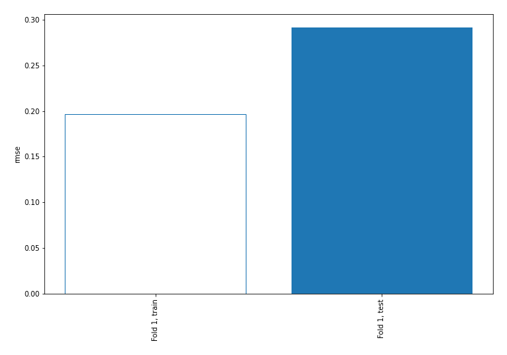
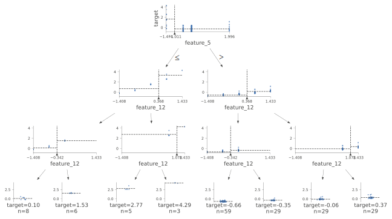
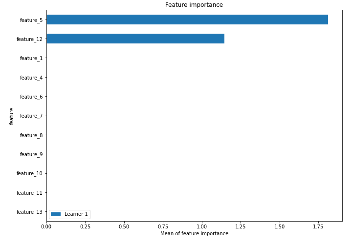
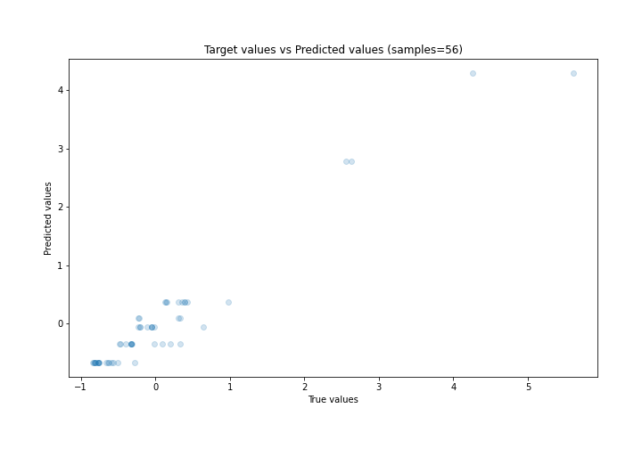
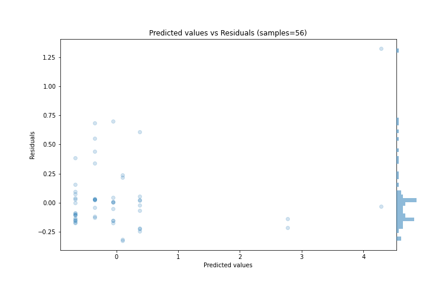
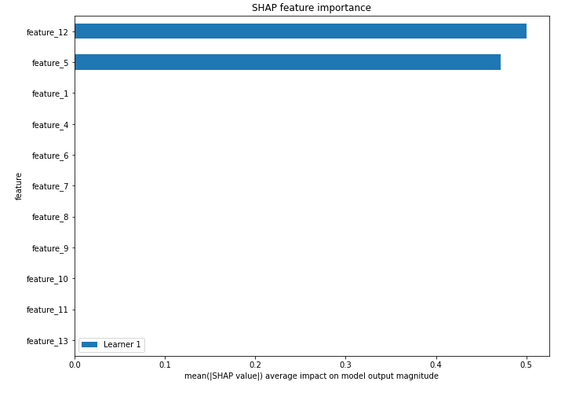
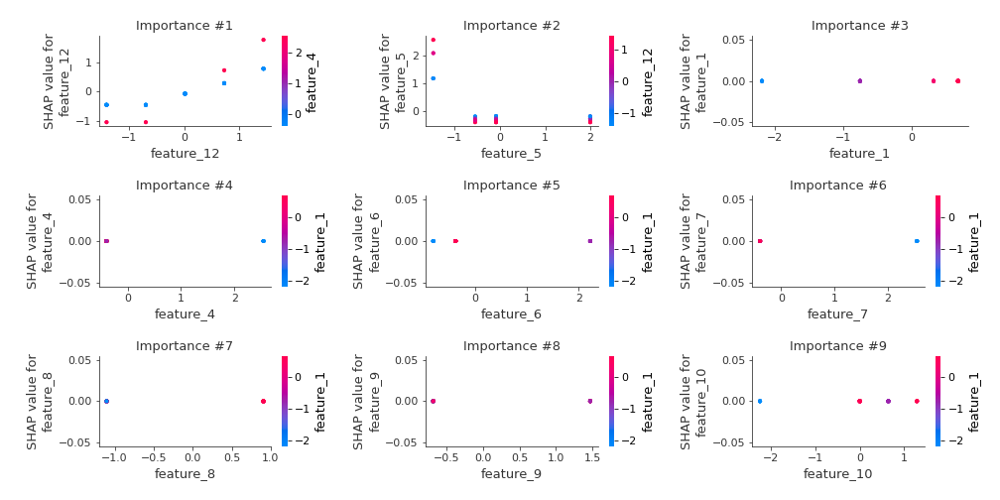
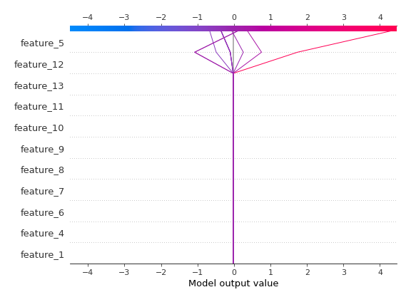
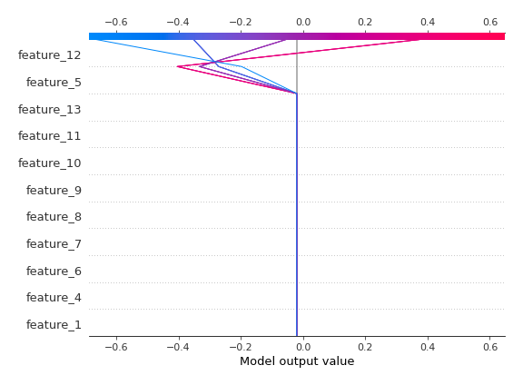

# Summary of 2_DecisionTree

[<< Go back](../README.md)

## Decision Tree
- **n_jobs**: -1
- **criterion**: mse
- **max_depth**: 3
- **explain_level**: 2

## Validation
 - **validation_type**: split
 - **train_ratio**: 0.75
 - **shuffle**: True

## Optimized metric
rmse

## Training time

4.9 seconds

### Metric details:
| Metric   |     Score |
|:---------|----------:|
| MAE      | 0.182969  |
| MSE      | 0.0848976 |
| RMSE     | 0.291372  |
| R2       | 0.937411  |
| MAPE     | 1.22934   |

## Learning curves

## Decision Tree 

### Tree #1

### Rules

if (feature_5 > -1.011) and (feature_12 <= 0.368) and (feature_12 <= -0.342) then response: -0.663 | based on 59 samples

if (feature_5 > -1.011) and (feature_12 > 0.368) and (feature_12 > 1.078) then response: 0.373 | based on 29 samples

if (feature_5 > -1.011) and (feature_12 > 0.368) and (feature_12 <= 1.078) then response: -0.055 | based on 29 samples

if (feature_5 > -1.011) and (feature_12 <= 0.368) and (feature_12 > -0.342) then response: -0.351 | based on 29 samples

if (feature_5 <= -1.011) and (feature_12 <= 0.368) and (feature_12 <= -0.342) then response: 0.098 | based on 8 samples

if (feature_5 <= -1.011) and (feature_12 <= 0.368) and (feature_12 > -0.342) then response: 1.53 | based on 6 samples

if (feature_5 <= -1.011) and (feature_12 > 0.368) and (feature_12 <= 1.078) then response: 2.773 | based on 5 samples

if (feature_5 <= -1.011) and (feature_12 > 0.368) and (feature_12 > 1.078) then response: 4.287 | based on 3 samples

## Permutation-based Importance

## True vs Predicted

## Predicted vs Residuals

## SHAP Importance

## SHAP Dependence plots

### Dependence (Fold 1)

## SHAP Decision plots

### Top-10 Worst decisions (Fold 1)

### Top-10 Best decisions (Fold 1)

[<< Go back](../README.md)
