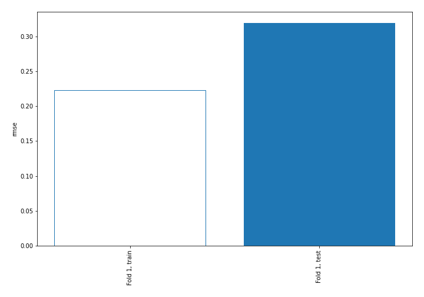
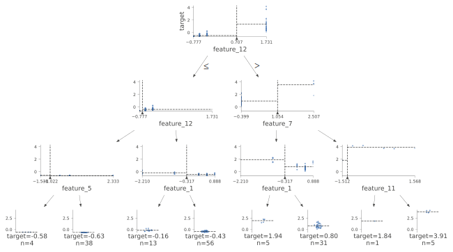
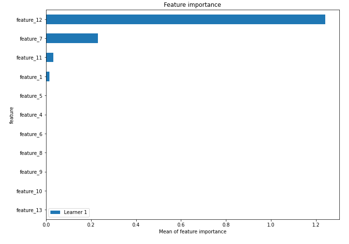
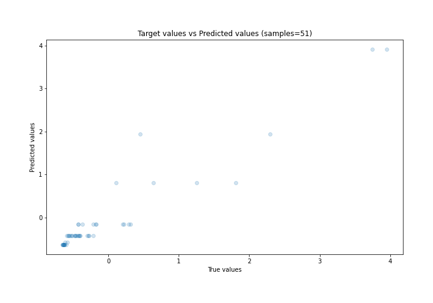
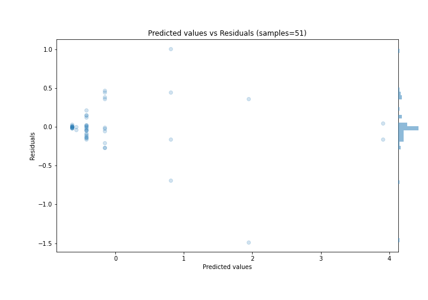
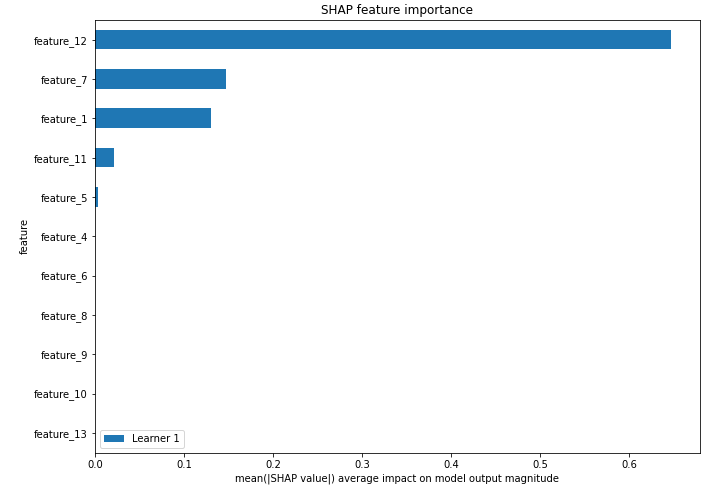
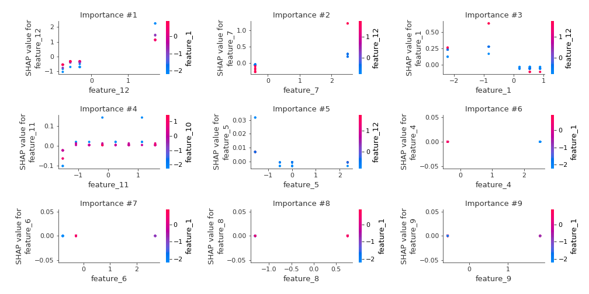
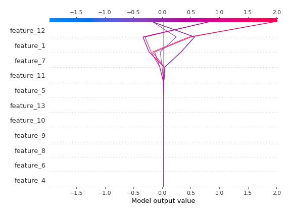
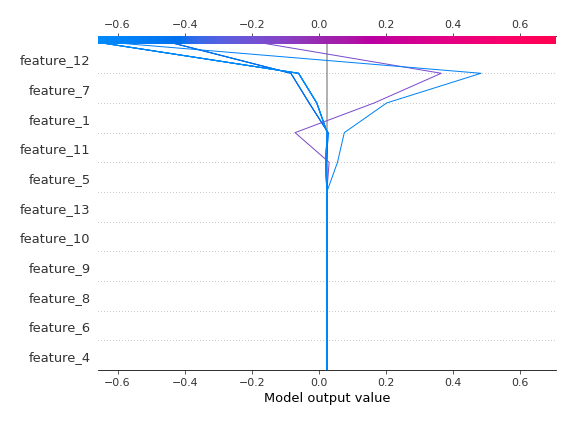

# Summary of 2_DecisionTree

[<< Go back](../README.md)

## Decision Tree
- **n_jobs**: -1
- **criterion**: mse
- **max_depth**: 3
- **explain_level**: 2

## Validation
 - **validation_type**: split
 - **train_ratio**: 0.75
 - **shuffle**: True

## Optimized metric
rmse

## Training time

5.3 seconds

### Metric details:
| Metric   |    Score |
|:---------|---------:|
| MAE      | 0.171428 |
| MSE      | 0.101818 |
| RMSE     | 0.31909  |
| R2       | 0.896847 |
| MAPE     | 0.478267 |

## Learning curves

## Decision Tree 

### Tree #1

### Rules

if (feature_12 <= 0.707) and (feature_12 > -0.674) and (feature_1 > -0.317) then response: -0.429 | based on 56 samples

if (feature_12 <= 0.707) and (feature_12 <= -0.674) and (feature_5 > -1.022) then response: -0.633 | based on 38 samples

if (feature_12 > 0.707) and (feature_7 <= 1.054) and (feature_1 > -0.317) then response: 0.804 | based on 31 samples

if (feature_12 <= 0.707) and (feature_12 > -0.674) and (feature_1 <= -0.317) then response: -0.159 | based on 13 samples

if (feature_12 > 0.707) and (feature_7 > 1.054) and (feature_11 > -1.292) then response: 3.907 | based on 5 samples

if (feature_12 > 0.707) and (feature_7 <= 1.054) and (feature_1 <= -0.317) then response: 1.941 | based on 5 samples

if (feature_12 <= 0.707) and (feature_12 <= -0.674) and (feature_5 <= -1.022) then response: -0.578 | based on 4 samples

if (feature_12 > 0.707) and (feature_7 > 1.054) and (feature_11 <= -1.292) then response: 1.838 | based on 1 samples

## Permutation-based Importance

## True vs Predicted

## Predicted vs Residuals

## SHAP Importance

## SHAP Dependence plots

### Dependence (Fold 1)

## SHAP Decision plots

### Top-10 Worst decisions (Fold 1)

### Top-10 Best decisions (Fold 1)

[<< Go back](../README.md)
