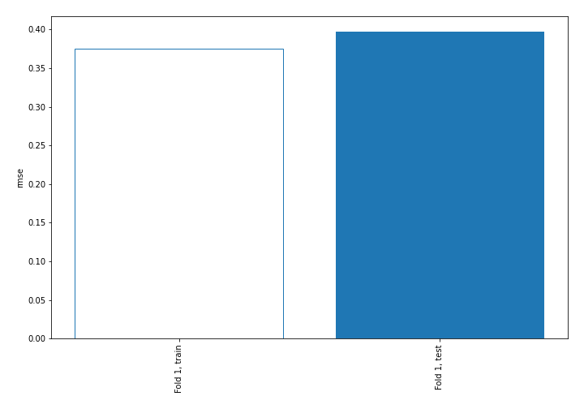
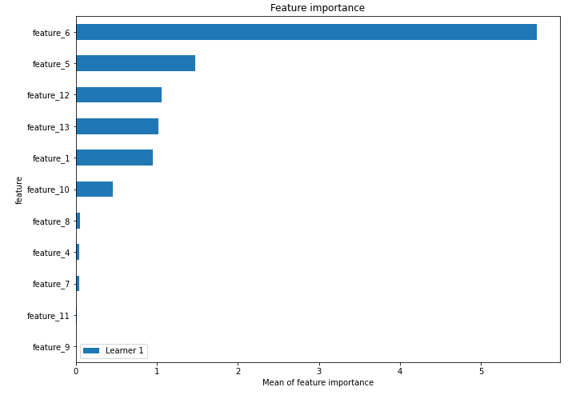
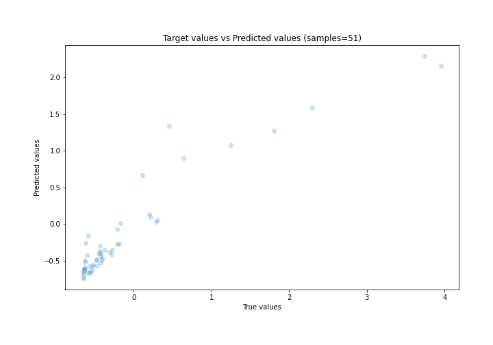
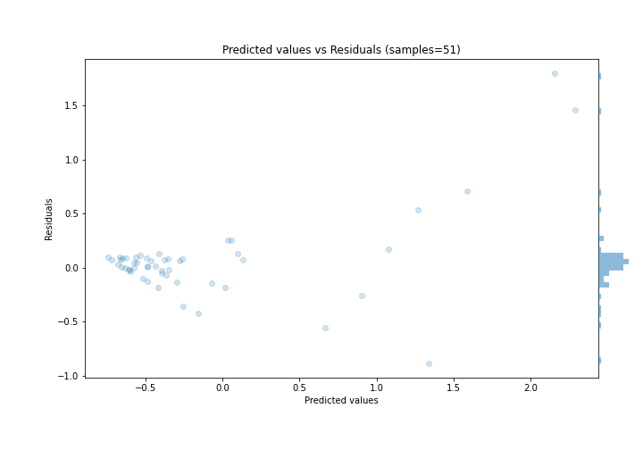
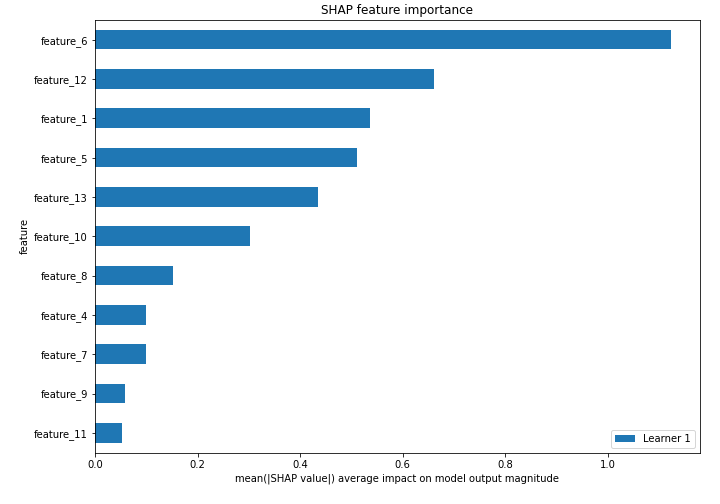
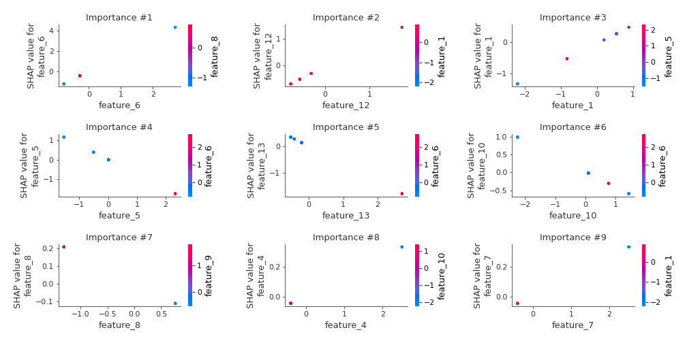
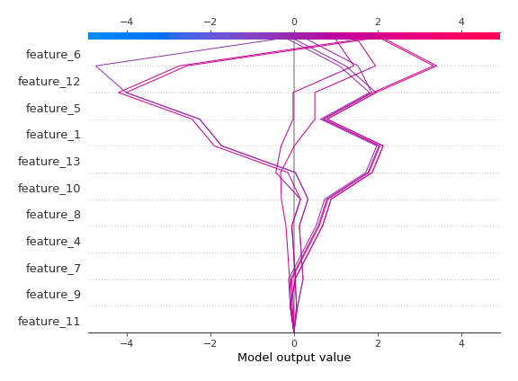
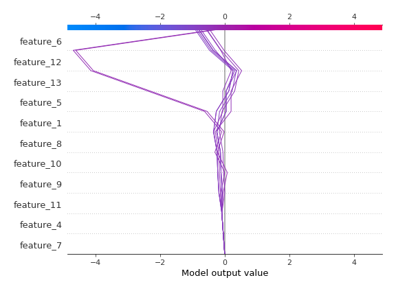

# Summary of 3_Linear

[<< Go back](../README.md)

## Linear Regression (Linear)
- **n_jobs**: -1
- **explain_level**: 2

## Validation
 - **validation_type**: split
 - **train_ratio**: 0.75
 - **shuffle**: True

## Optimized metric
rmse

## Training time

3.7 seconds

### Metric details:
| Metric   |    Score |
|:---------|---------:|
| MAE      | 0.205191 |
| MSE      | 0.157917 |
| RMSE     | 0.397388 |
| R2       | 0.840013 |
| MAPE     | 0.388409 |

## Learning curves

## Coefficients
| feature    |   Learner_1 |
|:-----------|------------:|
| feature_6  |   1.59371   |
| feature_12 |   0.869115  |
| feature_1  |   0.592024  |
| feature_4  |   0.128317  |
| feature_7  |   0.128317  |
| feature_9  |   0.0701312 |
| feature_11 |   0.0585724 |
| intercept  |  -0.0350835 |
| feature_8  |  -0.152826  |
| feature_10 |  -0.427354  |
| feature_13 |  -0.643964  |
| feature_5  |  -0.758058  |

## Permutation-based Importance

## True vs Predicted

## Predicted vs Residuals

## SHAP Importance

## SHAP Dependence plots

### Dependence (Fold 1)

## SHAP Decision plots

### Top-10 Worst decisions (Fold 1)

### Top-10 Best decisions (Fold 1)

[<< Go back](../README.md)
