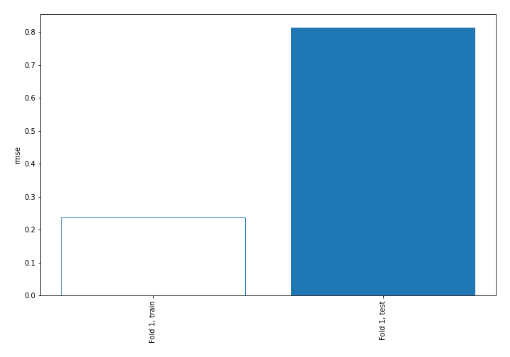
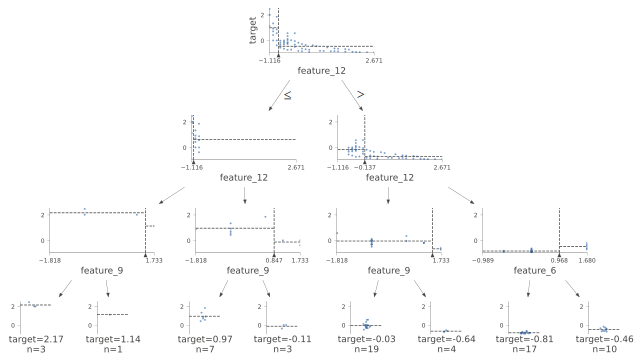
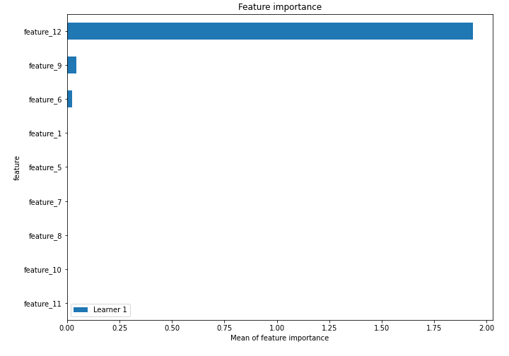
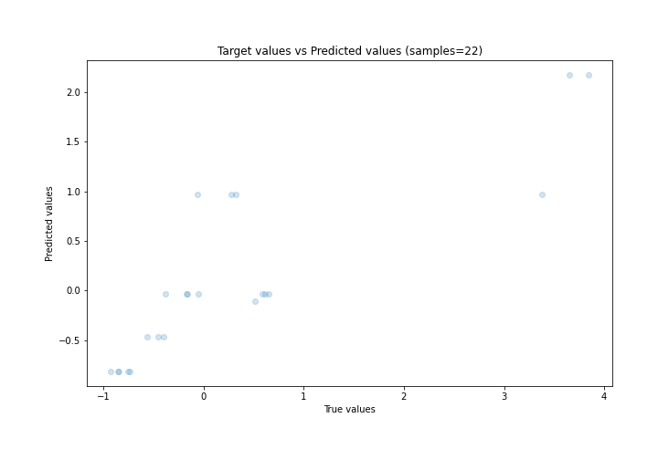
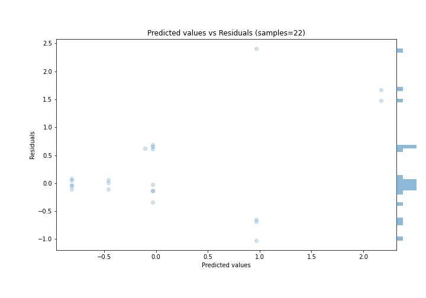
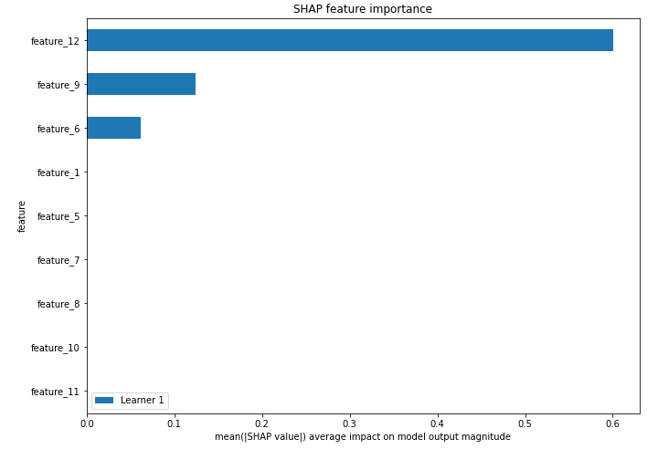
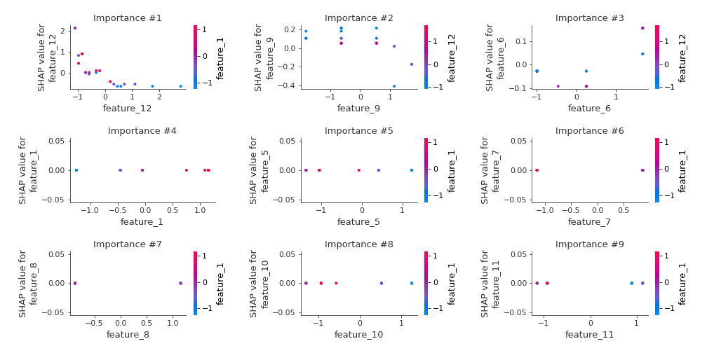
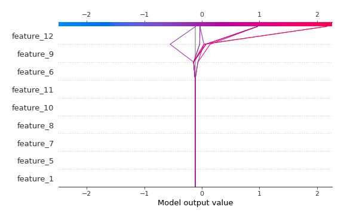
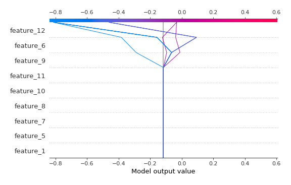

# Summary of 2_DecisionTree

[<< Go back](../README.md)

## Decision Tree
- **n_jobs**: -1
- **criterion**: mse
- **max_depth**: 3
- **explain_level**: 2

## Validation
 - **validation_type**: split
 - **train_ratio**: 0.75
 - **shuffle**: True

## Optimized metric
rmse

## Training time

10.1 seconds

### Metric details:
| Metric   |    Score |
|:---------|---------:|
| MAE      | 0.528378 |
| MSE      | 0.662316 |
| RMSE     | 0.813828 |
| R2       | 0.659828 |
| MAPE     | 1.45905  |

## Learning curves

## Decision Tree 

### Tree #1

### Rules

if (feature_12 > -0.79) and (feature_12 <= -0.137) and (feature_9 <= 1.438) then response: -0.033 | based on 19 samples

if (feature_12 > -0.79) and (feature_12 > -0.137) and (feature_6 <= 0.968) then response: -0.812 | based on 17 samples

if (feature_12 > -0.79) and (feature_12 > -0.137) and (feature_6 > 0.968) then response: -0.46 | based on 10 samples

if (feature_12 <= -0.79) and (feature_12 > -1.051) and (feature_9 <= 0.847) then response: 0.969 | based on 7 samples

if (feature_12 > -0.79) and (feature_12 <= -0.137) and (feature_9 > 1.438) then response: -0.641 | based on 4 samples

if (feature_12 <= -0.79) and (feature_12 > -1.051) and (feature_9 > 0.847) then response: -0.109 | based on 3 samples

if (feature_12 <= -0.79) and (feature_12 <= -1.051) and (feature_9 <= 1.438) then response: 2.17 | based on 3 samples

if (feature_12 <= -0.79) and (feature_12 <= -1.051) and (feature_9 > 1.438) then response: 1.14 | based on 1 samples

## Permutation-based Importance

## True vs Predicted

## Predicted vs Residuals

## SHAP Importance

## SHAP Dependence plots

### Dependence (Fold 1)

## SHAP Decision plots

### Top-10 Worst decisions (Fold 1)

### Top-10 Best decisions (Fold 1)

[<< Go back](../README.md)
