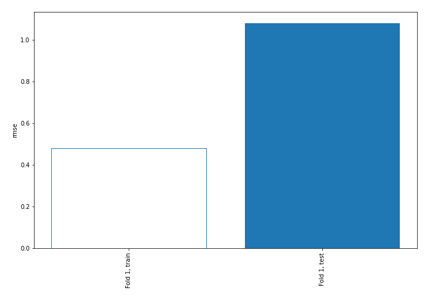
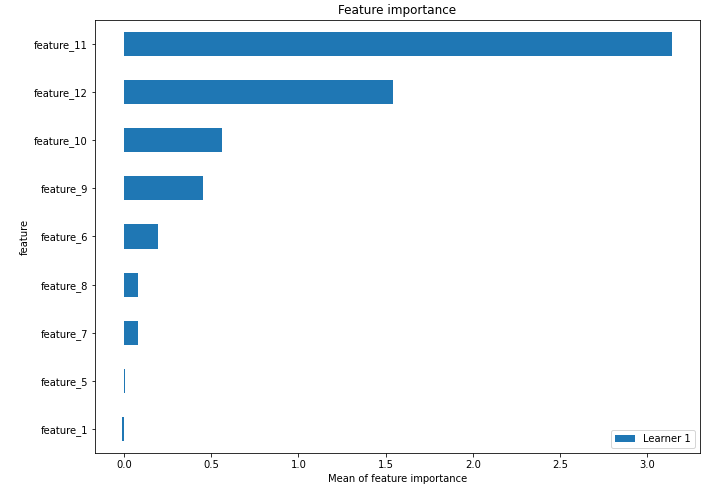
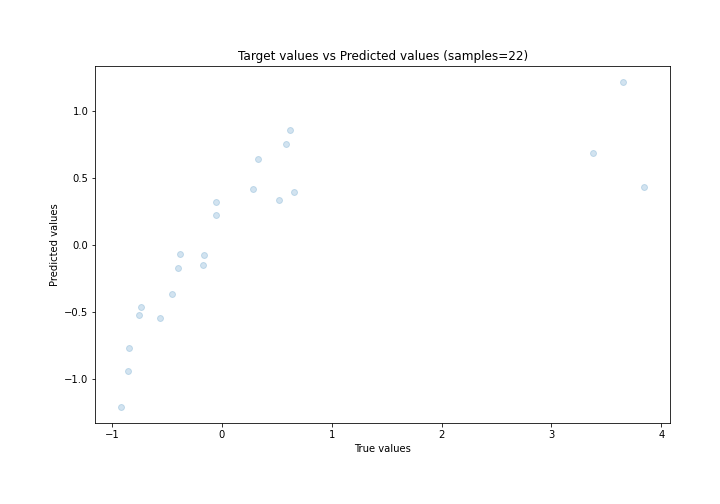
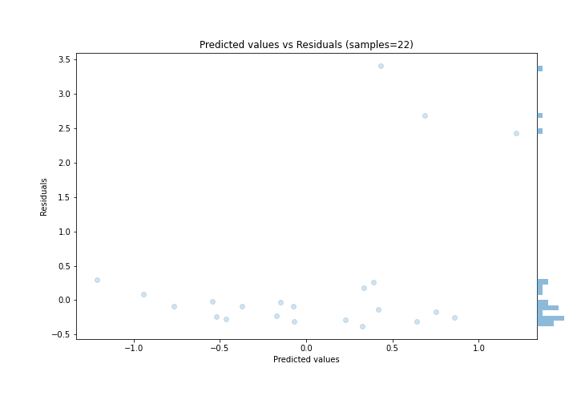
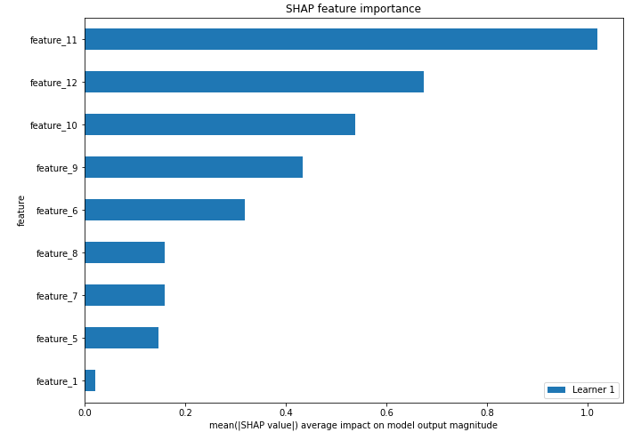
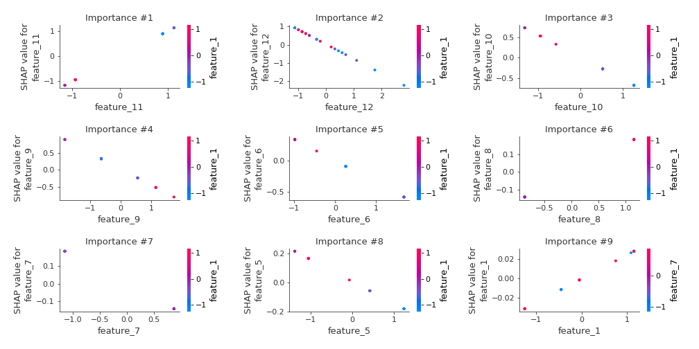
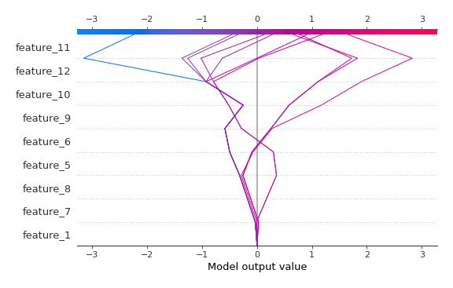
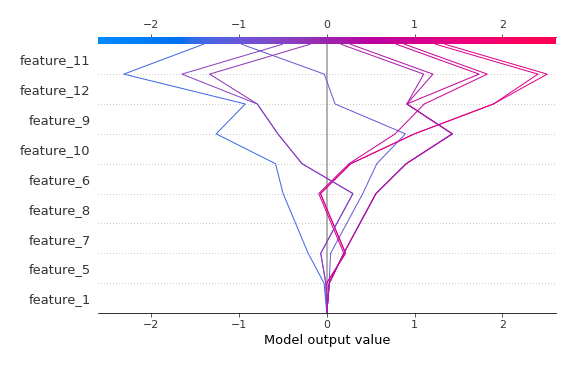

# Summary of 3_Linear

[<< Go back](../README.md)

## Linear Regression (Linear)
- **n_jobs**: -1
- **explain_level**: 2

## Validation
 - **validation_type**: split
 - **train_ratio**: 0.75
 - **shuffle**: True

## Optimized metric
rmse

## Training time

2.7 seconds

### Metric details:
| Metric   |    Score |
|:---------|---------:|
| MAE      | 0.55576  |
| MSE      | 1.16784  |
| RMSE     | 1.08066  |
| R2       | 0.399915 |
| MAPE     | 0.950883 |

## Learning curves

## Coefficients
| feature    |   Learner_1 |
|:-----------|------------:|
| feature_11 |   1.01414   |
| feature_8  |   0.161395  |
| intercept  |   0.0714694 |
| feature_1  |   0.0248885 |
| feature_5  |  -0.151731  |
| feature_7  |  -0.161395  |
| feature_6  |  -0.346447  |
| feature_9  |  -0.479122  |
| feature_10 |  -0.548011  |
| feature_12 |  -0.805267  |

## Permutation-based Importance

## True vs Predicted

## Predicted vs Residuals

## SHAP Importance

## SHAP Dependence plots

### Dependence (Fold 1)

## SHAP Decision plots

### Top-10 Worst decisions (Fold 1)

### Top-10 Best decisions (Fold 1)

[<< Go back](../README.md)
