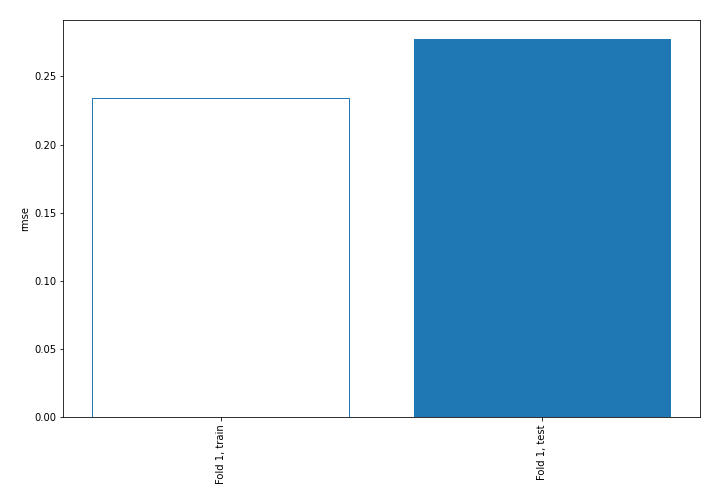
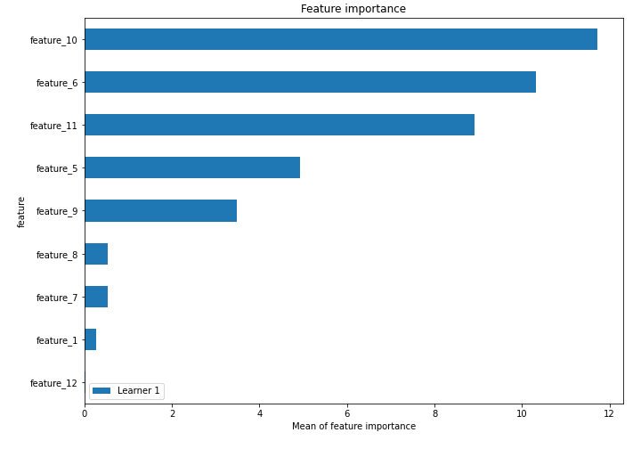
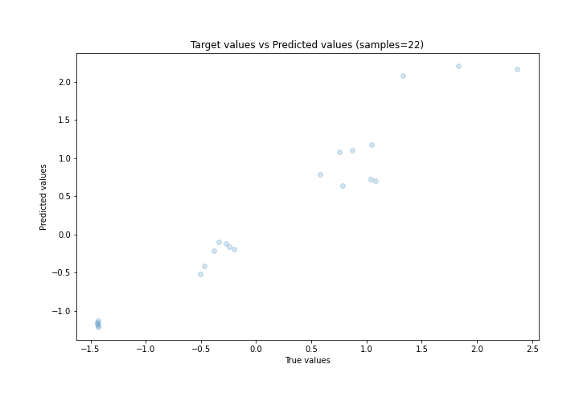
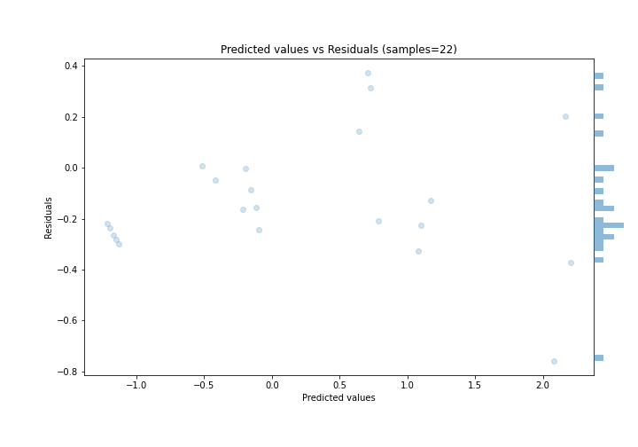
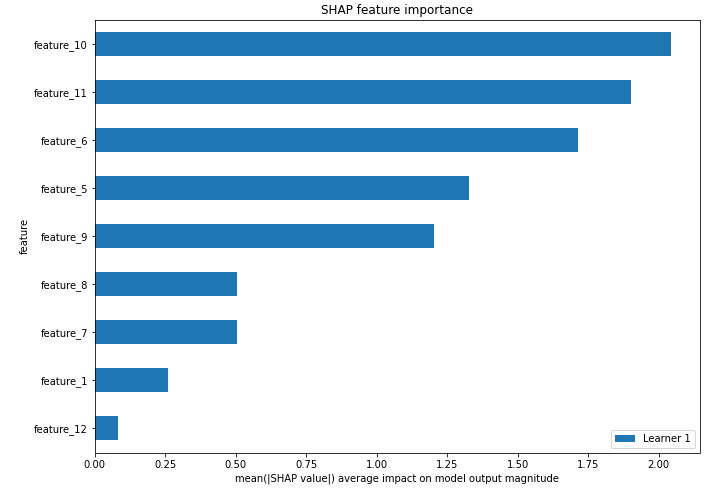
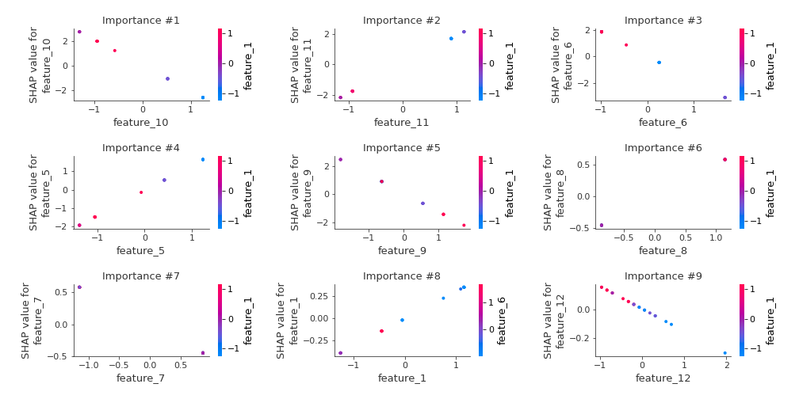
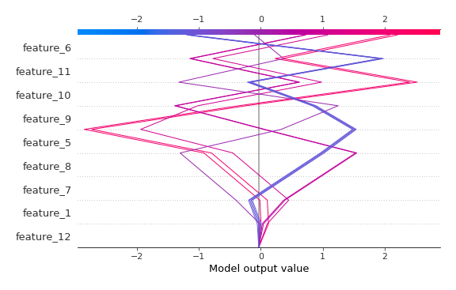
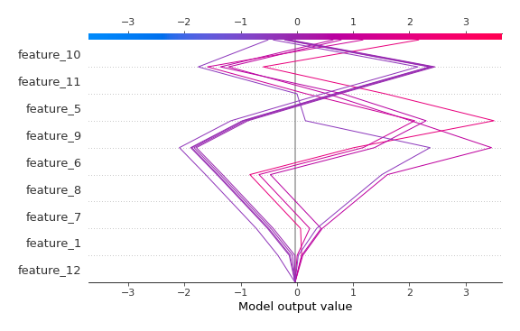

# Summary of 3_Linear

[<< Go back](../README.md)

## Linear Regression (Linear)
- **n_jobs**: -1
- **explain_level**: 2

## Validation
 - **validation_type**: split
 - **train_ratio**: 0.75
 - **shuffle**: True

## Optimized metric
rmse

## Training time

3.4 seconds

### Metric details:
| Metric   |     Score |
|:---------|----------:|
| MAE      | 0.230371  |
| MSE      | 0.0770331 |
| RMSE     | 0.277548  |
| R2       | 0.937928  |
| MAPE     | 0.272481  |

## Learning curves

## Coefficients
| feature    |   Learner_1 |
|:-----------|------------:|
| feature_11 |   1.89142   |
| feature_5  |   1.36671   |
| feature_8  |   0.510669  |
| feature_1  |   0.303829  |
| intercept  |   0.0347258 |
| feature_12 |  -0.157986  |
| feature_7  |  -0.510669  |
| feature_9  |  -1.32654   |
| feature_6  |  -1.86081   |
| feature_10 |  -2.08487   |

## Permutation-based Importance

## True vs Predicted

## Predicted vs Residuals

## SHAP Importance

## SHAP Dependence plots

### Dependence (Fold 1)

## SHAP Decision plots

### Top-10 Worst decisions (Fold 1)

### Top-10 Best decisions (Fold 1)

[<< Go back](../README.md)
