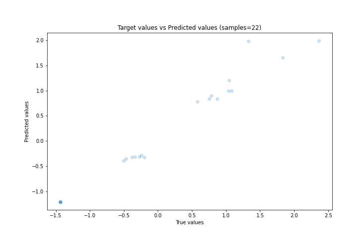

# Summary of Ensemble

[<< Go back](../README.md)

## Ensemble structure
| Model                  |   Weight |
|:-----------------------|---------:|
| 2_DecisionTree         |        1 |
| 4_Default_Xgboost      |        1 |
| 6_Default_RandomForest |        1 |

### Metric details:
| Metric   |     Score |
|:---------|----------:|
| MAE      | 0.164526  |
| MSE      | 0.0462181 |
| RMSE     | 0.214984  |
| R2       | 0.962758  |
| MAPE     | 0.187481  |

## Learning curves

## True vs Predicted

## Predicted vs Residuals

[<< Go back](../README.md)
