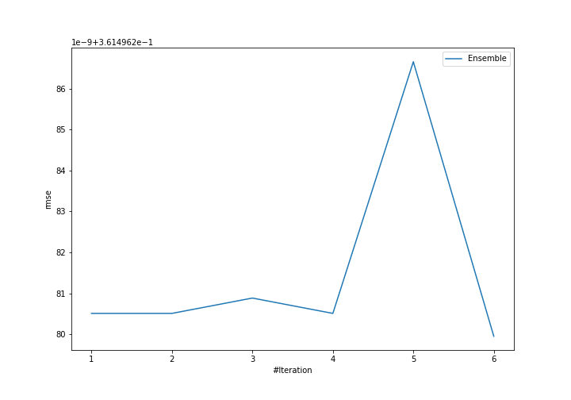
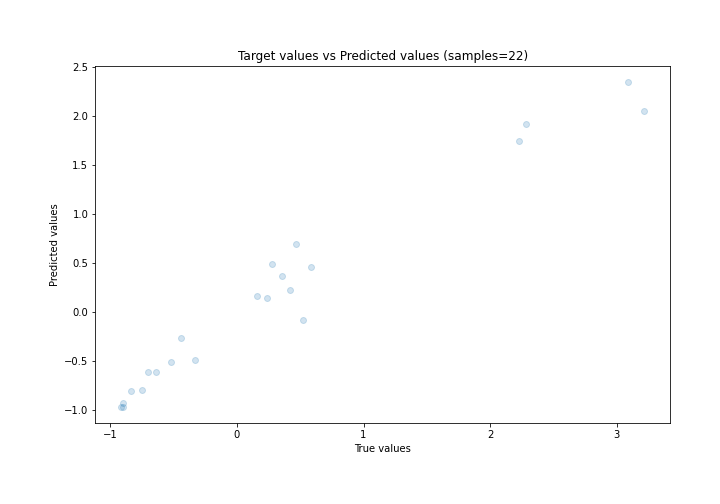
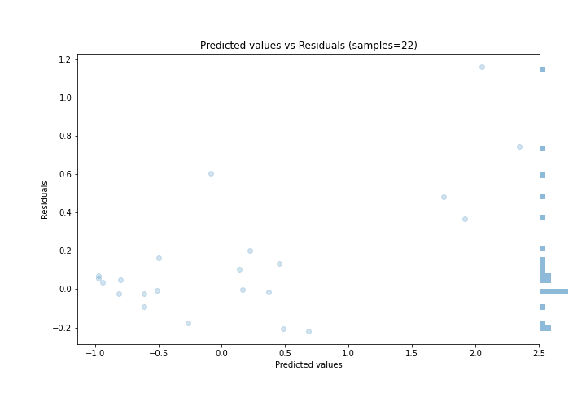

# Summary of Ensemble

[<< Go back](../README.md)

## Ensemble structure
| Model             |   Weight |
|:------------------|---------:|
| 4_Default_Xgboost |        6 |

### Metric details:
| Metric   |    Score |
|:---------|---------:|
| MAE      | 0.224488 |
| MSE      | 0.13068  |
| RMSE     | 0.361496 |
| R2       | 0.916359 |
| MAPE     | 0.267998 |

## Learning curves

## True vs Predicted

## Predicted vs Residuals

[<< Go back](../README.md)
