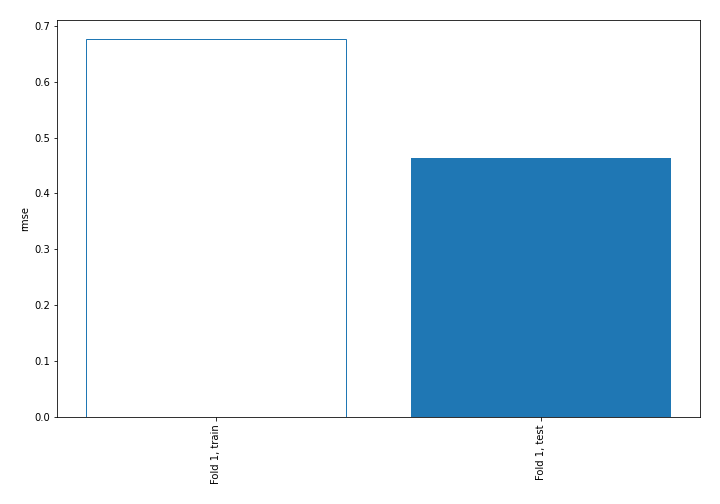
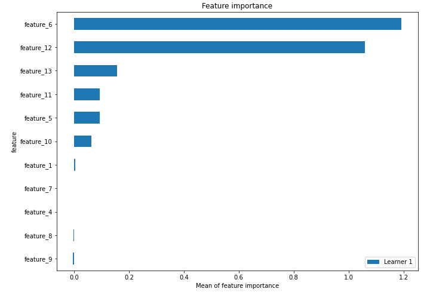
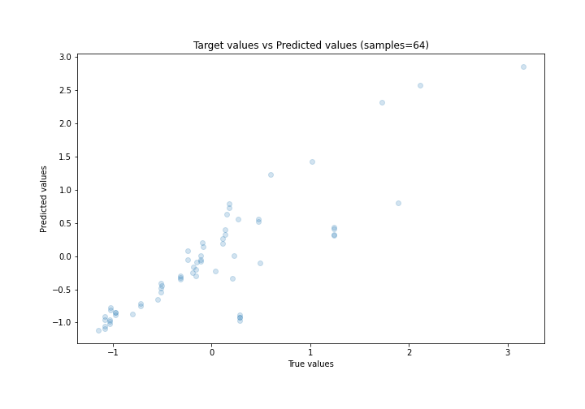
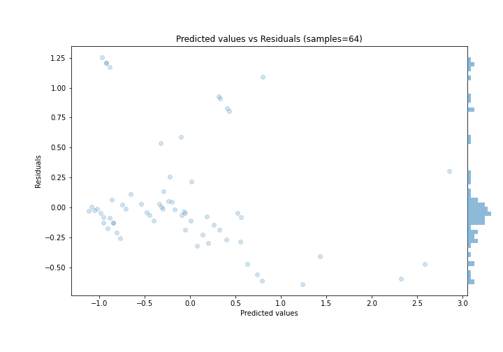
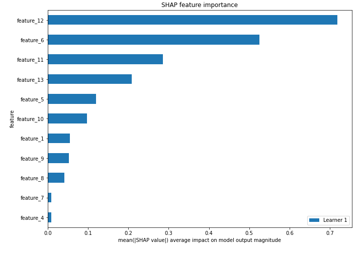
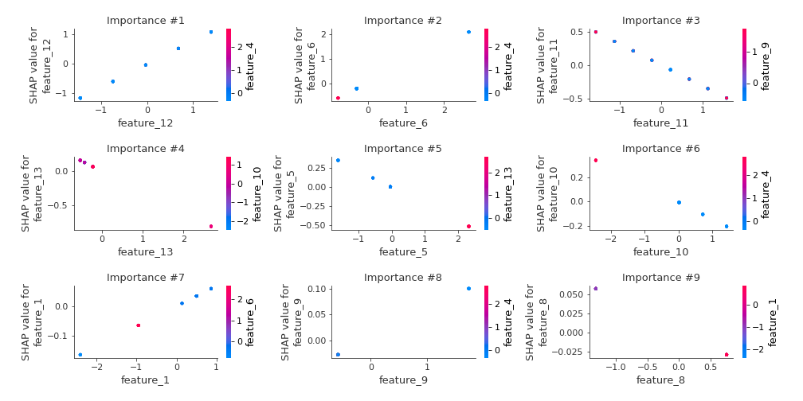
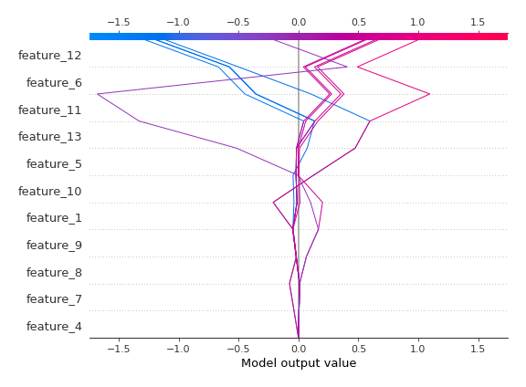
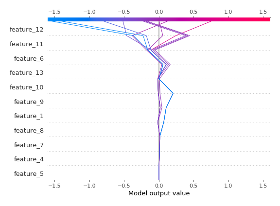

# Summary of 3_Linear

[<< Go back](../README.md)

## Linear Regression (Linear)
- **n_jobs**: -1
- **explain_level**: 2

## Validation
 - **validation_type**: split
 - **train_ratio**: 0.75
 - **shuffle**: True

## Optimized metric
rmse

## Training time

4.0 seconds

### Metric details:
| Metric   |    Score |
|:---------|---------:|
| MAE      | 0.304665 |
| MSE      | 0.215156 |
| RMSE     | 0.463849 |
| R2       | 0.710746 |
| MAPE     | 1.00966  |

## Learning curves

## Coefficients
| feature    |   Learner_1 |
|:-----------|------------:|
| feature_12 |   0.787992  |
| feature_6  |   0.778799  |
| feature_1  |   0.0688027 |
| feature_9  |   0.0554569 |
| feature_4  |  -0.0133161 |
| feature_7  |  -0.0133161 |
| intercept  |  -0.0190886 |
| feature_8  |  -0.0411548 |
| feature_10 |  -0.140356  |
| feature_5  |  -0.216825  |
| feature_13 |  -0.3024    |
| feature_11 |  -0.316251  |

## Permutation-based Importance

## True vs Predicted

## Predicted vs Residuals

## SHAP Importance

## SHAP Dependence plots

### Dependence (Fold 1)

## SHAP Decision plots

### Top-10 Worst decisions (Fold 1)

### Top-10 Best decisions (Fold 1)

[<< Go back](../README.md)
