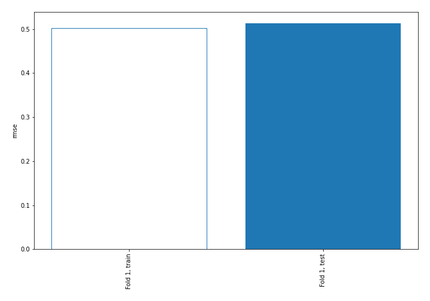
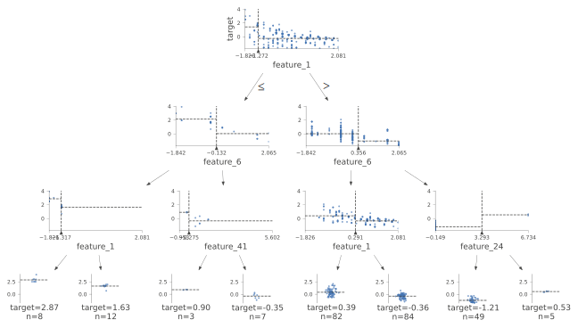
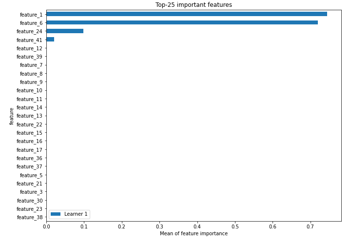
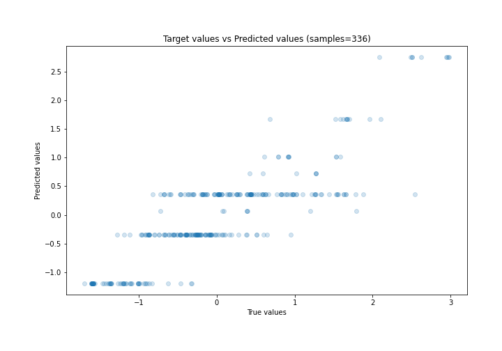
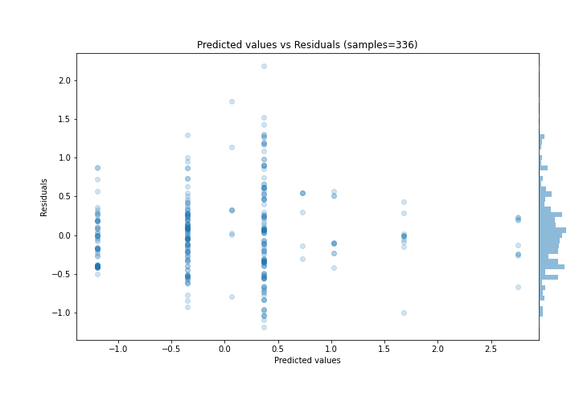
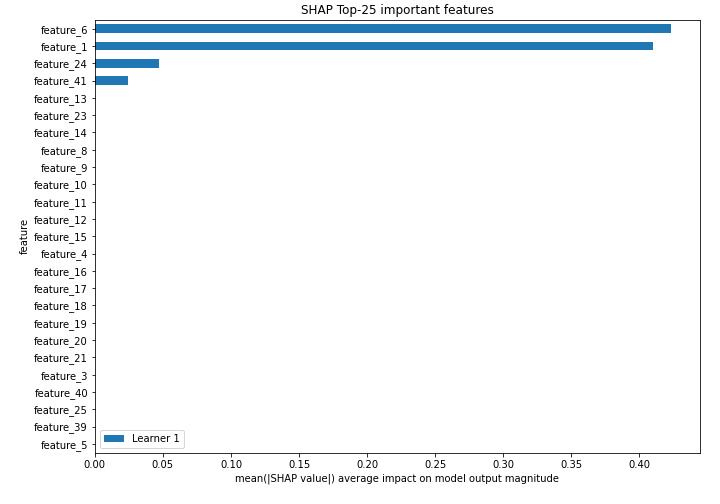
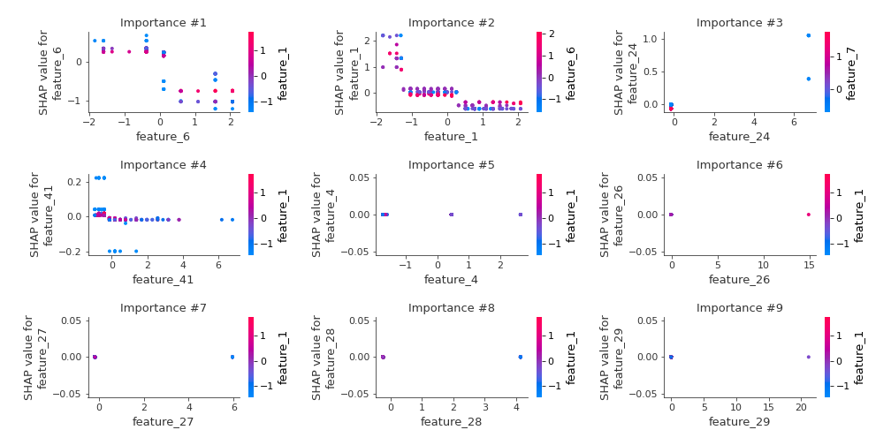
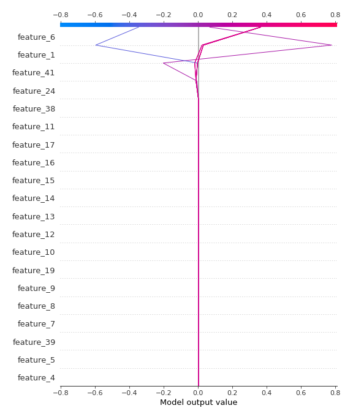
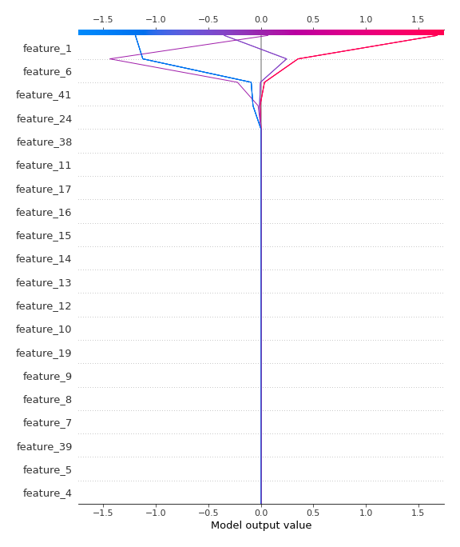

# Summary of 2_DecisionTree

[<< Go back](../README.md)

## Decision Tree
- **n_jobs**: -1
- **criterion**: mse
- **max_depth**: 3
- **explain_level**: 2

## Validation
 - **validation_type**: split
 - **train_ratio**: 0.75
 - **shuffle**: True

## Optimized metric
rmse

## Training time

6.9 seconds

### Metric details:
| Metric   |    Score |
|:---------|---------:|
| MAE      | 0.386915 |
| MSE      | 0.263305 |
| RMSE     | 0.513133 |
| R2       | 0.729955 |
| MAPE     | 2.08085  |

## Learning curves

## Decision Tree 

### Tree #1

### Rules

if (feature_1 > -1.272) and (feature_6 <= 0.356) and (feature_1 <= 0.291) then response: 0.364 | based on 374 samples

if (feature_1 > -1.272) and (feature_6 <= 0.356) and (feature_1 > 0.291) then response: -0.348 | based on 299 samples

if (feature_1 > -1.272) and (feature_6 > 0.356) and (feature_24 <= 3.293) then response: -1.194 | based on 193 samples

if (feature_1 <= -1.272) and (feature_6 <= -0.132) and (feature_1 > -1.317) then response: 1.677 | based on 45 samples

if (feature_1 <= -1.272) and (feature_6 <= -0.132) and (feature_1 <= -1.317) then response: 2.751 | based on 32 samples

if (feature_1 <= -1.272) and (feature_6 > -0.132) and (feature_41 > -0.275) then response: 0.068 | based on 27 samples

if (feature_1 <= -1.272) and (feature_6 > -0.132) and (feature_41 <= -0.275) then response: 1.021 | based on 24 samples

if (feature_1 > -1.272) and (feature_6 > 0.356) and (feature_24 > 3.293) then response: 0.728 | based on 14 samples

## Permutation-based Importance

## True vs Predicted

## Predicted vs Residuals

## SHAP Importance

## SHAP Dependence plots

### Dependence (Fold 1)

## SHAP Decision plots

### Top-10 Worst decisions (Fold 1)

### Top-10 Best decisions (Fold 1)

[<< Go back](../README.md)
