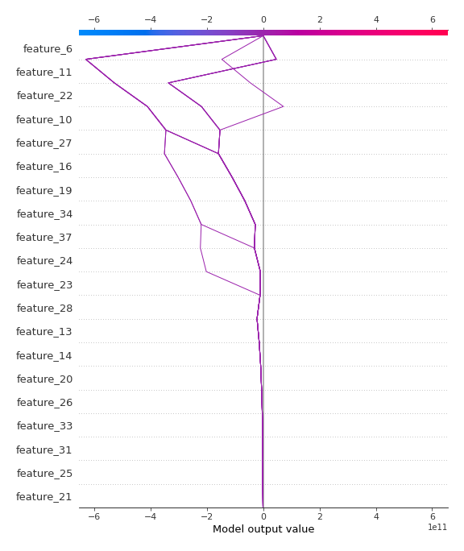

# Summary of 3_Linear

[<< Go back](../README.md)

## Linear Regression (Linear)
- **n_jobs**: -1
- **explain_level**: 2

## Validation
 - **validation_type**: split
 - **train_ratio**: 0.75
 - **shuffle**: True

## Optimized metric
rmse

## Training time

5.3 seconds

### Metric details:
| Metric   |     Score |
|:---------|----------:|
| MAE      | 0.143196  |
| MSE      | 0.0702856 |
| RMSE     | 0.265114  |
| R2       | 0.924846  |
| MAPE     | 0.771856  |

## Learning curves

## Coefficients
| feature    |    Learner_1 |
|:-----------|-------------:|
| feature_22 |  3.61624e+11 |
| feature_16 |  2.30292e+11 |
| feature_11 |  1.98056e+11 |
| feature_24 |  1.54847e+11 |
| feature_34 |  1.49668e+11 |
| feature_10 |  1.23159e+11 |
| feature_19 |  1.06004e+11 |
| feature_13 |  8.2023e+10  |
| feature_14 |  6.4881e+10  |
| feature_26 |  3.23429e+10 |
| feature_20 |  3.06108e+10 |
| feature_17 |  2.9059e+10  |
| feature_35 |  2.11438e+10 |
| feature_25 |  1.94254e+10 |
| feature_21 |  1.77395e+10 |
| feature_12 |  1.32286e+10 |
| feature_15 |  1.32286e+10 |
| feature_33 |  1.15245e+10 |
| feature_38 |  1.1232e+10  |
| feature_39 |  7.94519e+09 |
| feature_40 |  5.98727e+09 |
| feature_4  |  0.496412    |
| feature_3  |  0.224697    |
| feature_7  |  0.115519    |
| intercept  | -0.0115488   |
| feature_5  | -0.0127876   |
| feature_41 | -0.0917774   |
| feature_1  | -0.226674    |
| feature_18 | -2.60181e+09 |
| feature_8  | -5.23361e+09 |
| feature_36 | -7.33982e+09 |
| feature_32 | -7.33982e+09 |
| feature_29 | -9.05813e+09 |
| feature_30 | -1.11472e+10 |
| feature_23 | -1.47643e+10 |
| feature_31 | -1.76056e+10 |
| feature_9  | -1.84322e+10 |
| feature_37 | -2.43551e+10 |
| feature_27 | -3.14052e+10 |
| feature_28 | -4.37805e+10 |
| feature_6  | -3.96186e+11 |

## Permutation-based Importance

## True vs Predicted

## Predicted vs Residuals

## SHAP Importance

## SHAP Dependence plots

### Dependence (Fold 1)

## SHAP Decision plots

### Top-10 Worst decisions (Fold 1)

### Top-10 Best decisions (Fold 1)

[<< Go back](../README.md)
