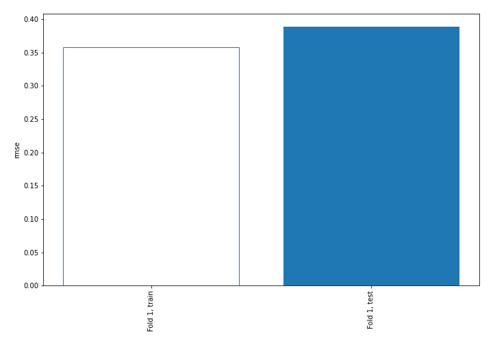
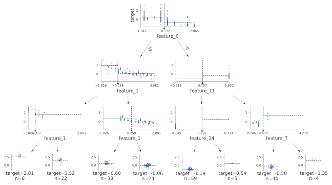
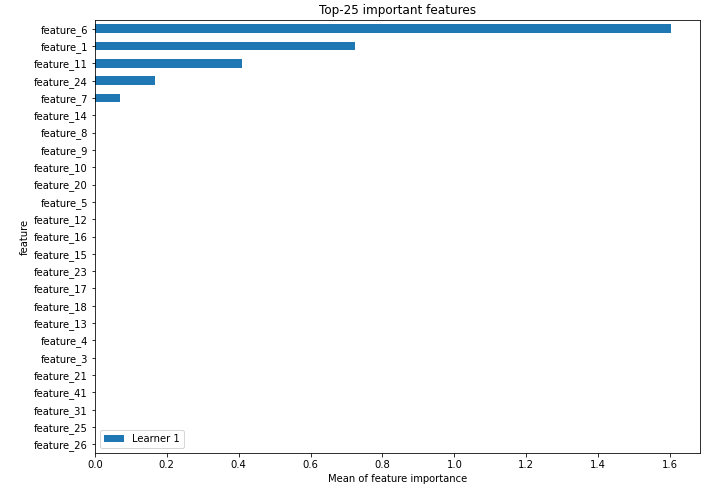
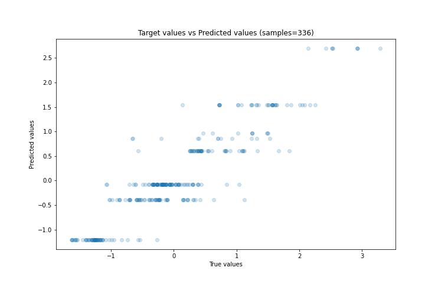
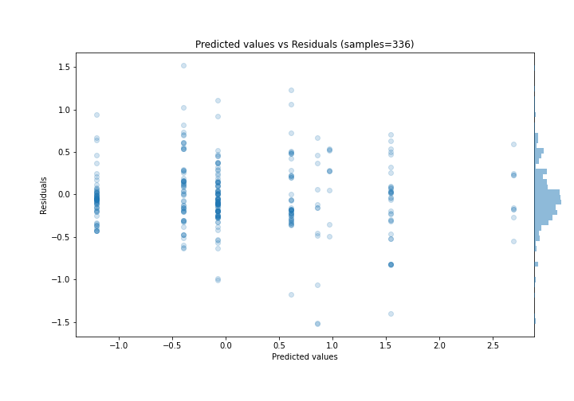
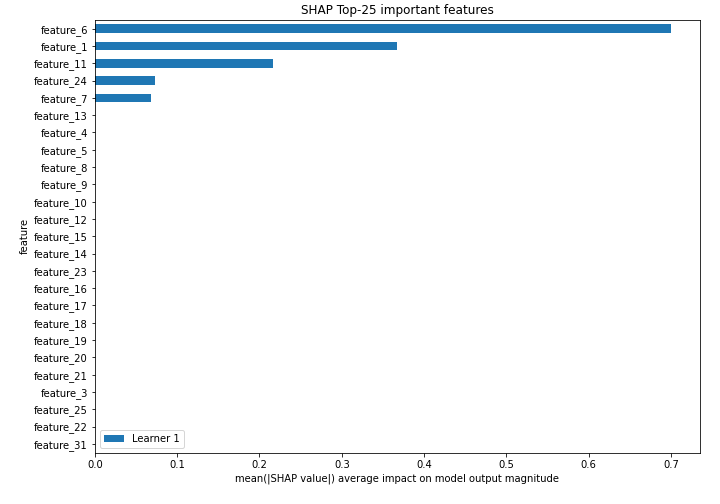
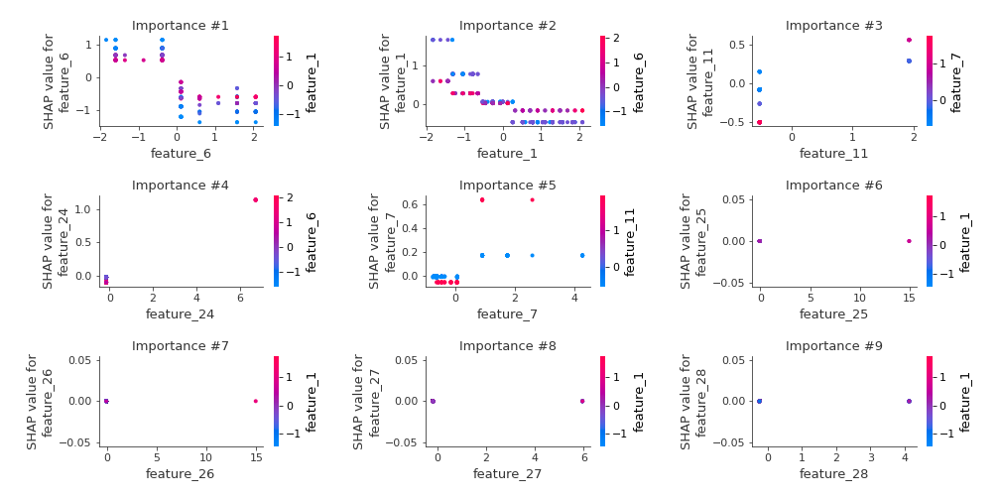
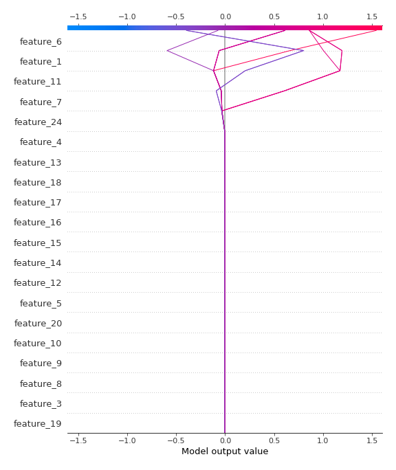
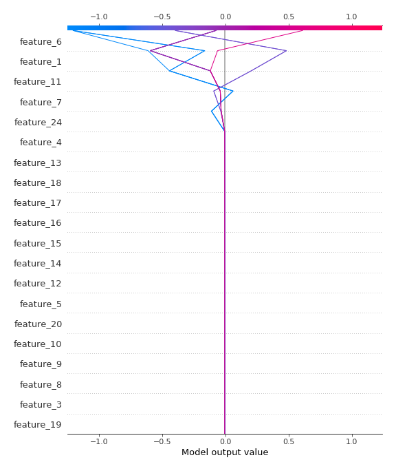

# Summary of 2_DecisionTree

[<< Go back](../README.md)

## Decision Tree
- **n_jobs**: -1
- **criterion**: mse
- **max_depth**: 3
- **explain_level**: 2

## Validation
 - **validation_type**: split
 - **train_ratio**: 0.75
 - **shuffle**: True

## Optimized metric
rmse

## Training time

7.0 seconds

### Metric details:
| Metric   |    Score |
|:---------|---------:|
| MAE      | 0.27971  |
| MSE      | 0.151234 |
| RMSE     | 0.388889 |
| R2       | 0.842962 |
| MAPE     | 0.712184 |

## Learning curves

## Decision Tree 

### Tree #1

### Rules

if (feature_6 <= -0.132) and (feature_1 > -0.588) and (feature_1 > 0.258) then response: -0.074 | based on 287 samples

if (feature_6 > -0.132) and (feature_11 <= 0.707) and (feature_24 <= 3.293) then response: -1.204 | based on 218 samples

if (feature_6 > -0.132) and (feature_11 > 0.707) and (feature_7 <= 0.49) then response: -0.395 | based on 194 samples

if (feature_6 <= -0.132) and (feature_1 > -0.588) and (feature_1 <= 0.258) then response: 0.611 | based on 145 samples

if (feature_6 <= -0.132) and (feature_1 <= -0.588) and (feature_1 > -1.317) then response: 1.544 | based on 95 samples

if (feature_6 <= -0.132) and (feature_1 <= -0.588) and (feature_1 <= -1.317) then response: 2.692 | based on 32 samples

if (feature_6 > -0.132) and (feature_11 <= 0.707) and (feature_24 > 3.293) then response: 0.967 | based on 20 samples

if (feature_6 > -0.132) and (feature_11 > 0.707) and (feature_7 > 0.49) then response: 0.861 | based on 17 samples

## Permutation-based Importance

## True vs Predicted

## Predicted vs Residuals

## SHAP Importance

## SHAP Dependence plots

### Dependence (Fold 1)

## SHAP Decision plots

### Top-10 Worst decisions (Fold 1)

### Top-10 Best decisions (Fold 1)

[<< Go back](../README.md)
