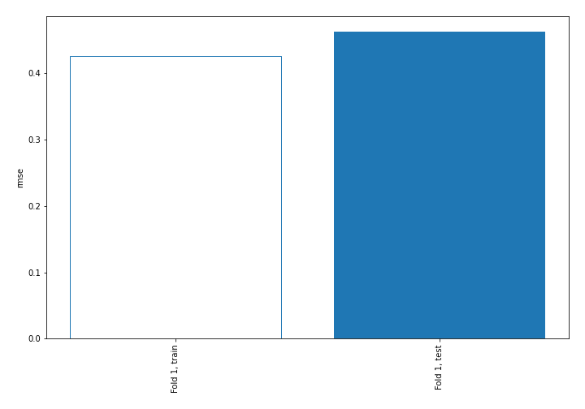
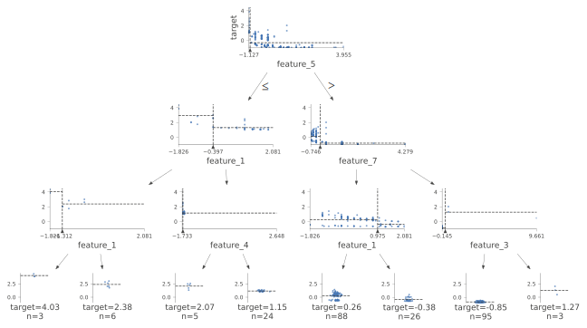
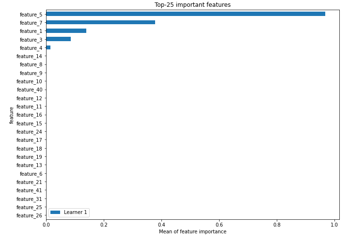
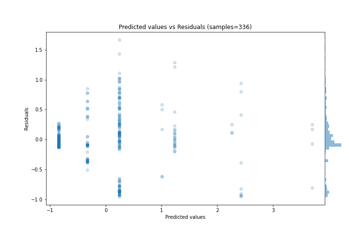
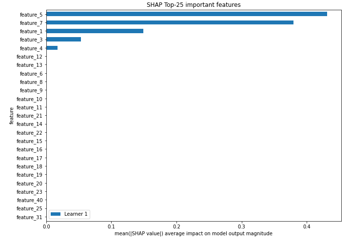
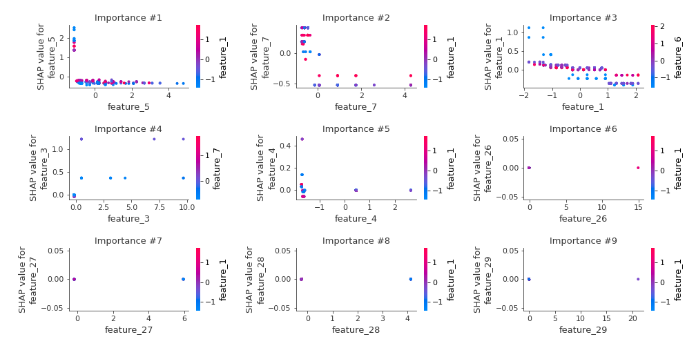
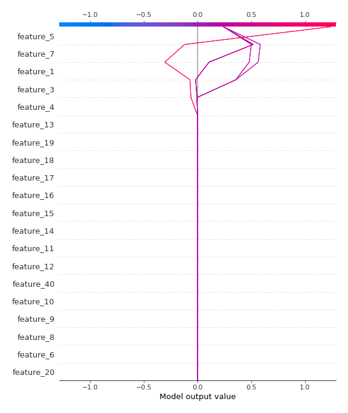
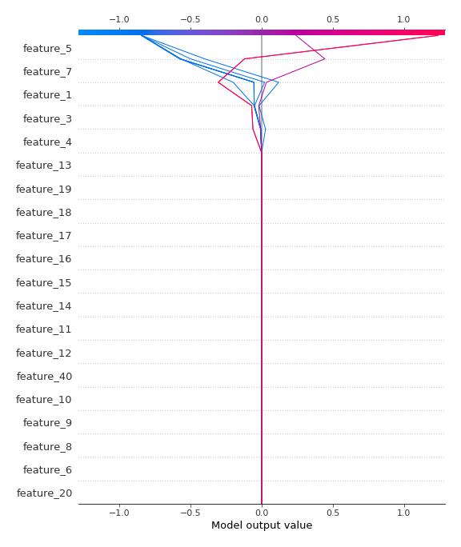

# Summary of 2_DecisionTree

[<< Go back](../README.md)

## Decision Tree
- **n_jobs**: -1
- **criterion**: mse
- **max_depth**: 3
- **explain_level**: 2

## Validation
 - **validation_type**: split
 - **train_ratio**: 0.75
 - **shuffle**: True

## Optimized metric
rmse

## Training time

7.3 seconds

### Metric details:
| Metric   |    Score |
|:---------|---------:|
| MAE      | 0.32376  |
| MSE      | 0.214292 |
| RMSE     | 0.462916 |
| R2       | 0.776658 |
| MAPE     | 0.621774 |

## Learning curves

## Decision Tree 

### Tree #1

### Rules

if (feature_5 > -1.063) and (feature_7 <= -0.246) and (feature_1 <= 0.975) then response: 0.241 | based on 392 samples

if (feature_5 > -1.063) and (feature_7 > -0.246) and (feature_3 <= 0.181) then response: -0.842 | based on 373 samples

if (feature_5 > -1.063) and (feature_7 <= -0.246) and (feature_1 > 0.975) then response: -0.331 | based on 98 samples

if (feature_5 <= -1.063) and (feature_1 > -0.397) and (feature_4 > -1.698) then response: 1.237 | based on 83 samples

if (feature_5 <= -1.063) and (feature_1 <= -0.397) and (feature_1 > -1.312) then response: 2.422 | based on 21 samples

if (feature_5 <= -1.063) and (feature_1 <= -0.397) and (feature_1 <= -1.312) then response: 3.704 | based on 16 samples

if (feature_5 > -1.063) and (feature_7 > -0.246) and (feature_3 > 0.181) then response: 1.01 | based on 14 samples

if (feature_5 <= -1.063) and (feature_1 > -0.397) and (feature_4 <= -1.698) then response: 2.26 | based on 11 samples

## Permutation-based Importance

## True vs Predicted

## Predicted vs Residuals

## SHAP Importance

## SHAP Dependence plots

### Dependence (Fold 1)

## SHAP Decision plots

### Top-10 Worst decisions (Fold 1)

### Top-10 Best decisions (Fold 1)

[<< Go back](../README.md)
