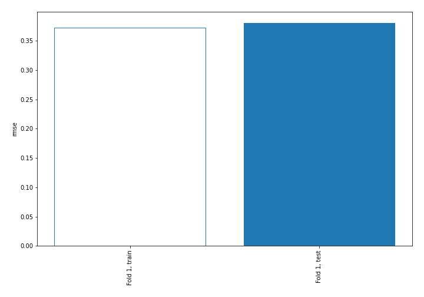
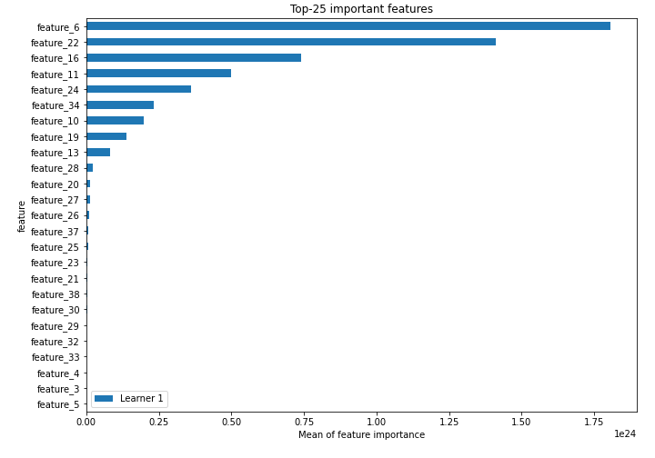
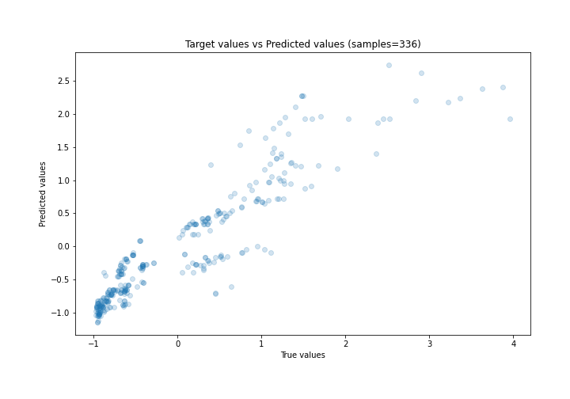
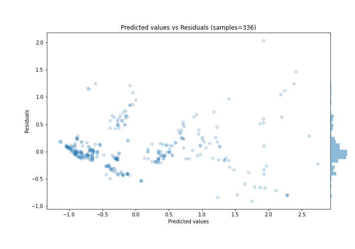
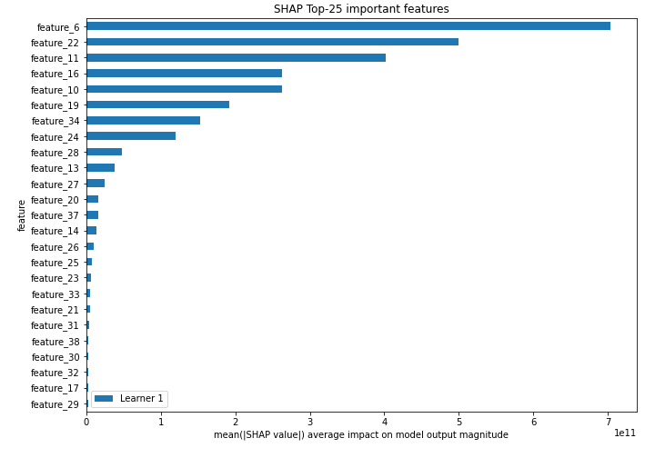
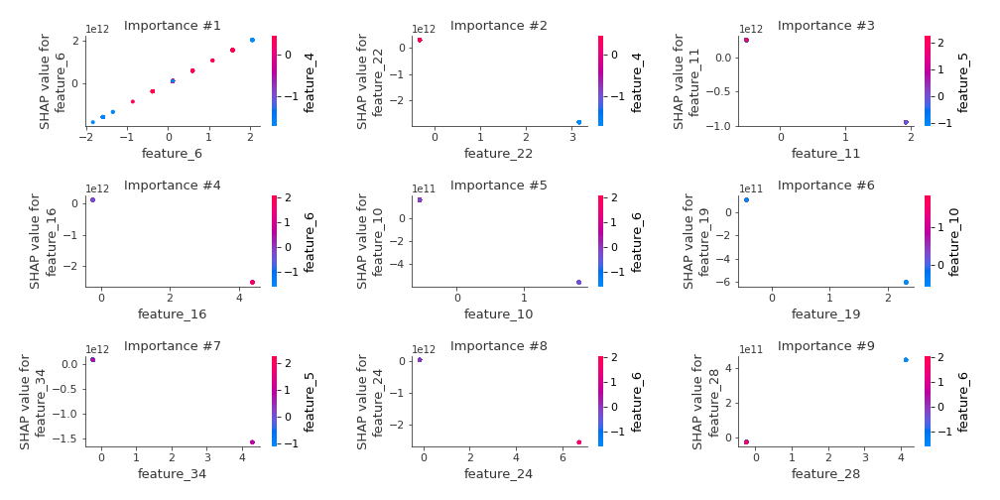
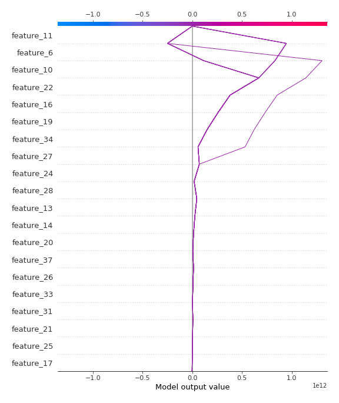
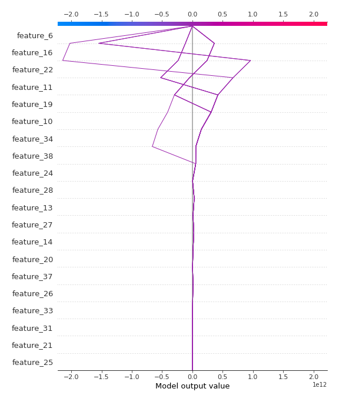

# Summary of 3_Linear

[<< Go back](../README.md)

## Linear Regression (Linear)
- **n_jobs**: -1
- **explain_level**: 2

## Validation
 - **validation_type**: split
 - **train_ratio**: 0.75
 - **shuffle**: True

## Optimized metric
rmse

## Training time

5.9 seconds

### Metric details:
| Metric   |    Score |
|:---------|---------:|
| MAE      | 0.251128 |
| MSE      | 0.144593 |
| RMSE     | 0.380254 |
| R2       | 0.8493   |
| MAPE     | 0.480681 |

## Learning curves

## Coefficients
| feature    |    Learner_1 |
|:-----------|-------------:|
| feature_6  |  9.77029e+11 |
| feature_28 |  1.07967e+11 |
| feature_27 |  7.7448e+10  |
| feature_37 |  6.00618e+10 |
| feature_9  |  4.54554e+10 |
| feature_31 |  4.34168e+10 |
| feature_23 |  3.64099e+10 |
| feature_30 |  2.74899e+10 |
| feature_29 |  2.23381e+10 |
| feature_36 |  1.81006e+10 |
| feature_32 |  1.81006e+10 |
| feature_8  |  1.29065e+10 |
| feature_18 |  6.41628e+09 |
| feature_4  |  0.372348    |
| feature_3  |  0.290278    |
| feature_41 |  0.0526365   |
| intercept  | -0.00320506  |
| feature_7  | -0.0142041   |
| feature_1  | -0.136496    |
| feature_5  | -0.169834    |
| feature_40 | -1.47651e+10 |
| feature_39 | -1.95935e+10 |
| feature_38 | -2.76991e+10 |
| feature_33 | -2.84204e+10 |
| feature_12 | -3.26228e+10 |
| feature_15 | -3.26228e+10 |
| feature_21 | -4.37471e+10 |
| feature_25 | -4.79047e+10 |
| feature_35 | -5.21423e+10 |
| feature_17 | -7.16619e+10 |
| feature_20 | -7.54888e+10 |
| feature_26 | -7.97603e+10 |
| feature_14 | -1.60002e+11 |
| feature_13 | -2.02276e+11 |
| feature_19 | -2.61415e+11 |
| feature_10 | -3.03722e+11 |
| feature_34 | -3.69095e+11 |
| feature_24 | -3.81867e+11 |
| feature_11 | -4.88422e+11 |
| feature_16 | -5.67921e+11 |
| feature_22 | -8.91796e+11 |

## Permutation-based Importance

## True vs Predicted

## Predicted vs Residuals

## SHAP Importance

## SHAP Dependence plots

### Dependence (Fold 1)

## SHAP Decision plots

### Top-10 Worst decisions (Fold 1)

### Top-10 Best decisions (Fold 1)

[<< Go back](../README.md)
