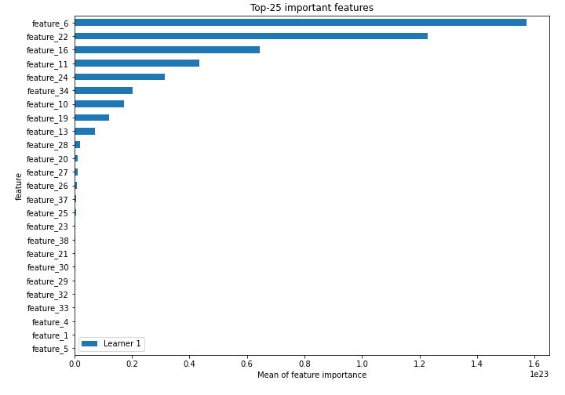
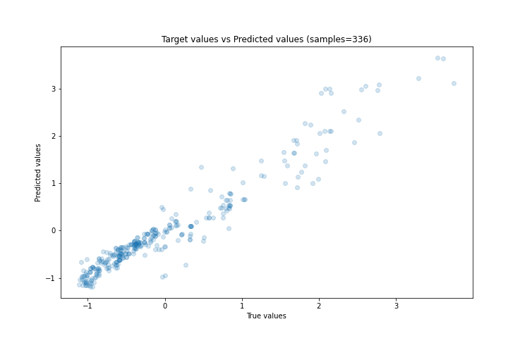
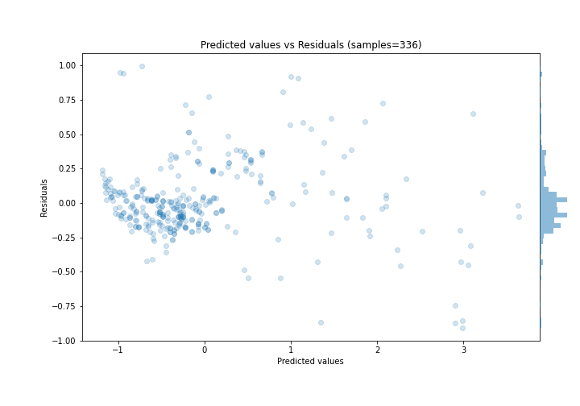
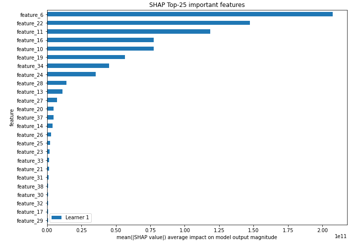
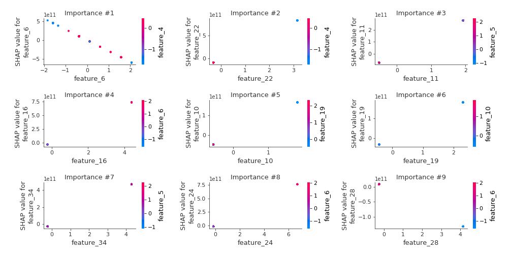
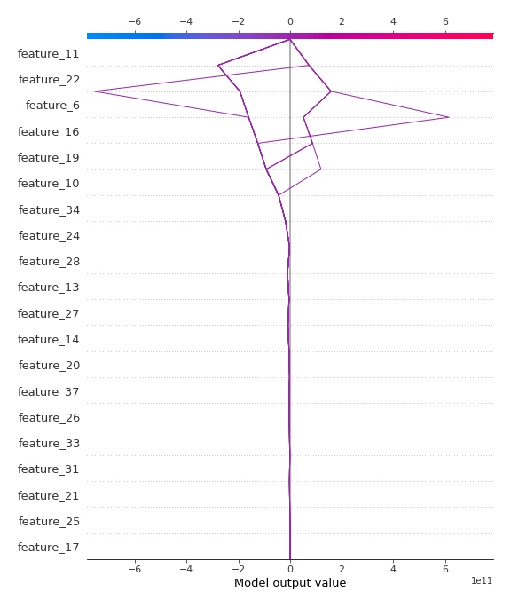
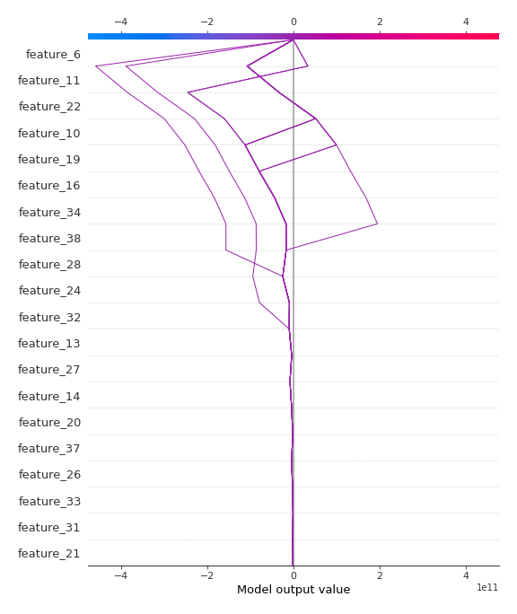

# Summary of 3_Linear

[<< Go back](../README.md)

## Linear Regression (Linear)
- **n_jobs**: -1
- **explain_level**: 2

## Validation
 - **validation_type**: split
 - **train_ratio**: 0.75
 - **shuffle**: True

## Optimized metric
rmse

## Training time

6.3 seconds

### Metric details:
| Metric   |     Score |
|:---------|----------:|
| MAE      | 0.183036  |
| MSE      | 0.0710675 |
| RMSE     | 0.266585  |
| R2       | 0.927146  |
| MAPE     | 5.44658   |

## Learning curves

## Coefficients
| feature    |    Learner_1 |
|:-----------|-------------:|
| feature_22 |  2.63104e+11 |
| feature_16 |  1.67552e+11 |
| feature_11 |  1.44098e+11 |
| feature_24 |  1.12661e+11 |
| feature_34 |  1.08893e+11 |
| feature_10 |  8.96063e+10 |
| feature_19 |  7.71247e+10 |
| feature_13 |  5.9677e+10  |
| feature_14 |  4.7205e+10  |
| feature_26 |  2.35315e+10 |
| feature_20 |  2.22713e+10 |
| feature_17 |  2.11422e+10 |
| feature_35 |  1.53834e+10 |
| feature_25 |  1.41332e+10 |
| feature_21 |  1.29066e+10 |
| feature_12 |  9.62463e+09 |
| feature_15 |  9.62463e+09 |
| feature_33 |  8.3848e+09  |
| feature_38 |  8.172e+09   |
| feature_39 |  5.78063e+09 |
| feature_40 |  4.35612e+09 |
| feature_4  |  0.452883    |
| feature_7  |  0.277796    |
| feature_3  |  0.246388    |
| intercept  | -0.00730578  |
| feature_41 | -0.0575516   |
| feature_5  | -0.255982    |
| feature_1  | -0.35671     |
| feature_18 | -1.89298e+09 |
| feature_8  | -3.80778e+09 |
| feature_36 | -5.34019e+09 |
| feature_32 | -5.34019e+09 |
| feature_29 | -6.59036e+09 |
| feature_30 | -8.1103e+09  |
| feature_23 | -1.07419e+10 |
| feature_31 | -1.28092e+10 |
| feature_9  | -1.34106e+10 |
| feature_37 | -1.77199e+10 |
| feature_27 | -2.28493e+10 |
| feature_28 | -3.18531e+10 |
| feature_6  | -2.88251e+11 |

## Permutation-based Importance

## True vs Predicted

## Predicted vs Residuals

## SHAP Importance

## SHAP Dependence plots

### Dependence (Fold 1)

## SHAP Decision plots

### Top-10 Worst decisions (Fold 1)

### Top-10 Best decisions (Fold 1)

[<< Go back](../README.md)
