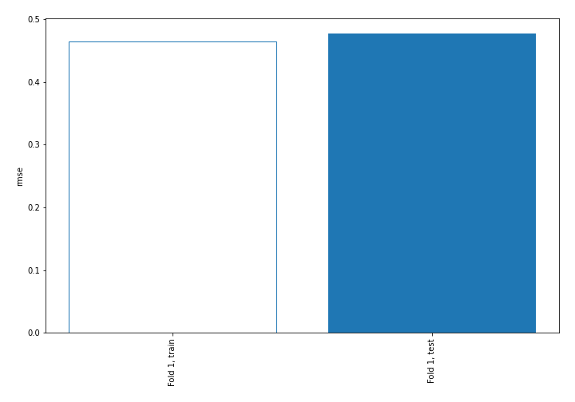
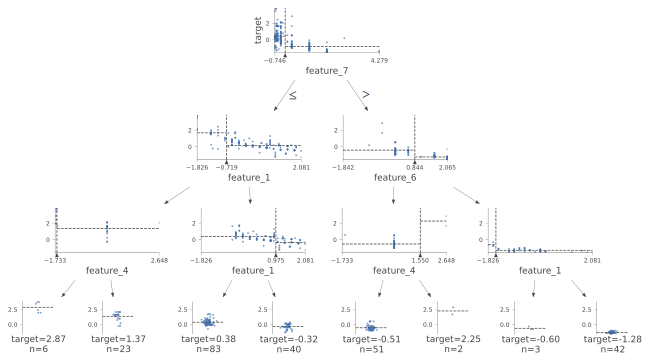
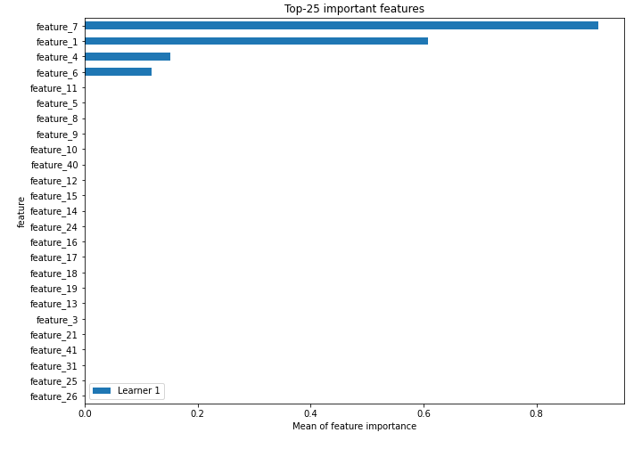
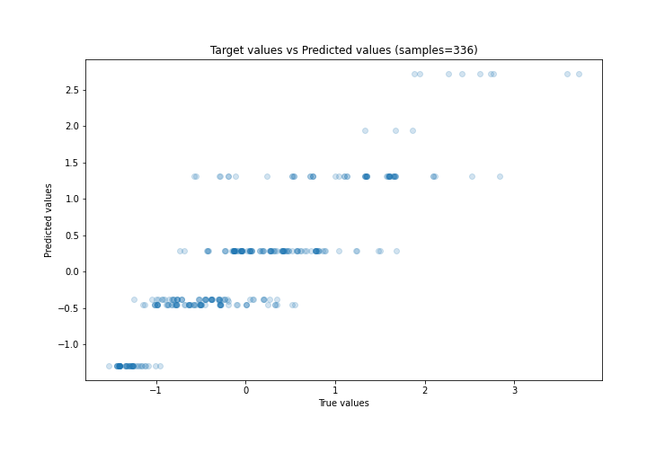
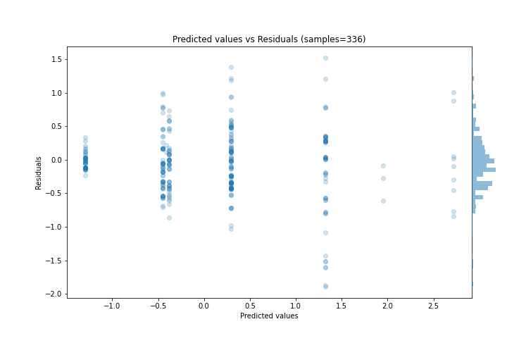
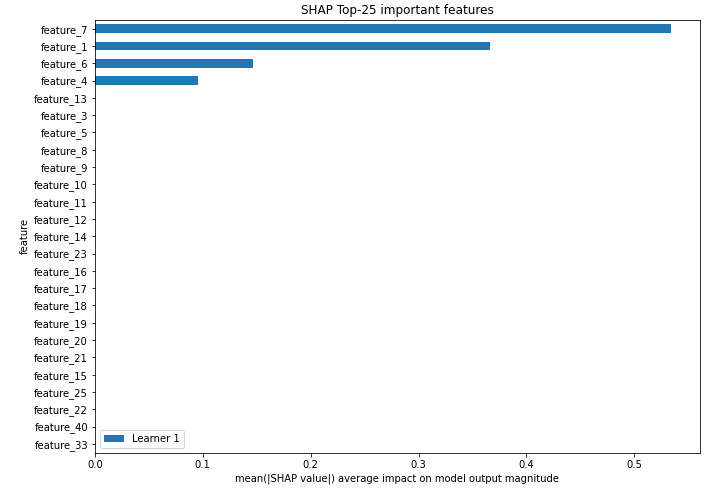
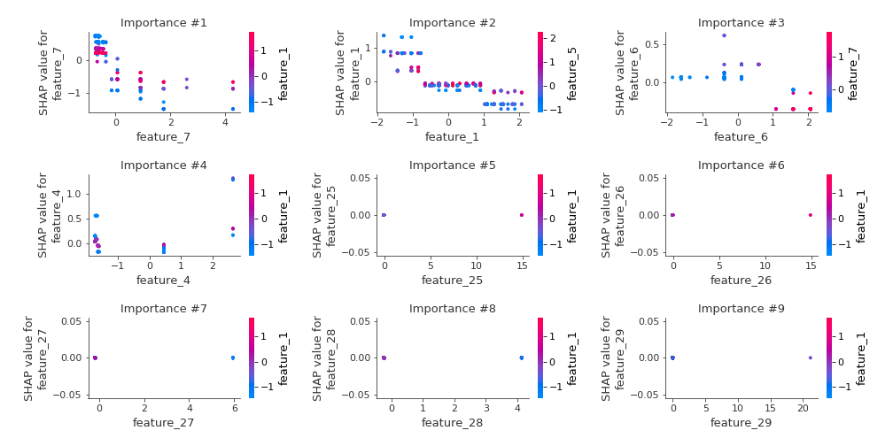
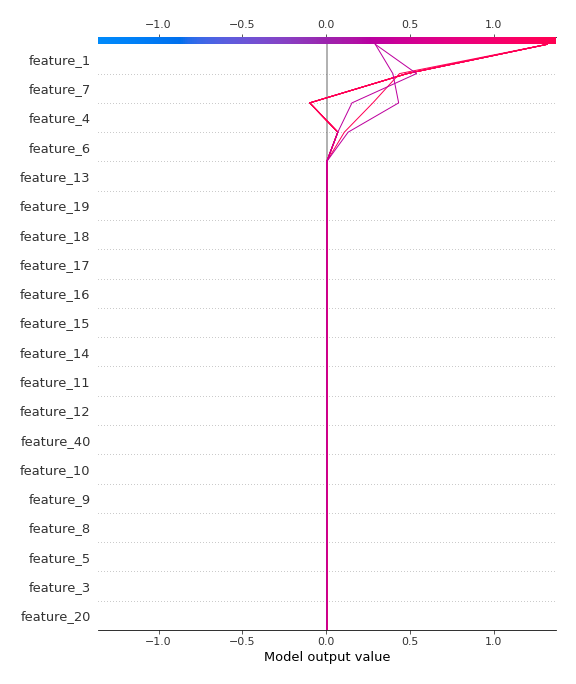
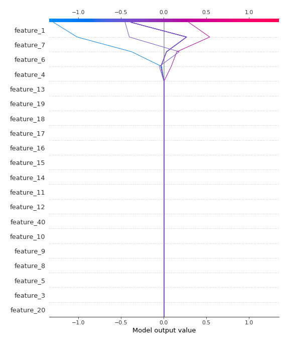

# Summary of 2_DecisionTree

[<< Go back](../README.md)

## Decision Tree
- **n_jobs**: -1
- **criterion**: mse
- **max_depth**: 3
- **explain_level**: 2

## Validation
 - **validation_type**: split
 - **train_ratio**: 0.75
 - **shuffle**: True

## Optimized metric
rmse

## Training time

8.0 seconds

### Metric details:
| Metric   |    Score |
|:---------|---------:|
| MAE      | 0.345939 |
| MSE      | 0.227633 |
| RMSE     | 0.477109 |
| R2       | 0.771737 |
| MAPE     | 1.90877  |

## Learning curves

## Decision Tree 

### Tree #1

### Rules

if (feature_7 <= -0.246) and (feature_1 > -0.719) and (feature_1 <= 0.975) then response: 0.293 | based on 345 samples

if (feature_7 > -0.246) and (feature_6 <= 0.844) and (feature_4 <= 1.55) then response: -0.451 | based on 225 samples

if (feature_7 > -0.246) and (feature_6 > 0.844) and (feature_1 > -1.533) then response: -1.29 | based on 146 samples

if (feature_7 <= -0.246) and (feature_1 > -0.719) and (feature_1 > 0.975) then response: -0.382 | based on 132 samples

if (feature_7 <= -0.246) and (feature_1 <= -0.719) and (feature_4 > -1.655) then response: 1.319 | based on 113 samples

if (feature_7 <= -0.246) and (feature_1 <= -0.719) and (feature_4 <= -1.655) then response: 2.718 | based on 31 samples

if (feature_7 > -0.246) and (feature_6 > 0.844) and (feature_1 <= -1.533) then response: -0.409 | based on 9 samples

if (feature_7 > -0.246) and (feature_6 <= 0.844) and (feature_4 > 1.55) then response: 1.948 | based on 7 samples

## Permutation-based Importance

## True vs Predicted

## Predicted vs Residuals

## SHAP Importance

## SHAP Dependence plots

### Dependence (Fold 1)

## SHAP Decision plots

### Top-10 Worst decisions (Fold 1)

### Top-10 Best decisions (Fold 1)

[<< Go back](../README.md)
