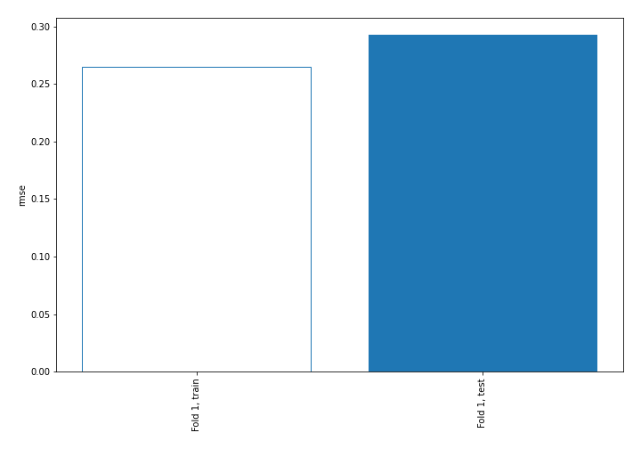
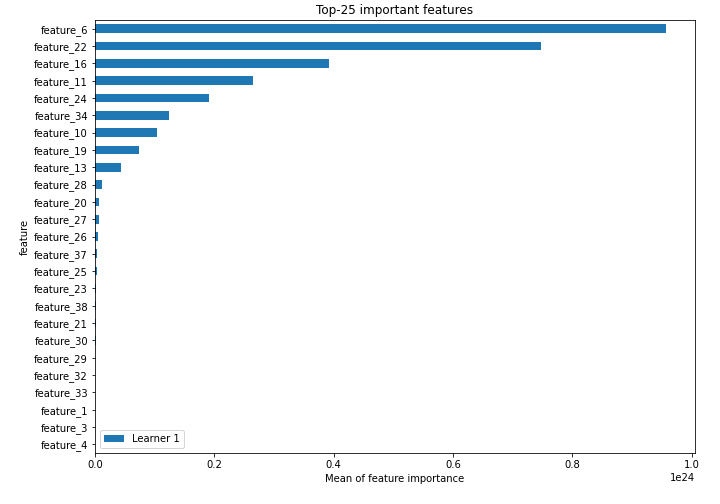
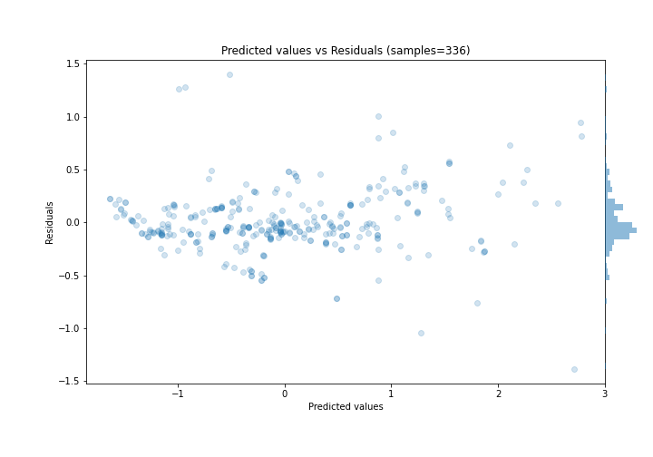
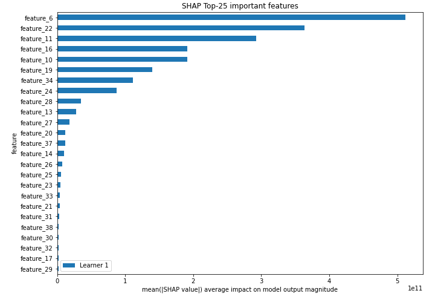
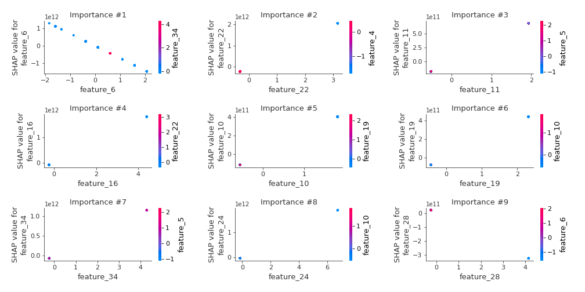
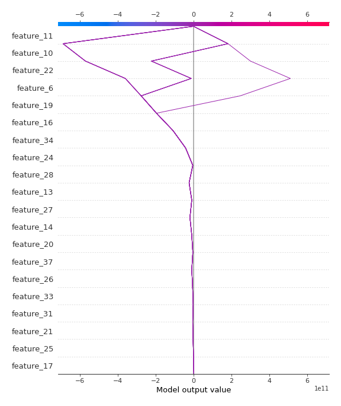
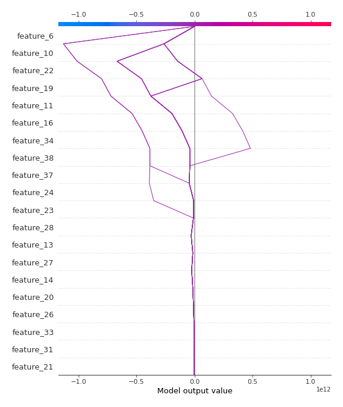

# Summary of 3_Linear

[<< Go back](../README.md)

## Linear Regression (Linear)
- **n_jobs**: -1
- **explain_level**: 2

## Validation
 - **validation_type**: split
 - **train_ratio**: 0.75
 - **shuffle**: True

## Optimized metric
rmse

## Training time

6.6 seconds

### Metric details:
| Metric   |     Score |
|:---------|----------:|
| MAE      | 0.197746  |
| MSE      | 0.0857712 |
| RMSE     | 0.292867  |
| R2       | 0.913991  |
| MAPE     | 0.984831  |

## Learning curves

## Coefficients
| feature    |    Learner_1 |
|:-----------|-------------:|
| feature_22 |  6.49034e+11 |
| feature_16 |  4.13323e+11 |
| feature_11 |  3.55465e+11 |
| feature_24 |  2.77916e+11 |
| feature_34 |  2.68621e+11 |
| feature_10 |  2.21043e+11 |
| feature_19 |  1.90253e+11 |
| feature_13 |  1.47213e+11 |
| feature_14 |  1.16447e+11 |
| feature_26 |  5.80482e+10 |
| feature_20 |  5.49394e+10 |
| feature_17 |  5.21543e+10 |
| feature_35 |  3.79483e+10 |
| feature_25 |  3.48642e+10 |
| feature_21 |  3.18384e+10 |
| feature_12 |  2.37423e+10 |
| feature_15 |  2.37423e+10 |
| feature_33 |  2.06839e+10 |
| feature_38 |  2.01589e+10 |
| feature_39 |  1.42598e+10 |
| feature_40 |  1.07458e+10 |
| feature_3  |  0.245675    |
| feature_4  |  0.224       |
| feature_7  |  0.161155    |
| intercept  | -0.00212135  |
| feature_5  | -0.0270182   |
| feature_41 | -0.18596     |
| feature_1  | -0.494439    |
| feature_18 | -4.66966e+09 |
| feature_8  | -9.39315e+09 |
| feature_36 | -1.31733e+10 |
| feature_32 | -1.31733e+10 |
| feature_29 | -1.62573e+10 |
| feature_30 | -2.00067e+10 |
| feature_23 | -2.64985e+10 |
| feature_31 | -3.1598e+10  |
| feature_9  | -3.30816e+10 |
| feature_37 | -4.3712e+10  |
| feature_27 | -5.63653e+10 |
| feature_28 | -7.85762e+10 |
| feature_6  | -7.11065e+11 |

## Permutation-based Importance

## True vs Predicted

## Predicted vs Residuals

## SHAP Importance

## SHAP Dependence plots

### Dependence (Fold 1)

## SHAP Decision plots

### Top-10 Worst decisions (Fold 1)

### Top-10 Best decisions (Fold 1)

[<< Go back](../README.md)
