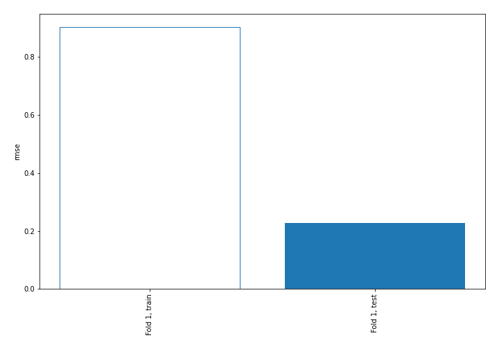
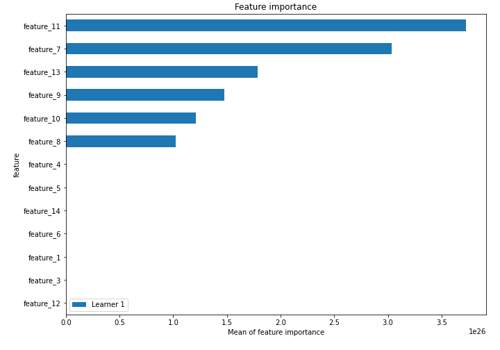
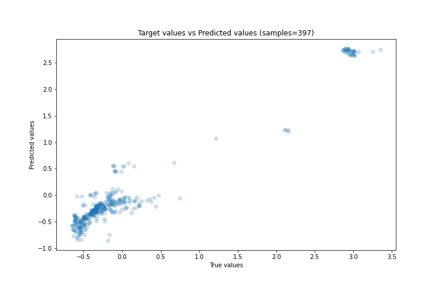
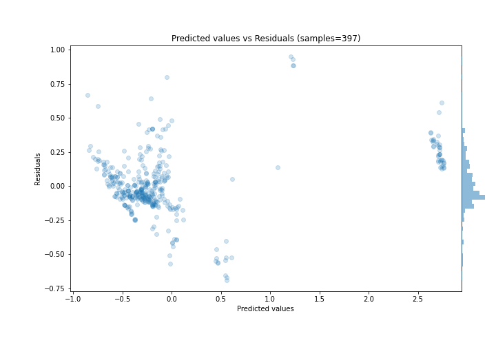
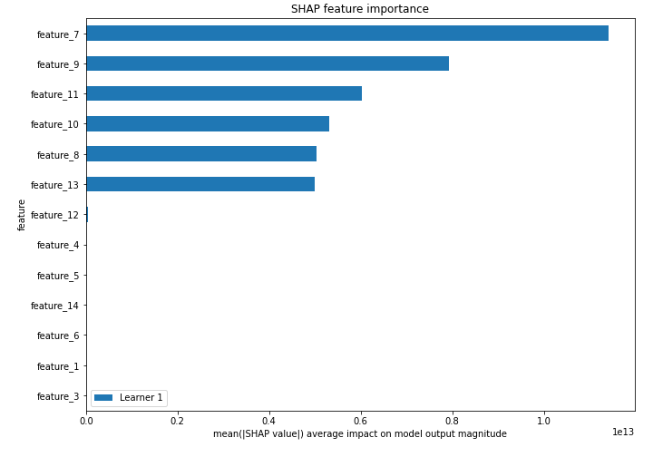
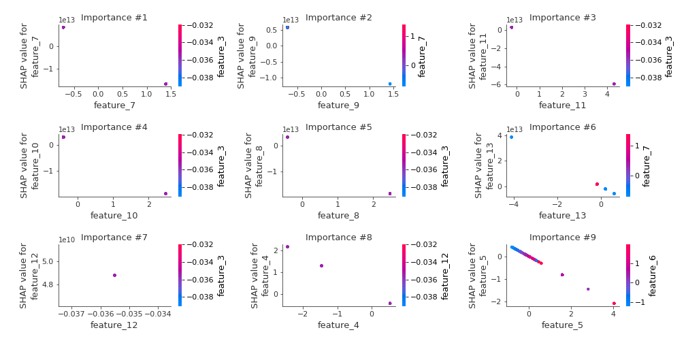
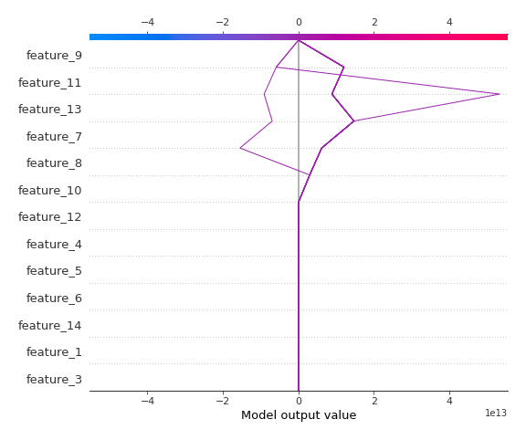
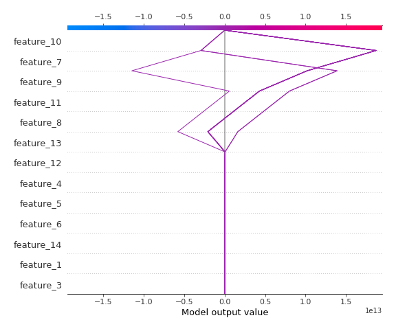

# Summary of 3_Linear

[<< Go back](../README.md)

## Linear Regression (Linear)
- **n_jobs**: -1
- **explain_level**: 2

## Validation
 - **validation_type**: split
 - **train_ratio**: 0.75
 - **shuffle**: True

## Optimized metric
rmse

## Training time

2.8 seconds

### Metric details:
| Metric   |     Score |
|:---------|----------:|
| MAE      | 0.159377  |
| MSE      | 0.0519908 |
| RMSE     | 0.228015  |
| R2       | 0.950405  |
| MAPE     | 1.3857    |

## Learning curves

## Coefficients
| feature    |    Learner_1 |
|:-----------|-------------:|
| intercept  |  0.0201257   |
| feature_1  | -0.0381852   |
| feature_3  | -0.0524768   |
| feature_6  | -0.0881975   |
| feature_14 | -0.114492    |
| feature_5  | -0.51785     |
| feature_4  | -0.867285    |
| feature_12 | -1.03071e+12 |
| feature_10 | -7.49552e+12 |
| feature_8  | -7.52385e+12 |
| feature_9  | -8.42994e+12 |
| feature_13 | -9.45809e+12 |
| feature_7  | -1.2011e+13  |
| feature_11 | -1.3731e+13  |

## Permutation-based Importance

## True vs Predicted

## Predicted vs Residuals

## SHAP Importance

## SHAP Dependence plots

### Dependence (Fold 1)

## SHAP Decision plots

### Top-10 Worst decisions (Fold 1)

### Top-10 Best decisions (Fold 1)

[<< Go back](../README.md)
