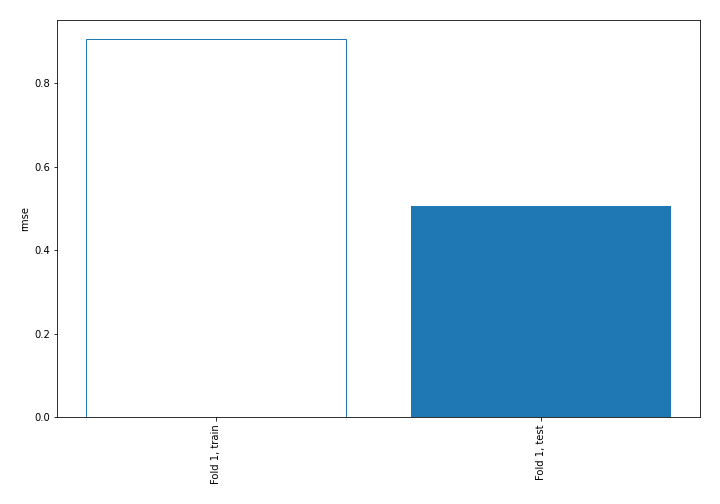
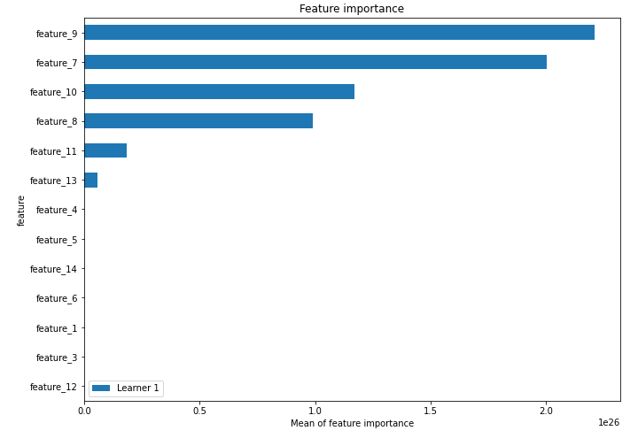
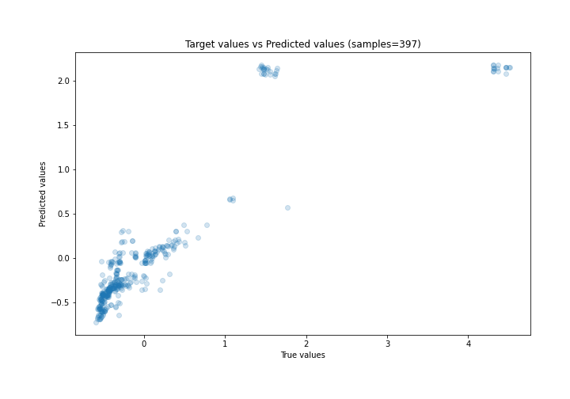
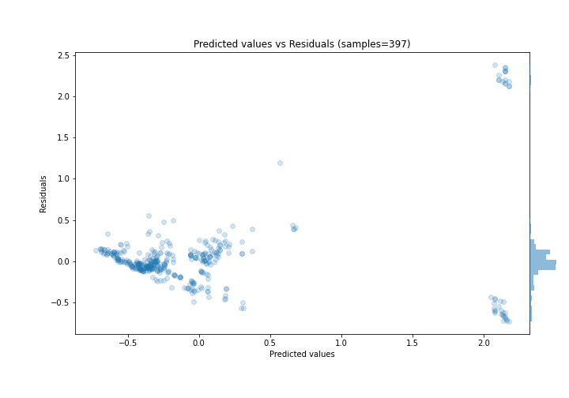
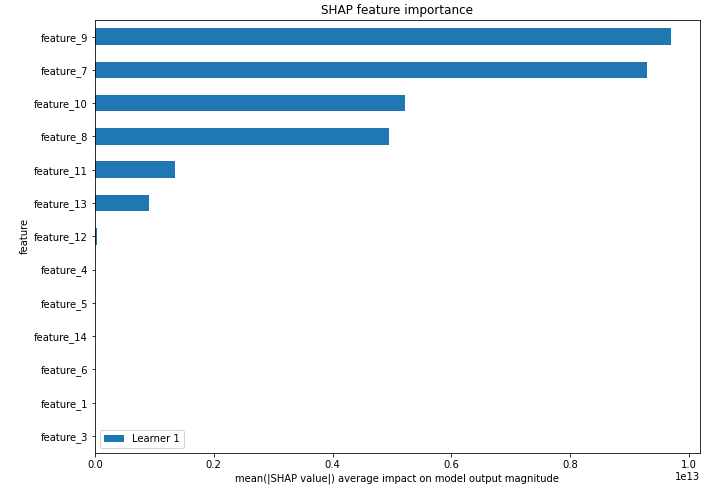
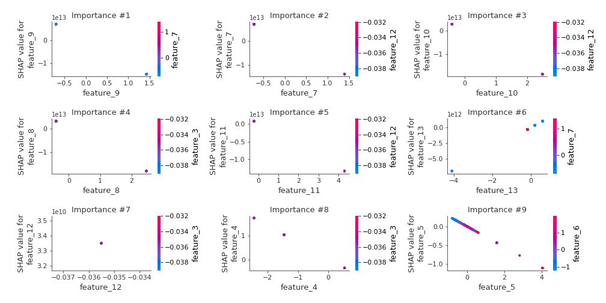
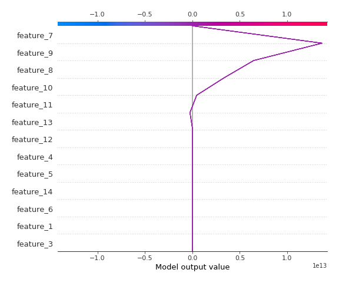
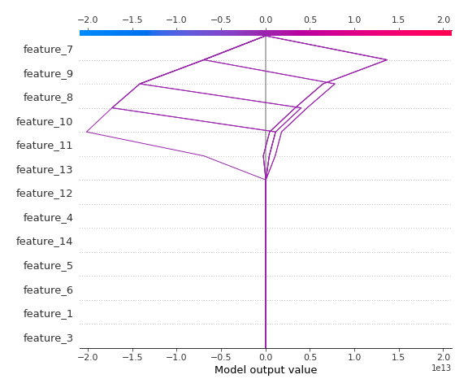

# Summary of 3_Linear

[<< Go back](../README.md)

## Linear Regression (Linear)
- **n_jobs**: -1
- **explain_level**: 2

## Validation
 - **validation_type**: split
 - **train_ratio**: 0.75
 - **shuffle**: True

## Optimized metric
rmse

## Training time

3.2 seconds

### Metric details:
| Metric   |    Score |
|:---------|---------:|
| MAE      | 0.241375 |
| MSE      | 0.254895 |
| RMSE     | 0.504871 |
| R2       | 0.758893 |
| MAPE     | 1.08399  |

## Learning curves

## Coefficients
| feature    |    Learner_1 |
|:-----------|-------------:|
| feature_13 |  1.70872e+12 |
| intercept  |  0.0130396   |
| feature_3  | -0.0210053   |
| feature_1  | -0.0581856   |
| feature_6  | -0.111818    |
| feature_14 | -0.176693    |
| feature_5  | -0.27626     |
| feature_4  | -0.70209     |
| feature_12 | -7.07597e+11 |
| feature_11 | -3.06401e+12 |
| feature_10 | -7.36868e+12 |
| feature_8  | -7.39653e+12 |
| feature_7  | -9.76334e+12 |
| feature_9  | -1.03154e+13 |

## Permutation-based Importance

## True vs Predicted

## Predicted vs Residuals

## SHAP Importance

## SHAP Dependence plots

### Dependence (Fold 1)

## SHAP Decision plots

### Top-10 Worst decisions (Fold 1)

### Top-10 Best decisions (Fold 1)

[<< Go back](../README.md)
