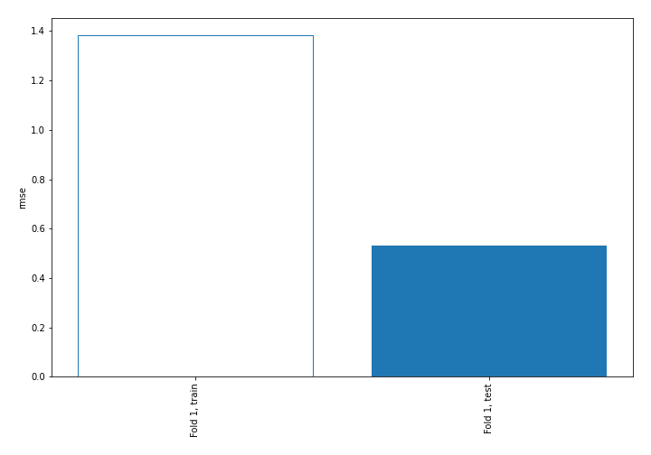
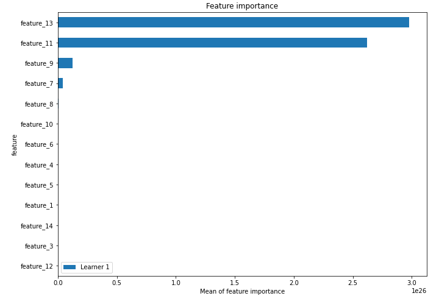
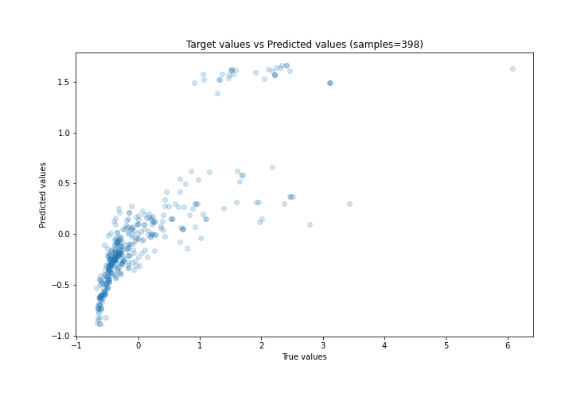
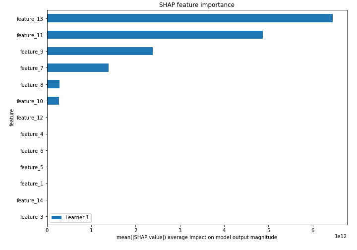
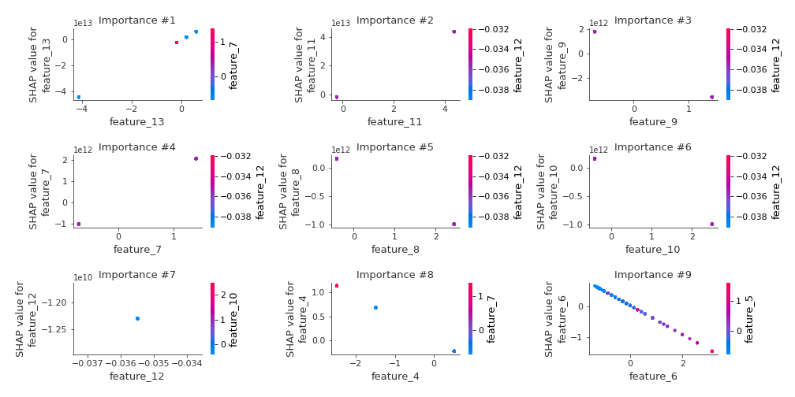
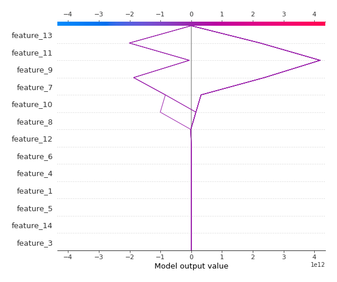
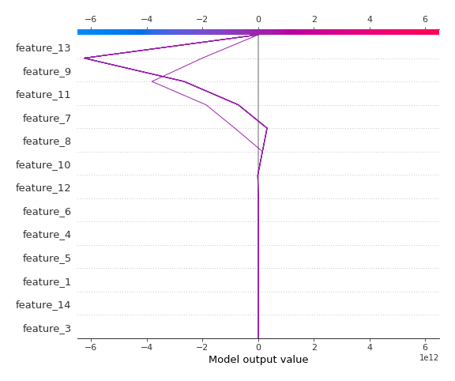

# Summary of 3_Linear

[<< Go back](../README.md)

## Linear Regression (Linear)
- **n_jobs**: -1
- **explain_level**: 2

## Validation
 - **validation_type**: split
 - **train_ratio**: 0.75
 - **shuffle**: True

## Optimized metric
rmse

## Training time

3.5 seconds

### Metric details:
| Metric   |    Score |
|:---------|---------:|
| MAE      | 0.284571 |
| MSE      | 0.283389 |
| RMSE     | 0.532343 |
| R2       | 0.632824 |
| MAPE     | 1.62982  |

## Learning curves

## Coefficients
| feature    |    Learner_1 |
|:-----------|-------------:|
| feature_13 |  1.07187e+13 |
| feature_11 |  9.89164e+12 |
| feature_7  |  1.46026e+12 |
| feature_12 |  2.59612e+11 |
| intercept  |  0.0208267   |
| feature_3  | -0.0251049   |
| feature_14 | -0.0571698   |
| feature_1  | -0.0792339   |
| feature_5  | -0.117039    |
| feature_4  | -0.454796    |
| feature_6  | -0.471197    |
| feature_10 | -3.99248e+11 |
| feature_8  | -4.05286e+11 |
| feature_9  | -2.54537e+12 |

## Permutation-based Importance

## True vs Predicted

## Predicted vs Residuals

## SHAP Importance

## SHAP Dependence plots

### Dependence (Fold 1)

## SHAP Decision plots

### Top-10 Worst decisions (Fold 1)

### Top-10 Best decisions (Fold 1)

[<< Go back](../README.md)
