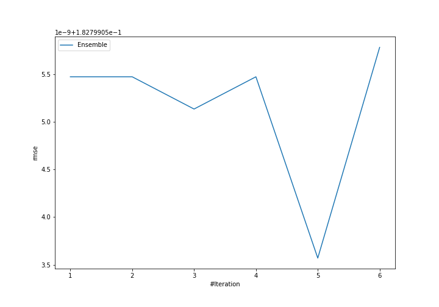
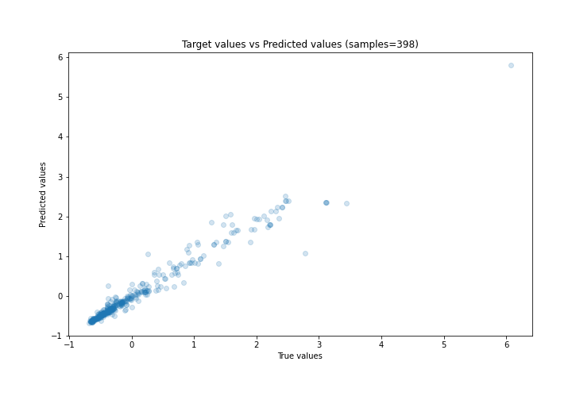
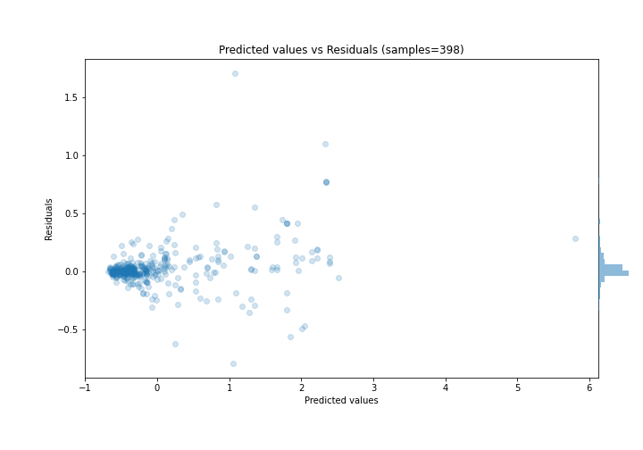

# Summary of Ensemble

[<< Go back](../README.md)

## Ensemble structure
| Model             |   Weight |
|:------------------|---------:|
| 4_Default_Xgboost |        5 |

### Metric details:
| Metric   |     Score |
|:---------|----------:|
| MAE      | 0.0911903 |
| MSE      | 0.0334155 |
| RMSE     | 0.182799  |
| R2       | 0.956705  |
| MAPE     | 1.87697   |

## Learning curves

## True vs Predicted

## Predicted vs Residuals

[<< Go back](../README.md)
