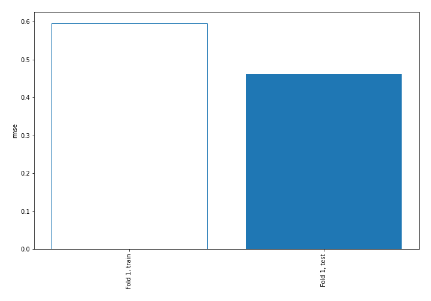
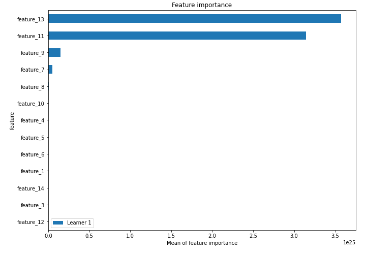
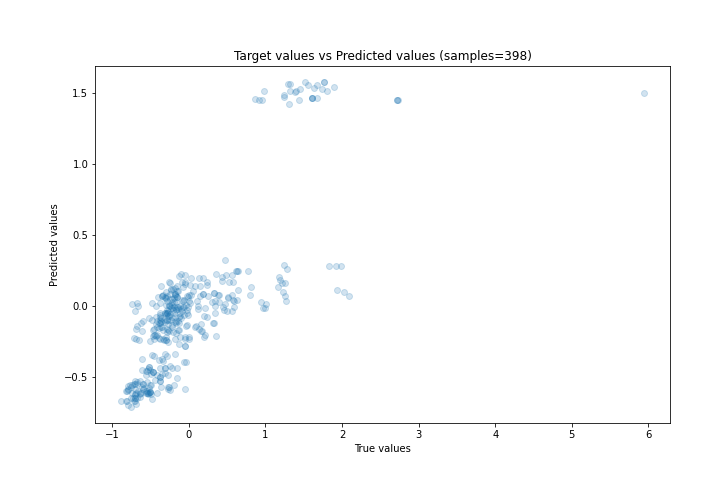
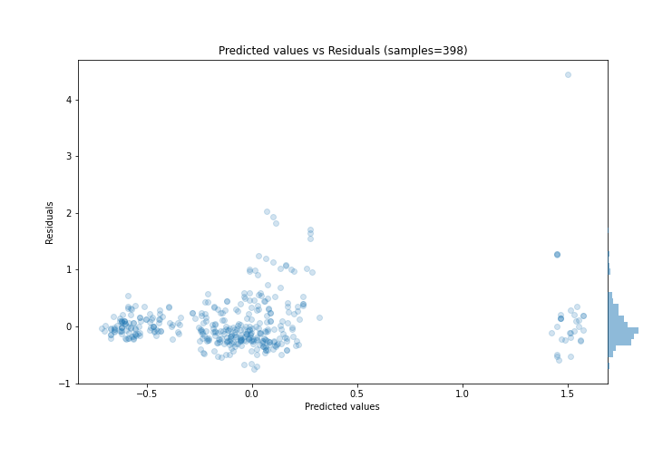
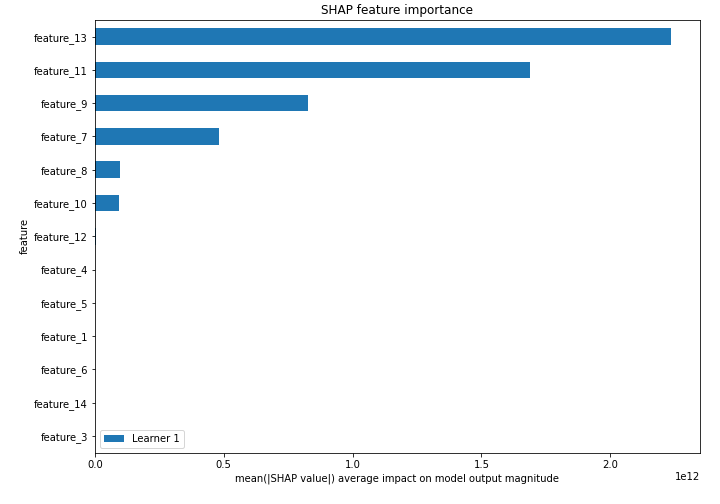
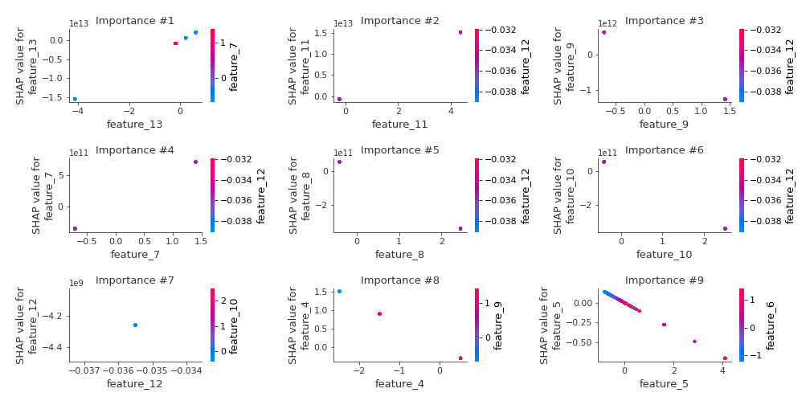
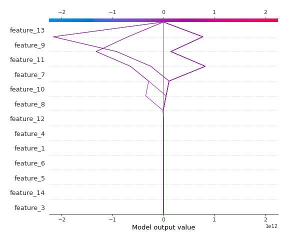

# Summary of 3_Linear

[<< Go back](../README.md)

## Linear Regression (Linear)
- **n_jobs**: -1
- **explain_level**: 2

## Validation
 - **validation_type**: split
 - **train_ratio**: 0.75
 - **shuffle**: True

## Optimized metric
rmse

## Training time

3.7 seconds

### Metric details:
| Metric   |    Score |
|:---------|---------:|
| MAE      | 0.283749 |
| MSE      | 0.2137   |
| RMSE     | 0.462277 |
| R2       | 0.610974 |
| MAPE     | 1.67871  |

## Learning curves

## Coefficients
| feature    |    Learner_1 |
|:-----------|-------------:|
| feature_13 |  3.71291e+12 |
| feature_11 |  3.42641e+12 |
| feature_7  |  5.05827e+11 |
| feature_12 |  8.99284e+10 |
| feature_14 |  0.0972345   |
| feature_3  |  0.0259003   |
| intercept  |  0.0103621   |
| feature_1  | -0.110639    |
| feature_6  | -0.114464    |
| feature_5  | -0.172252    |
| feature_4  | -0.594208    |
| feature_10 | -1.38297e+11 |
| feature_8  | -1.40389e+11 |
| feature_9  | -8.81704e+11 |

## Permutation-based Importance

## True vs Predicted

## Predicted vs Residuals

## SHAP Importance

## SHAP Dependence plots

### Dependence (Fold 1)

## SHAP Decision plots

### Top-10 Worst decisions (Fold 1)

### Top-10 Best decisions (Fold 1)

[<< Go back](../README.md)
