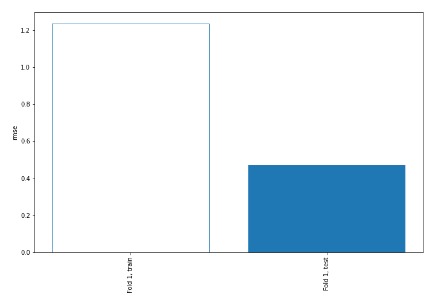
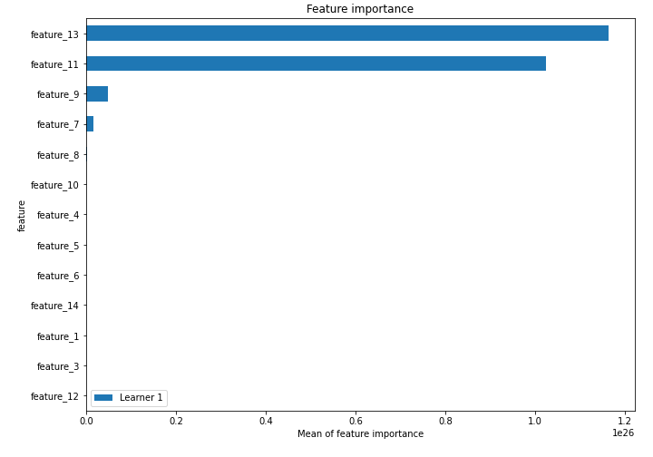
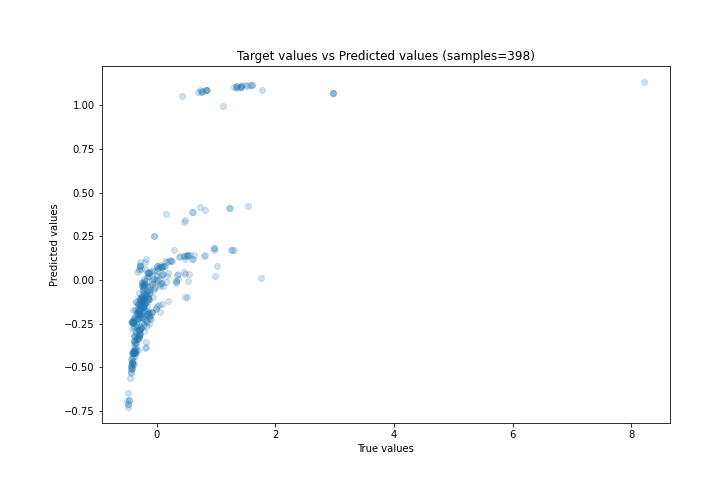
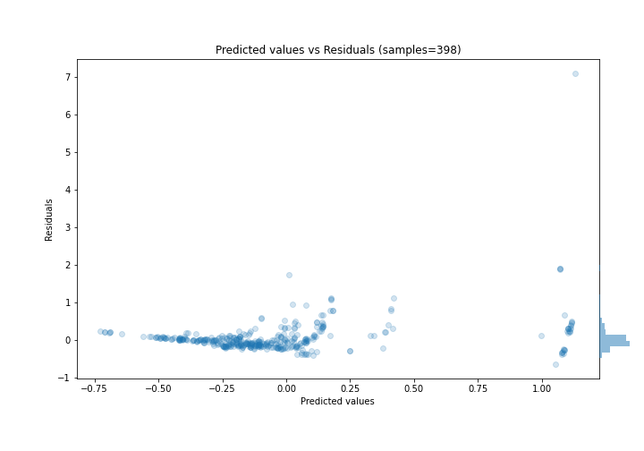
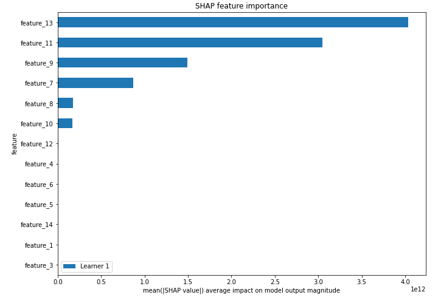
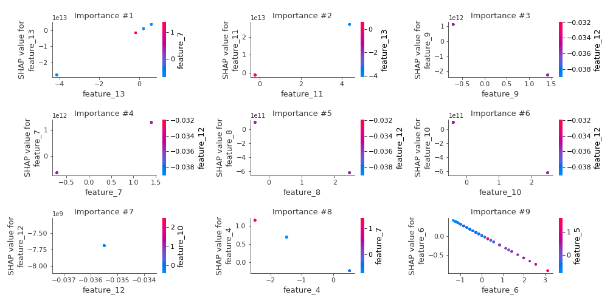
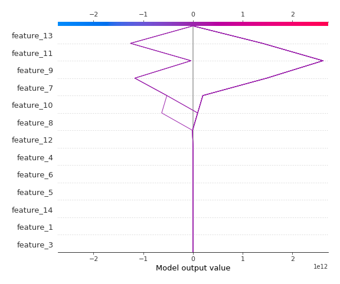
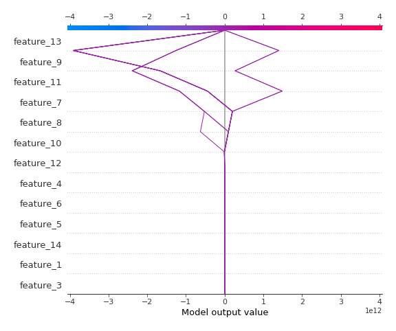

# Summary of 3_Linear

[<< Go back](../README.md)

## Linear Regression (Linear)
- **n_jobs**: -1
- **explain_level**: 2

## Validation
 - **validation_type**: split
 - **train_ratio**: 0.75
 - **shuffle**: True

## Optimized metric
rmse

## Training time

5.0 seconds

### Metric details:
| Metric   |    Score |
|:---------|---------:|
| MAE      | 0.20306  |
| MSE      | 0.22208  |
| RMSE     | 0.471253 |
| R2       | 0.527137 |
| MAPE     | 0.845656 |

## Learning curves

## Coefficients
| feature    |    Learner_1 |
|:-----------|-------------:|
| feature_13 |  6.70209e+12 |
| feature_11 |  6.18495e+12 |
| feature_7  |  9.13058e+11 |
| feature_12 |  1.62328e+11 |
| intercept  |  0.0151686   |
| feature_3  | -0.0114396   |
| feature_1  | -0.0165006   |
| feature_14 | -0.0420048   |
| feature_6  | -0.294386    |
| feature_5  | -0.297365    |
| feature_4  | -0.458764    |
| feature_10 | -2.49638e+11 |
| feature_8  | -2.53414e+11 |
| feature_9  | -1.59155e+12 |

## Permutation-based Importance

## True vs Predicted

## Predicted vs Residuals

## SHAP Importance

## SHAP Dependence plots

### Dependence (Fold 1)

## SHAP Decision plots

### Top-10 Worst decisions (Fold 1)

### Top-10 Best decisions (Fold 1)

[<< Go back](../README.md)
