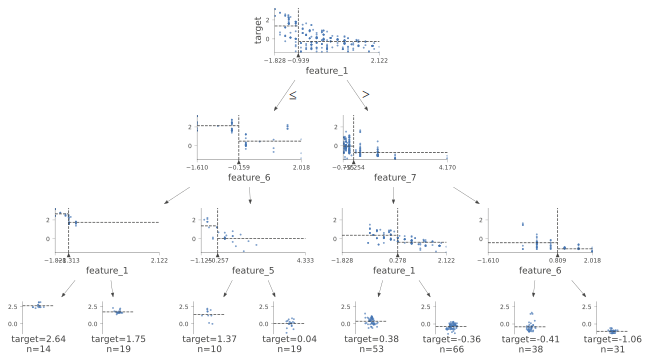
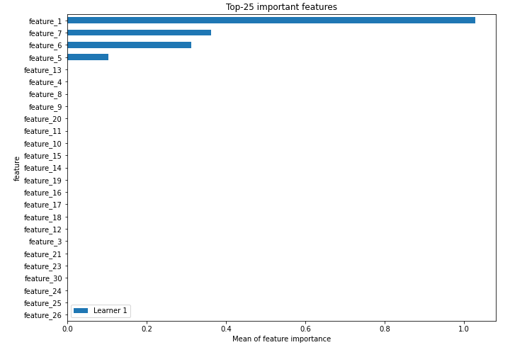
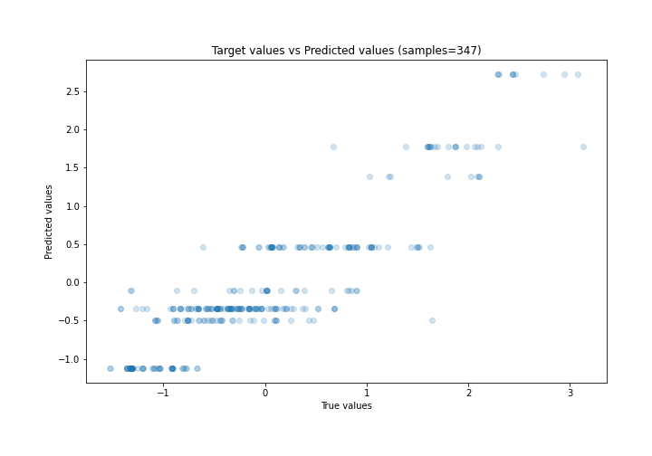
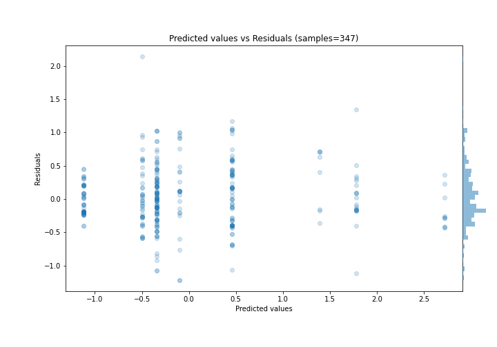
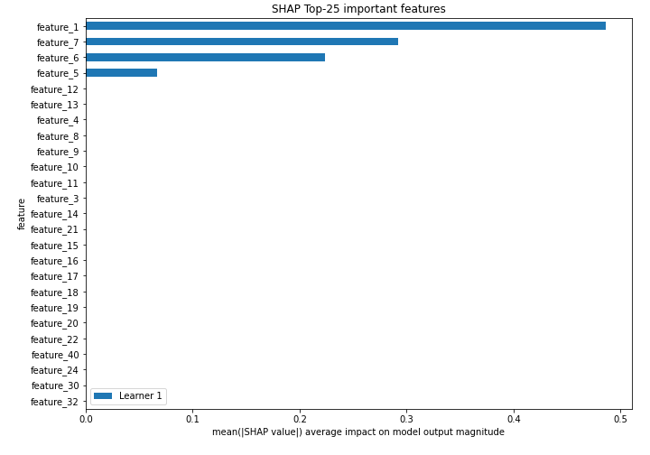
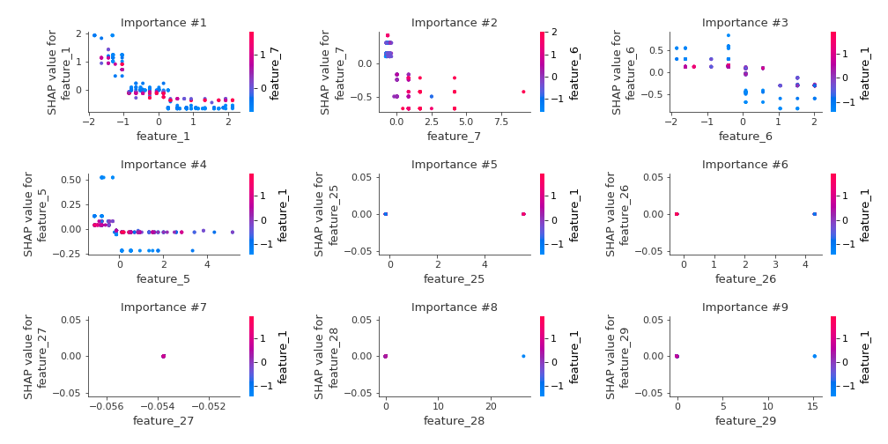
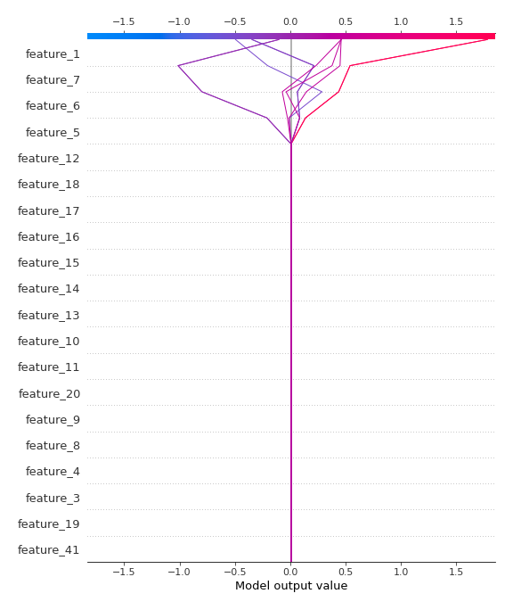
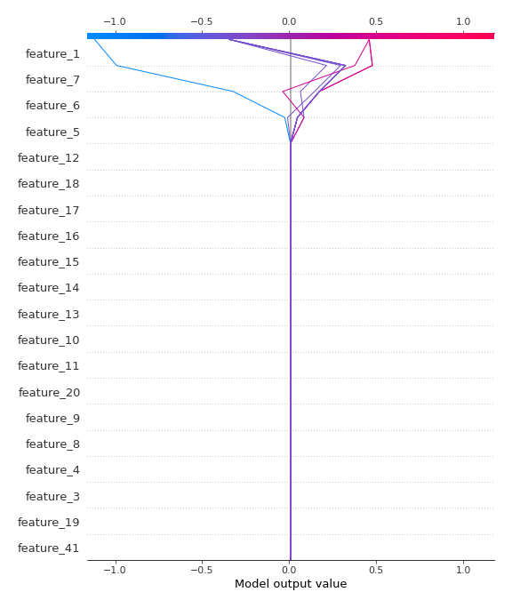

# Summary of 2_DecisionTree

[<< Go back](../README.md)

## Decision Tree
- **n_jobs**: -1
- **criterion**: mse
- **max_depth**: 3
- **explain_level**: 2

## Validation
 - **validation_type**: split
 - **train_ratio**: 0.75
 - **shuffle**: True

## Optimized metric
rmse

## Training time

7.7 seconds

### Metric details:
| Metric   |    Score |
|:---------|---------:|
| MAE      | 0.341044 |
| MSE      | 0.199759 |
| RMSE     | 0.446944 |
| R2       | 0.800501 |
| MAPE     | 1.36957  |

## Learning curves

## Decision Tree 

### Tree #1

### Rules

if (feature_1 > -0.939) and (feature_7 <= -0.254) and (feature_1 > 0.278) then response: -0.345 | based on 294 samples

if (feature_1 > -0.939) and (feature_7 <= -0.254) and (feature_1 <= 0.278) then response: 0.46 | based on 208 samples

if (feature_1 > -0.939) and (feature_7 > -0.254) and (feature_6 <= 0.809) then response: -0.494 | based on 159 samples

if (feature_1 > -0.939) and (feature_7 > -0.254) and (feature_6 > 0.809) then response: -1.118 | based on 152 samples

if (feature_1 <= -0.939) and (feature_6 > -0.159) and (feature_5 > -0.257) then response: -0.102 | based on 83 samples

if (feature_1 <= -0.939) and (feature_6 <= -0.159) and (feature_1 > -1.313) then response: 1.78 | based on 79 samples

if (feature_1 <= -0.939) and (feature_6 > -0.159) and (feature_5 <= -0.257) then response: 1.389 | based on 35 samples

if (feature_1 <= -0.939) and (feature_6 <= -0.159) and (feature_1 <= -1.313) then response: 2.719 | based on 30 samples

## Permutation-based Importance

## True vs Predicted

## Predicted vs Residuals

## SHAP Importance

## SHAP Dependence plots

### Dependence (Fold 1)

## SHAP Decision plots

### Top-10 Worst decisions (Fold 1)

### Top-10 Best decisions (Fold 1)

[<< Go back](../README.md)
