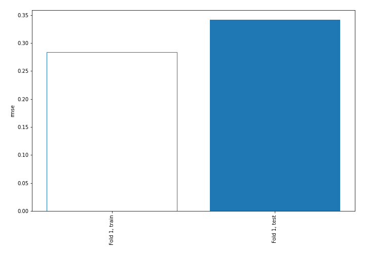
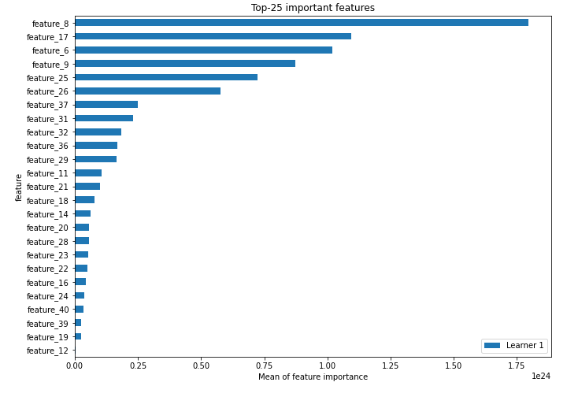
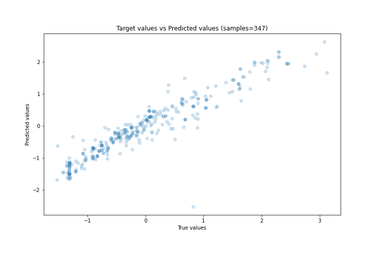
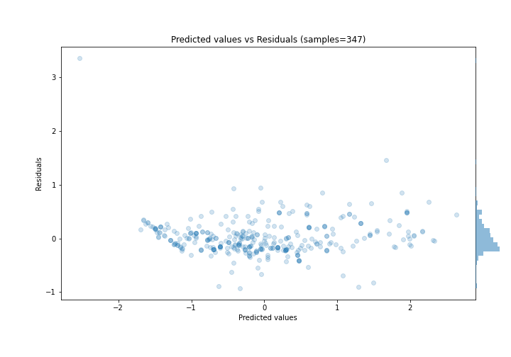
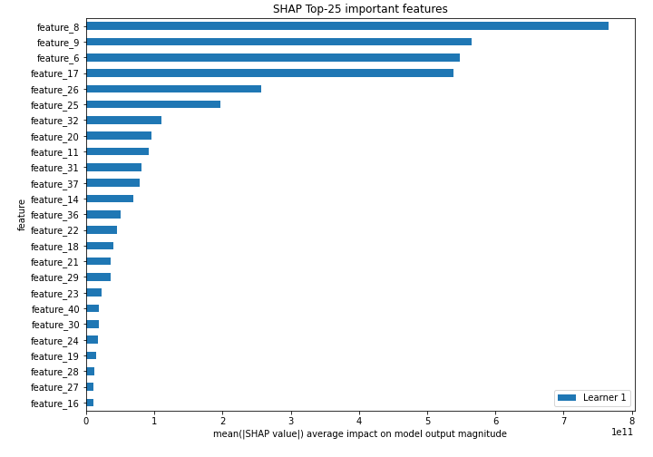
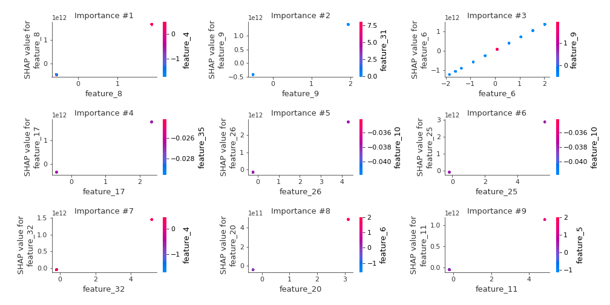
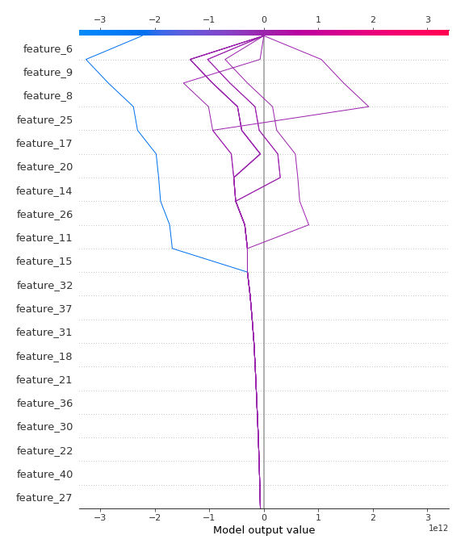
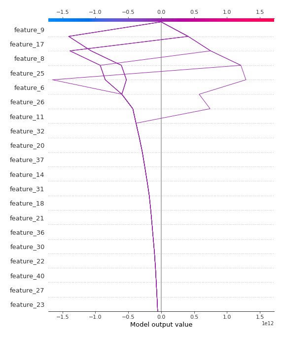

# Summary of 3_Linear

[<< Go back](../README.md)

## Linear Regression (Linear)
- **n_jobs**: -1
- **explain_level**: 2

## Validation
 - **validation_type**: split
 - **train_ratio**: 0.75
 - **shuffle**: True

## Optimized metric
rmse

## Training time

6.0 seconds

### Metric details:
| Metric   |    Score |
|:---------|---------:|
| MAE      | 0.223667 |
| MSE      | 0.116656 |
| RMSE     | 0.341549 |
| R2       | 0.883496 |
| MAPE     | 0.927131 |

## Learning curves

## Coefficients
| feature    |    Learner_1 |
|:-----------|-------------:|
| feature_8  |  8.91578e+11 |
| feature_17 |  7.70721e+11 |
| feature_9  |  7.37637e+11 |
| feature_6  |  6.63275e+11 |
| feature_26 |  6.4785e+11  |
| feature_25 |  5.03736e+11 |
| feature_37 |  3.32702e+11 |
| feature_31 |  3.00299e+11 |
| feature_32 |  2.7886e+11  |
| feature_36 |  2.46544e+11 |
| feature_21 |  2.36028e+11 |
| feature_11 |  2.33141e+11 |
| feature_18 |  2.13684e+11 |
| feature_29 |  2.03515e+11 |
| feature_30 |  1.9696e+11  |
| feature_14 |  1.70736e+11 |
| feature_40 |  1.61316e+11 |
| feature_27 |  1.57637e+11 |
| feature_20 |  1.54708e+11 |
| feature_23 |  1.51482e+11 |
| feature_19 |  1.28119e+11 |
| feature_22 |  1.26084e+11 |
| feature_24 |  1.19197e+11 |
| feature_28 |  1.17669e+11 |
| feature_16 |  1.0547e+11  |
| feature_38 |  9.9312e+10  |
| feature_39 |  8.11172e+10 |
| feature_35 |  7.8904e+10  |
| feature_10 |  6.8918e+10  |
| feature_13 |  6.8918e+10  |
| feature_12 |  5.59784e+10 |
| feature_33 |  2.28944e+10 |
| feature_7  |  0.346296    |
| feature_4  |  0.211587    |
| feature_3  |  0.189507    |
| feature_41 | -0.120958    |
| feature_5  | -0.256662    |
| feature_1  | -0.642703    |
| intercept  | -1.60875e+09 |
| feature_15 | -3.69979e+10 |

## Permutation-based Importance

## True vs Predicted

## Predicted vs Residuals

## SHAP Importance

## SHAP Dependence plots

### Dependence (Fold 1)

## SHAP Decision plots

### Top-10 Worst decisions (Fold 1)

### Top-10 Best decisions (Fold 1)

[<< Go back](../README.md)
