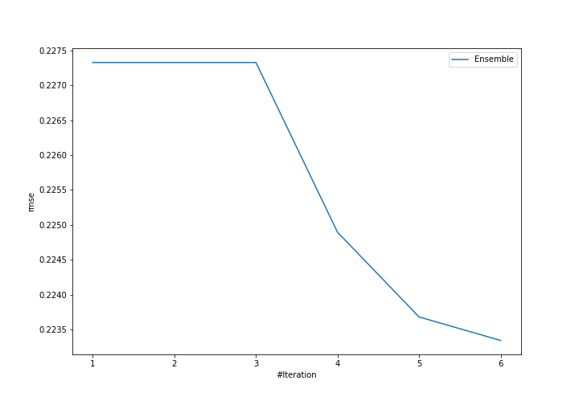
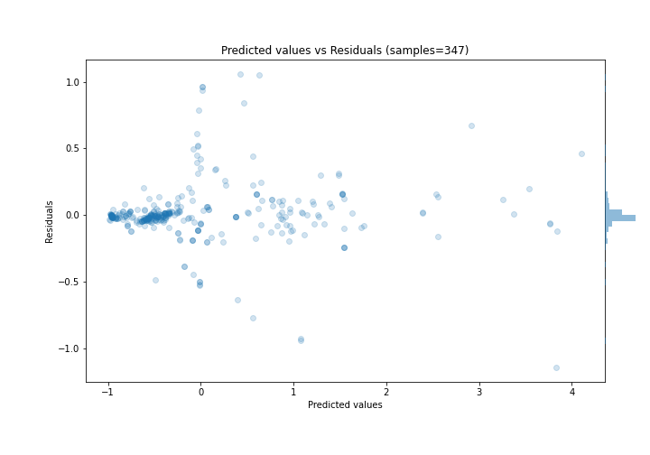

# Summary of Ensemble

[<< Go back](../README.md)

## Ensemble structure
| Model                  |   Weight |
|:-----------------------|---------:|
| 4_Default_Xgboost      |        5 |
| 6_Default_RandomForest |        1 |

### Metric details:
| Metric   |     Score |
|:---------|----------:|
| MAE      | 0.110654  |
| MSE      | 0.0498832 |
| RMSE     | 0.223345  |
| R2       | 0.948788  |
| MAPE     | 0.302473  |

## Learning curves

## True vs Predicted

## Predicted vs Residuals

[<< Go back](../README.md)
