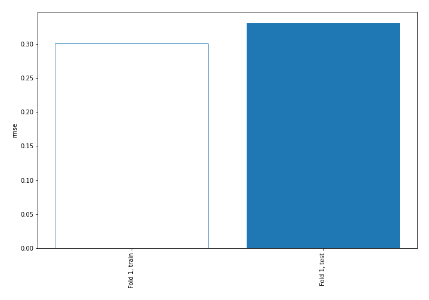
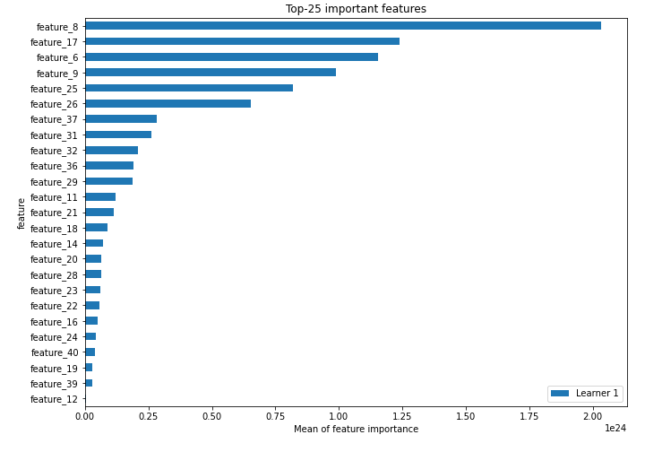
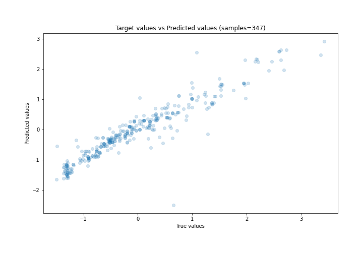
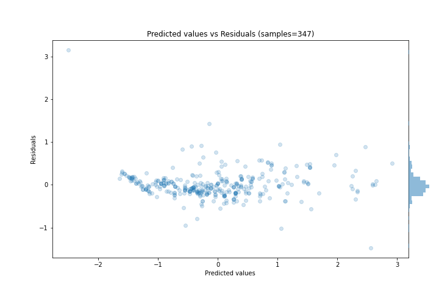
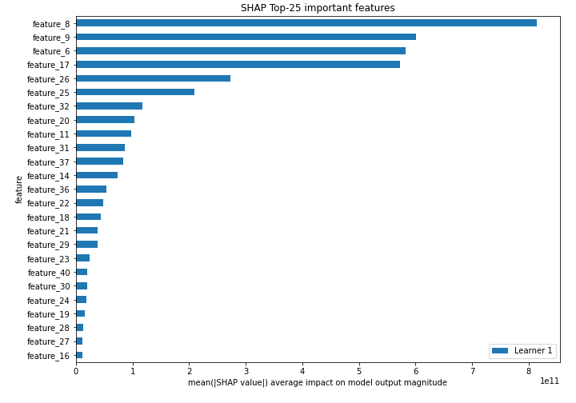
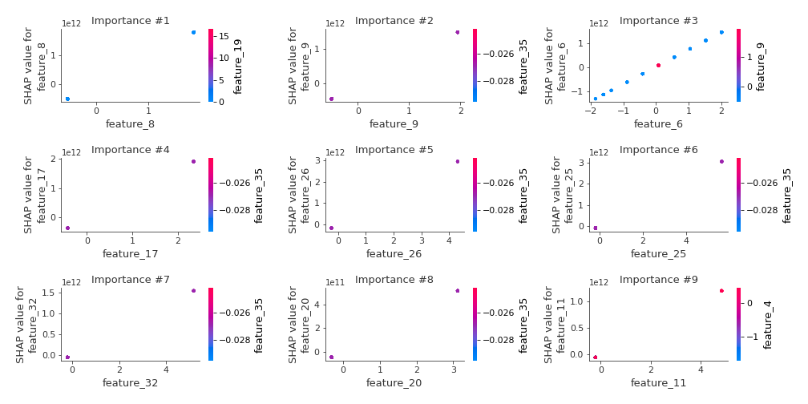
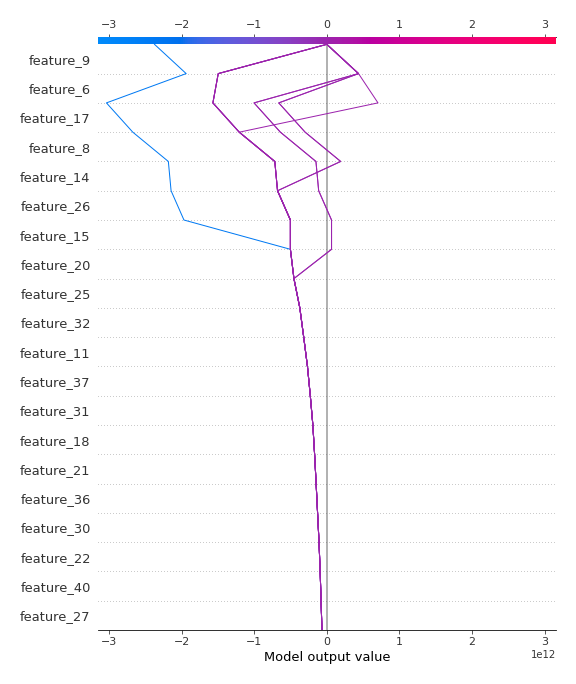
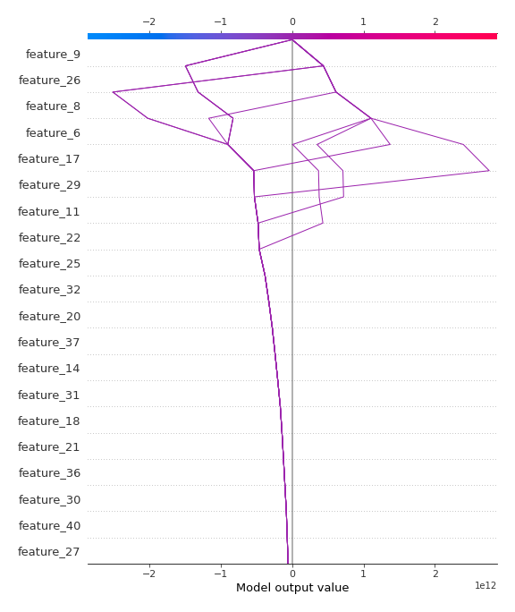

# Summary of 3_Linear

[<< Go back](../README.md)

## Linear Regression (Linear)
- **n_jobs**: -1
- **explain_level**: 2

## Validation
 - **validation_type**: split
 - **train_ratio**: 0.75
 - **shuffle**: True

## Optimized metric
rmse

## Training time

6.6 seconds

### Metric details:
| Metric   |    Score |
|:---------|---------:|
| MAE      | 0.205366 |
| MSE      | 0.10915  |
| RMSE     | 0.330379 |
| R2       | 0.886742 |
| MAPE     | 0.66348  |

## Learning curves

## Coefficients
| feature    |    Learner_1 |
|:-----------|-------------:|
| feature_8  |  9.48669e+11 |
| feature_17 |  8.20072e+11 |
| feature_9  |  7.8487e+11  |
| feature_6  |  7.05747e+11 |
| feature_26 |  6.89334e+11 |
| feature_25 |  5.35992e+11 |
| feature_37 |  3.54006e+11 |
| feature_31 |  3.19528e+11 |
| feature_32 |  2.96717e+11 |
| feature_36 |  2.62331e+11 |
| feature_21 |  2.51141e+11 |
| feature_11 |  2.4807e+11  |
| feature_18 |  2.27367e+11 |
| feature_29 |  2.16546e+11 |
| feature_30 |  2.09572e+11 |
| feature_14 |  1.81669e+11 |
| feature_40 |  1.71646e+11 |
| feature_27 |  1.67731e+11 |
| feature_20 |  1.64614e+11 |
| feature_23 |  1.61182e+11 |
| feature_19 |  1.36322e+11 |
| feature_22 |  1.34157e+11 |
| feature_24 |  1.26829e+11 |
| feature_28 |  1.25204e+11 |
| feature_16 |  1.12224e+11 |
| feature_38 |  1.05671e+11 |
| feature_39 |  8.63114e+10 |
| feature_35 |  8.39565e+10 |
| feature_10 |  7.3331e+10  |
| feature_13 |  7.3331e+10  |
| feature_12 |  5.95629e+10 |
| feature_33 |  2.43604e+10 |
| feature_7  |  0.352445    |
| feature_4  |  0.343745    |
| feature_3  |  0.295147    |
| feature_41 | -0.10084     |
| feature_5  | -0.282603    |
| feature_1  | -0.580406    |
| intercept  | -1.71177e+09 |
| feature_15 | -3.9367e+10  |

## Permutation-based Importance

## True vs Predicted

## Predicted vs Residuals

## SHAP Importance

## SHAP Dependence plots

### Dependence (Fold 1)

## SHAP Decision plots

### Top-10 Worst decisions (Fold 1)

### Top-10 Best decisions (Fold 1)

[<< Go back](../README.md)
