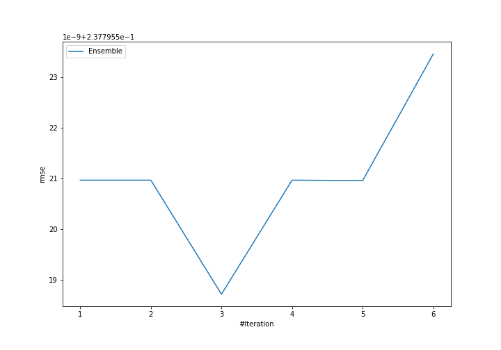
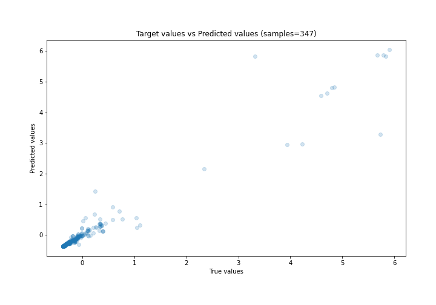
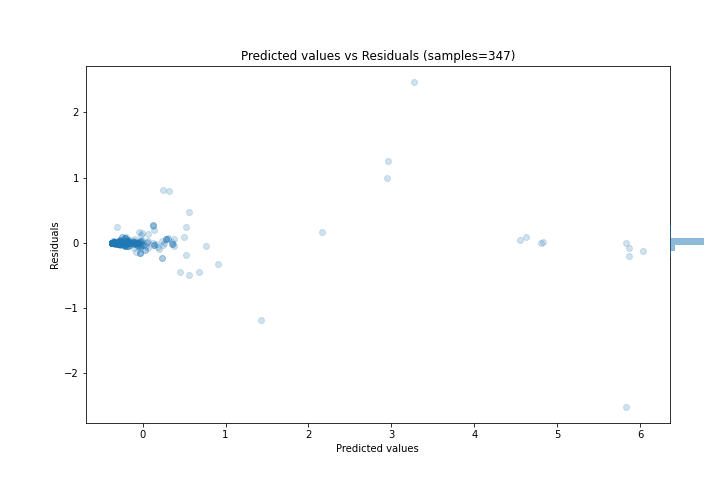

# Summary of Ensemble

[<< Go back](../README.md)

## Ensemble structure
| Model             |   Weight |
|:------------------|---------:|
| 4_Default_Xgboost |        3 |

### Metric details:
| Metric   |     Score |
|:---------|----------:|
| MAE      | 0.0611682 |
| MSE      | 0.0565467 |
| RMSE     | 0.237796  |
| R2       | 0.941906  |
| MAPE     | 0.899549  |

## Learning curves

## True vs Predicted

## Predicted vs Residuals

[<< Go back](../README.md)
