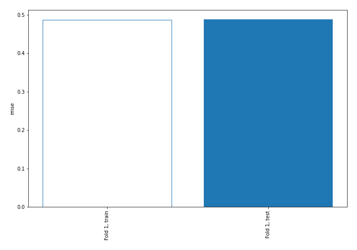
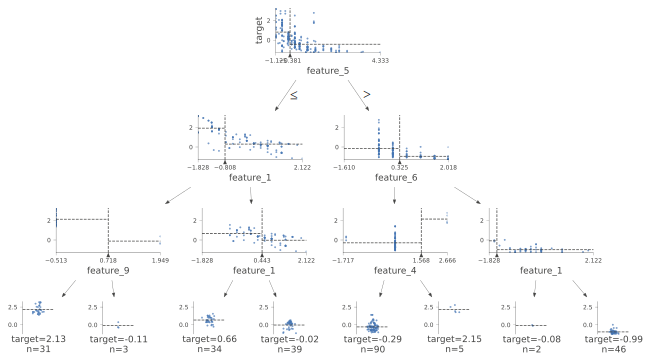
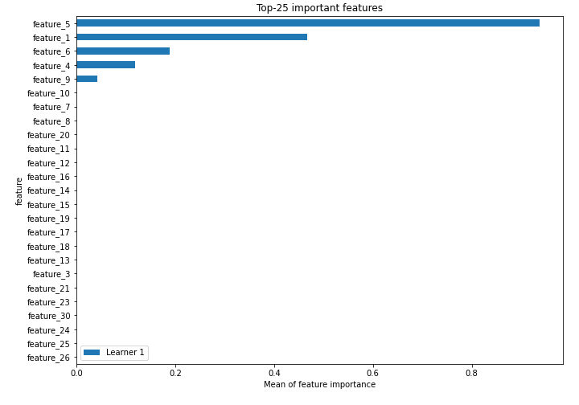
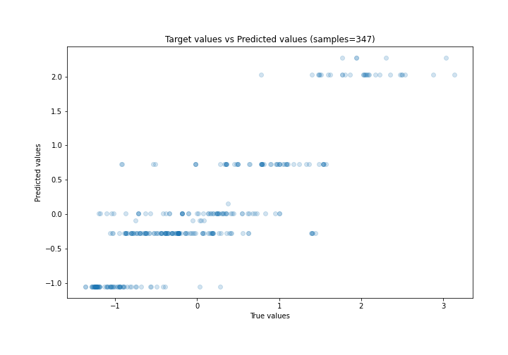
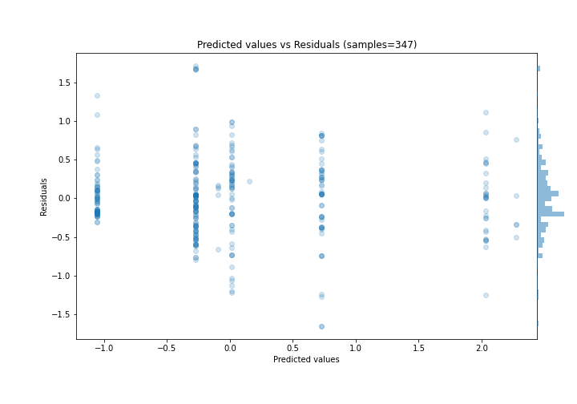
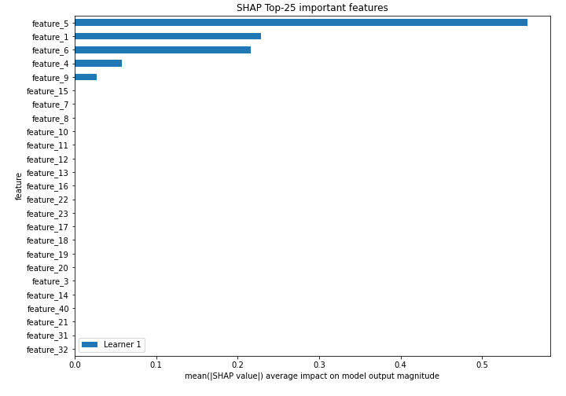
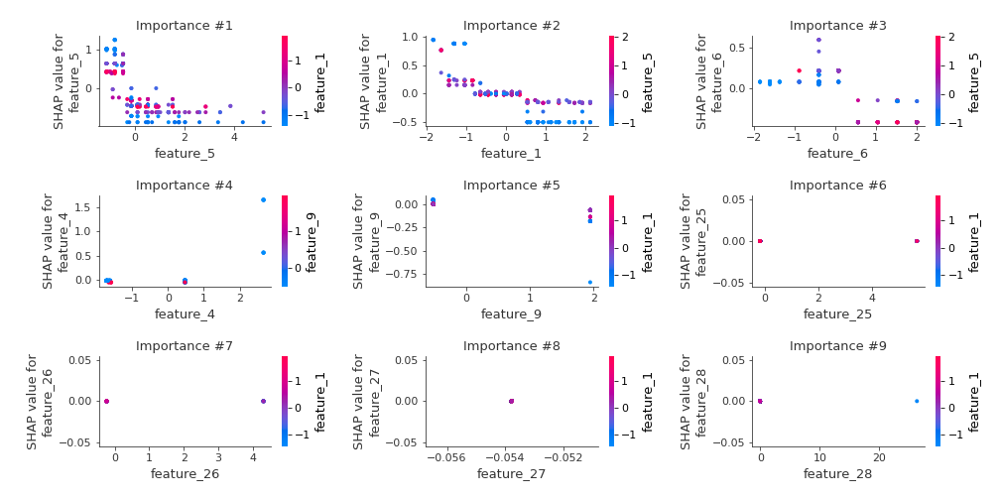
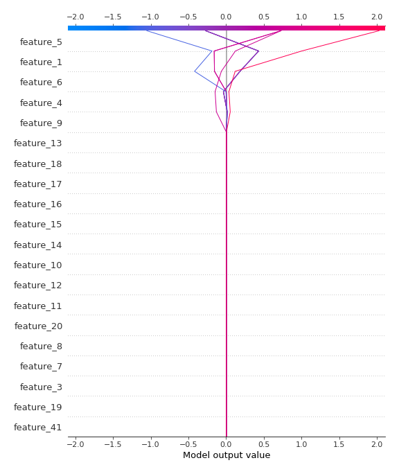
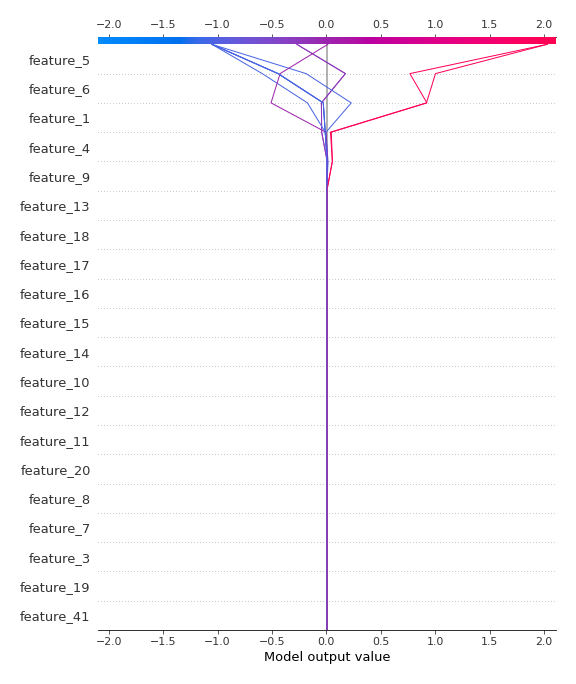

# Summary of 2_DecisionTree

[<< Go back](../README.md)

## Decision Tree
- **n_jobs**: -1
- **criterion**: mse
- **max_depth**: 3
- **explain_level**: 2

## Validation
 - **validation_type**: split
 - **train_ratio**: 0.75
 - **shuffle**: True

## Optimized metric
rmse

## Training time

8.4 seconds

### Metric details:
| Metric   |    Score |
|:---------|---------:|
| MAE      | 0.357734 |
| MSE      | 0.238169 |
| RMSE     | 0.488026 |
| R2       | 0.759287 |
| MAPE     | 1.20895  |

## Learning curves

## Decision Tree 

### Tree #1

### Rules

if (feature_5 > -0.381) and (feature_6 <= 0.325) and (feature_4 <= 1.568) then response: -0.272 | based on 391 samples

if (feature_5 > -0.381) and (feature_6 > 0.325) and (feature_1 > -1.532) then response: -1.052 | based on 206 samples

if (feature_5 <= -0.381) and (feature_1 > -0.808) and (feature_1 > 0.443) then response: 0.013 | based on 186 samples

if (feature_5 <= -0.381) and (feature_1 > -0.808) and (feature_1 <= 0.443) then response: 0.728 | based on 132 samples

if (feature_5 <= -0.381) and (feature_1 <= -0.808) and (feature_9 <= 0.718) then response: 2.029 | based on 99 samples

if (feature_5 > -0.381) and (feature_6 <= 0.325) and (feature_4 > 1.568) then response: 2.273 | based on 12 samples

if (feature_5 > -0.381) and (feature_6 > 0.325) and (feature_1 <= -1.532) then response: -0.095 | based on 8 samples

if (feature_5 <= -0.381) and (feature_1 <= -0.808) and (feature_9 > 0.718) then response: 0.155 | based on 6 samples

## Permutation-based Importance

## True vs Predicted

## Predicted vs Residuals

## SHAP Importance

## SHAP Dependence plots

### Dependence (Fold 1)

## SHAP Decision plots

### Top-10 Worst decisions (Fold 1)

### Top-10 Best decisions (Fold 1)

[<< Go back](../README.md)
