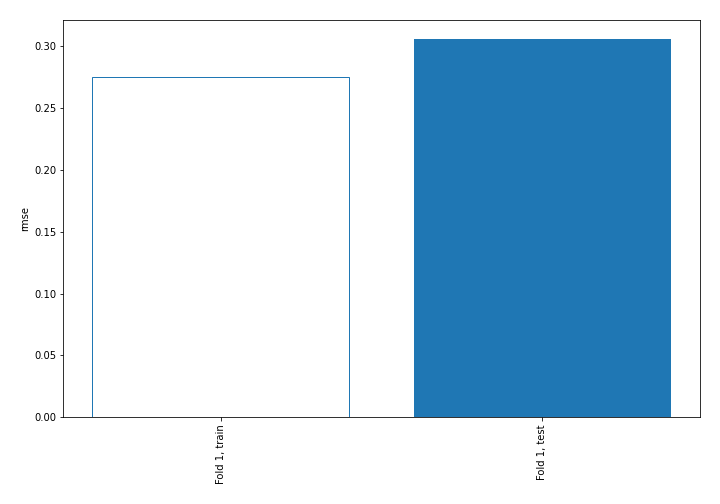
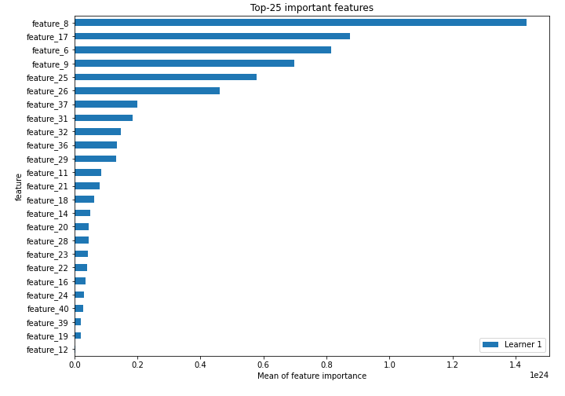
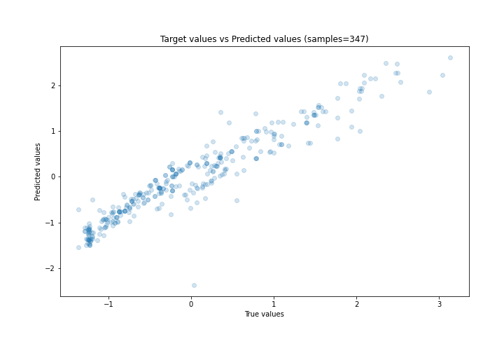
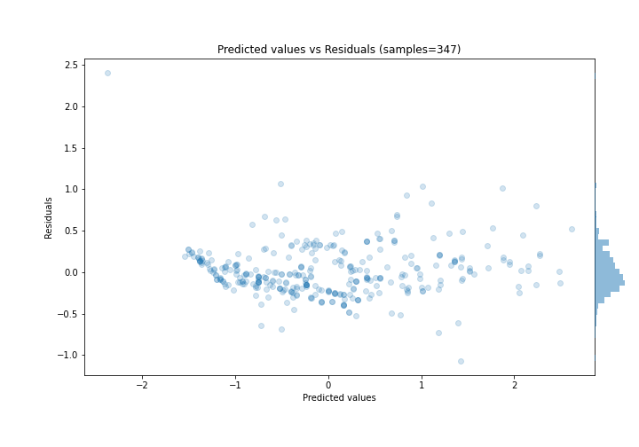
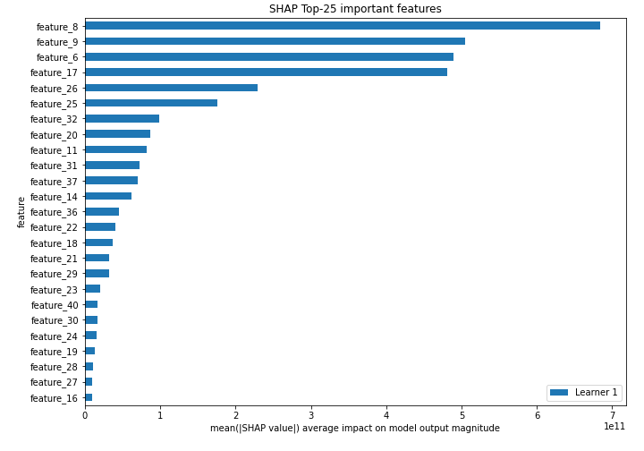
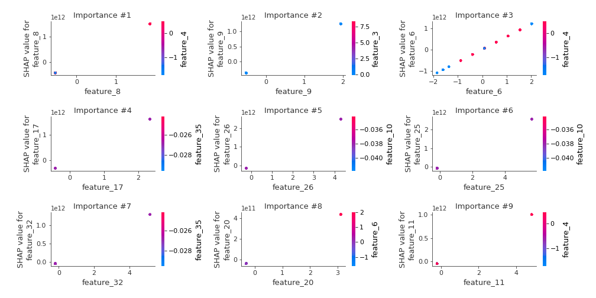
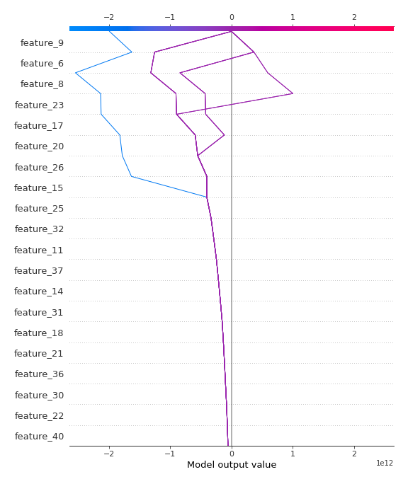
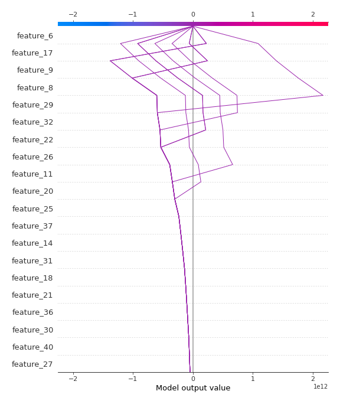

# Summary of 3_Linear

[<< Go back](../README.md)

## Linear Regression (Linear)
- **n_jobs**: -1
- **explain_level**: 2

## Validation
 - **validation_type**: split
 - **train_ratio**: 0.75
 - **shuffle**: True

## Optimized metric
rmse

## Training time

6.7 seconds

### Metric details:
| Metric   |     Score |
|:---------|----------:|
| MAE      | 0.215192  |
| MSE      | 0.0936889 |
| RMSE     | 0.306086  |
| R2       | 0.90531   |
| MAPE     | 1.42054   |

## Learning curves

## Coefficients
| feature    |    Learner_1 |
|:-----------|-------------:|
| feature_8  |  7.97042e+11 |
| feature_17 |  6.88999e+11 |
| feature_9  |  6.59423e+11 |
| feature_6  |  5.92946e+11 |
| feature_26 |  5.79156e+11 |
| feature_25 |  4.50323e+11 |
| feature_37 |  2.97424e+11 |
| feature_31 |  2.68457e+11 |
| feature_32 |  2.49292e+11 |
| feature_36 |  2.20402e+11 |
| feature_21 |  2.11001e+11 |
| feature_11 |  2.0842e+11  |
| feature_18 |  1.91027e+11 |
| feature_29 |  1.81935e+11 |
| feature_30 |  1.76076e+11 |
| feature_14 |  1.52632e+11 |
| feature_40 |  1.44211e+11 |
| feature_27 |  1.40922e+11 |
| feature_20 |  1.38304e+11 |
| feature_23 |  1.3542e+11  |
| feature_19 |  1.14534e+11 |
| feature_22 |  1.12715e+11 |
| feature_24 |  1.06558e+11 |
| feature_28 |  1.05192e+11 |
| feature_16 |  9.42867e+10 |
| feature_38 |  8.87817e+10 |
| feature_39 |  7.25161e+10 |
| feature_35 |  7.05375e+10 |
| feature_10 |  6.16104e+10 |
| feature_13 |  6.16104e+10 |
| feature_12 |  5.00428e+10 |
| feature_33 |  2.04669e+10 |
| feature_4  |  0.30474     |
| feature_7  |  0.281799    |
| feature_3  |  0.253699    |
| feature_41 | -0.0278388   |
| feature_5  | -0.29987     |
| feature_1  | -0.468519    |
| intercept  | -1.43817e+09 |
| feature_15 | -3.30749e+10 |

## Permutation-based Importance

## True vs Predicted

## Predicted vs Residuals

## SHAP Importance

## SHAP Dependence plots

### Dependence (Fold 1)

## SHAP Decision plots

### Top-10 Worst decisions (Fold 1)

### Top-10 Best decisions (Fold 1)

[<< Go back](../README.md)
