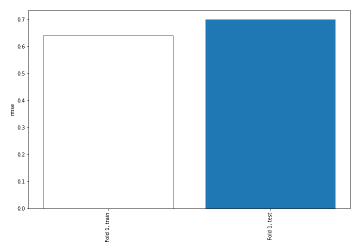
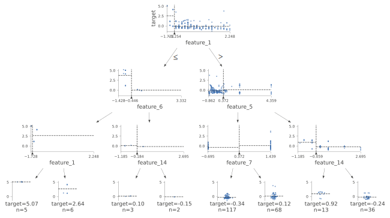
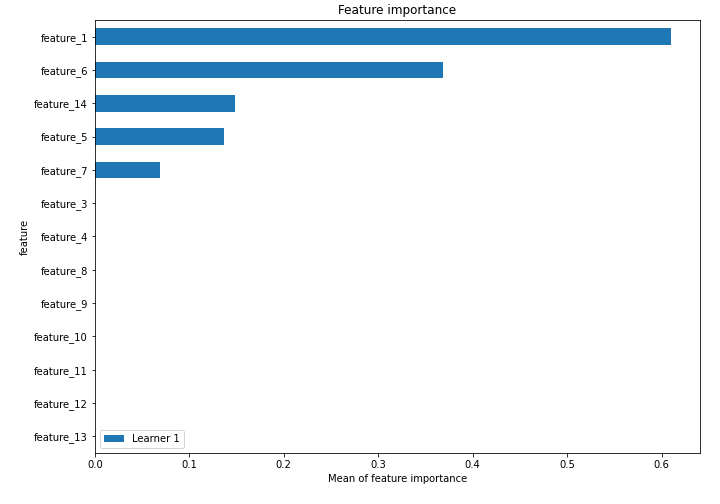
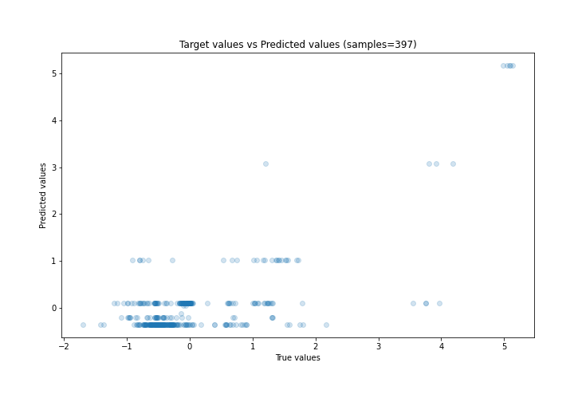
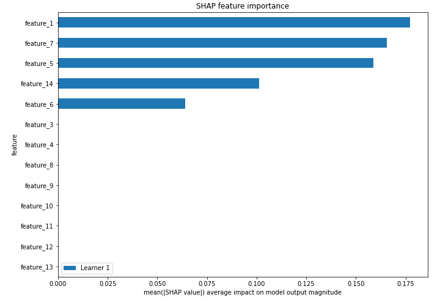
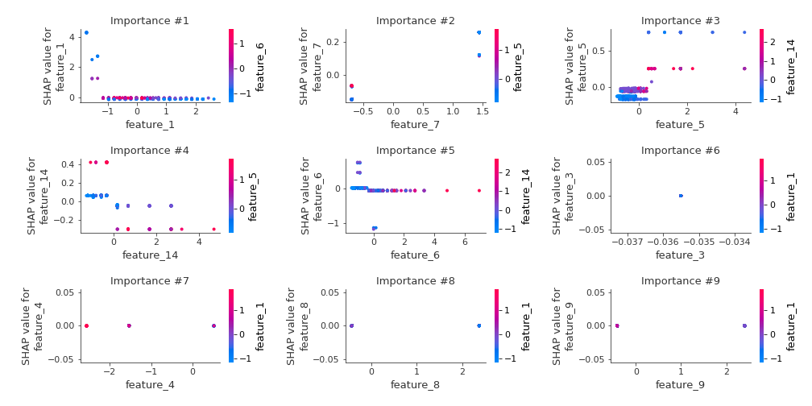
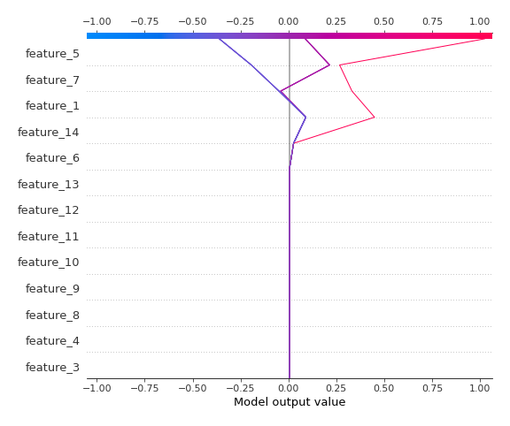
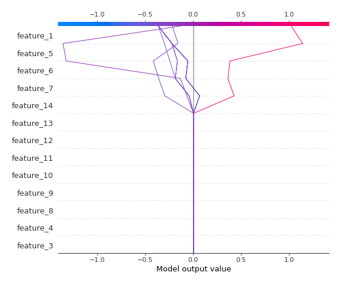

# Summary of 2_DecisionTree

[<< Go back](../README.md)

## Decision Tree
- **n_jobs**: -1
- **criterion**: mse
- **max_depth**: 3
- **explain_level**: 2

## Validation
 - **validation_type**: split
 - **train_ratio**: 0.75
 - **shuffle**: True

## Optimized metric
rmse

## Training time

11.3 seconds

### Metric details:
| Metric   |    Score |
|:---------|---------:|
| MAE      | 0.436984 |
| MSE      | 0.489668 |
| RMSE     | 0.699763 |
| R2       | 0.517625 |
| MAPE     | 7.38361  |

## Learning curves

## Decision Tree 

### Tree #1

### Rules

if (feature_1 > -1.254) and (feature_5 <= 0.372) and (feature_7 <= 0.372) then response: -0.36 | based on 598 samples

if (feature_1 > -1.254) and (feature_5 <= 0.372) and (feature_7 > 0.372) then response: 0.089 | based on 338 samples

if (feature_1 > -1.254) and (feature_5 > 0.372) and (feature_14 > -0.059) then response: -0.214 | based on 121 samples

if (feature_1 > -1.254) and (feature_5 > 0.372) and (feature_14 <= -0.059) then response: 1.024 | based on 85 samples

if (feature_1 <= -1.254) and (feature_6 <= -0.446) and (feature_1 > -1.633) then response: 3.079 | based on 24 samples

if (feature_1 <= -1.254) and (feature_6 <= -0.446) and (feature_1 <= -1.633) then response: 5.171 | based on 11 samples

if (feature_1 <= -1.254) and (feature_6 > -0.446) and (feature_14 <= -0.184) then response: 0.045 | based on 8 samples

if (feature_1 <= -1.254) and (feature_6 > -0.446) and (feature_14 > -0.184) then response: -0.127 | based on 6 samples

## Permutation-based Importance

## True vs Predicted

## Predicted vs Residuals

## SHAP Importance

## SHAP Dependence plots

### Dependence (Fold 1)

## SHAP Decision plots

### Top-10 Worst decisions (Fold 1)

### Top-10 Best decisions (Fold 1)

[<< Go back](../README.md)
