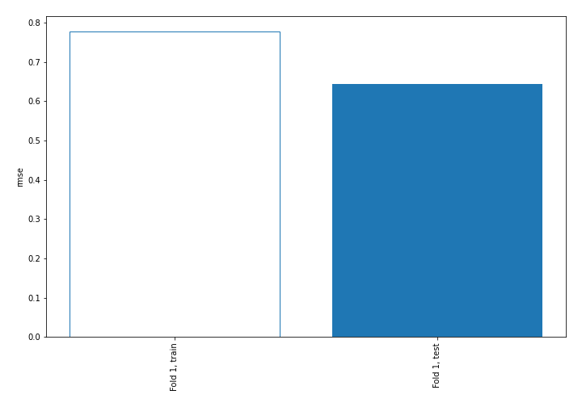
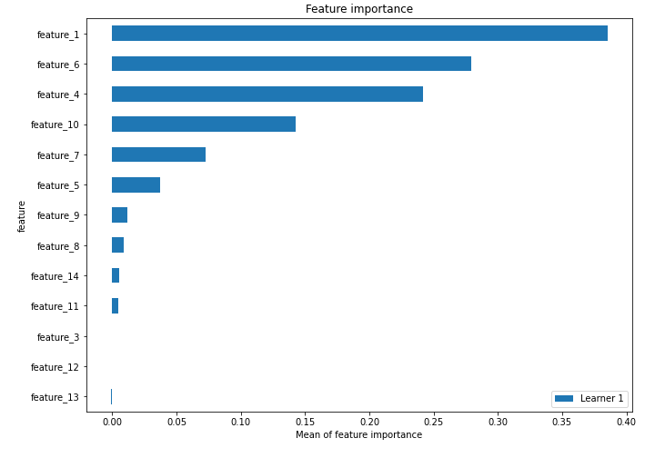
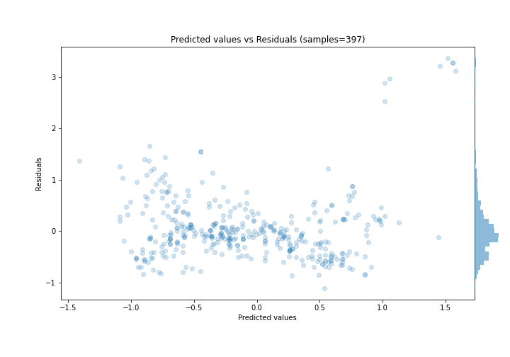
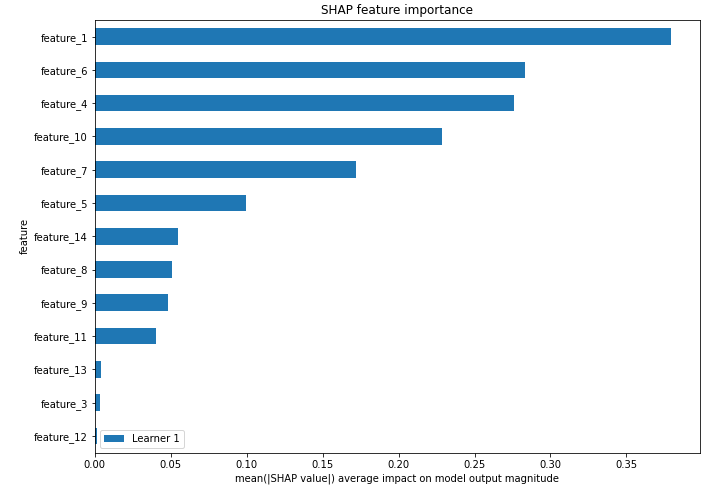
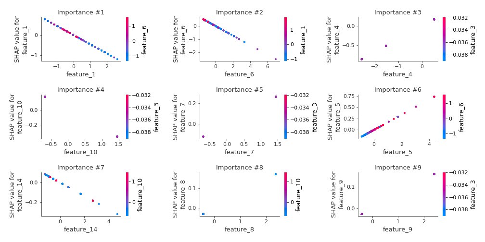
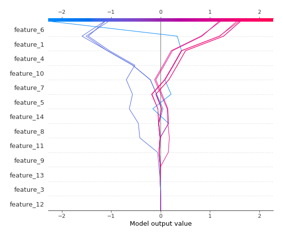
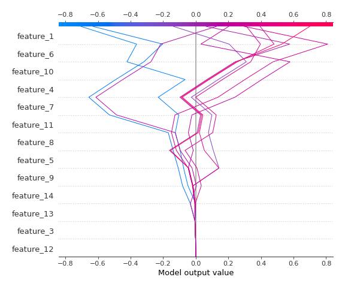

# Summary of 3_Linear

[<< Go back](../README.md)

## Linear Regression (Linear)
- **n_jobs**: -1
- **explain_level**: 2

## Validation
 - **validation_type**: split
 - **train_ratio**: 0.75
 - **shuffle**: True

## Optimized metric
rmse

## Training time

3.4 seconds

### Metric details:
| Metric   |    Score |
|:---------|---------:|
| MAE      | 0.417112 |
| MSE      | 0.415356 |
| RMSE     | 0.644481 |
| R2       | 0.48982  |
| MAPE     | 8.30588  |

## Learning curves

## Coefficients
| feature    |   Learner_1 |
|:-----------|------------:|
| feature_4  |  0.330909   |
| feature_7  |  0.183001   |
| feature_5  |  0.168375   |
| feature_3  |  0.0758966  |
| feature_8  |  0.0713587  |
| feature_9  |  0.0658998  |
| feature_12 |  0.0354967  |
| feature_13 |  0.007282   |
| intercept  | -0.00999987 |
| feature_14 | -0.0677191  |
| feature_11 | -0.0879122  |
| feature_10 | -0.247184   |
| feature_6  | -0.364872   |
| feature_1  | -0.452646   |

## Permutation-based Importance

## True vs Predicted

## Predicted vs Residuals

## SHAP Importance

## SHAP Dependence plots

### Dependence (Fold 1)

## SHAP Decision plots

### Top-10 Worst decisions (Fold 1)

### Top-10 Best decisions (Fold 1)

[<< Go back](../README.md)
