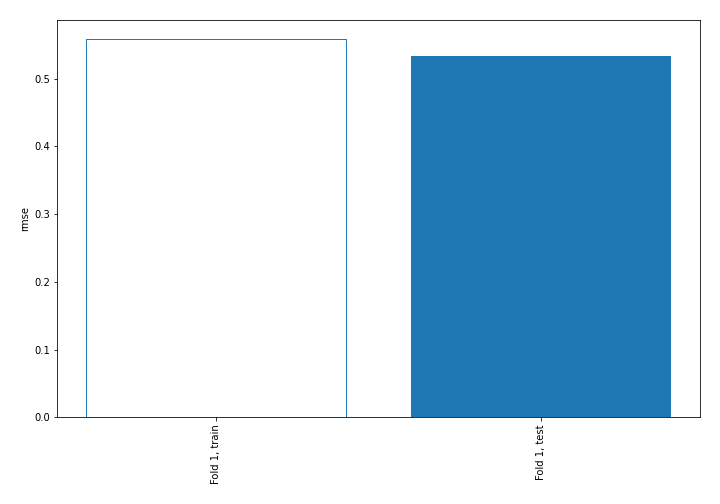
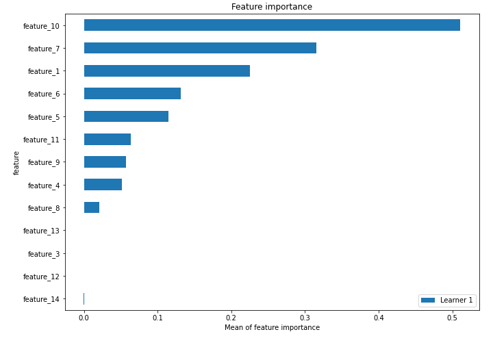
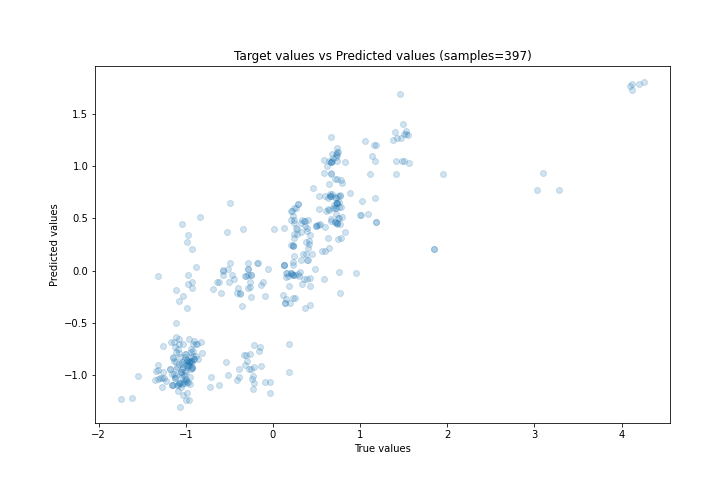
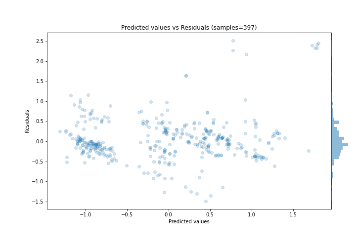
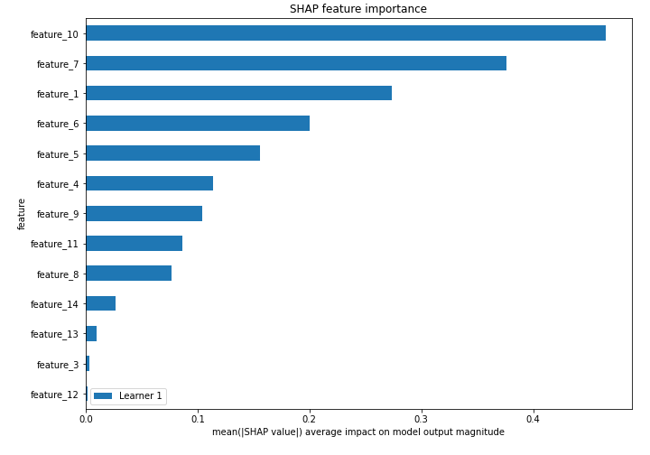
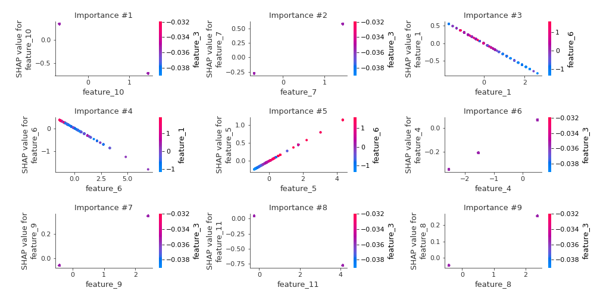
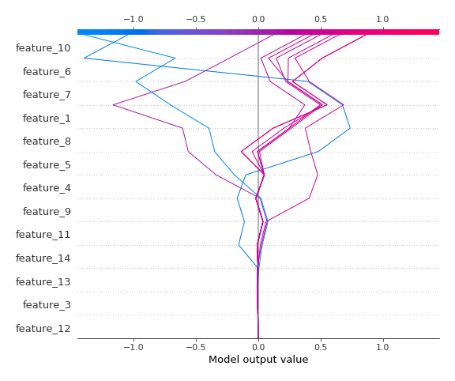
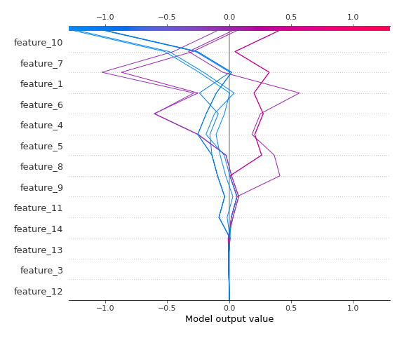

# Summary of 3_Linear

[<< Go back](../README.md)

## Linear Regression (Linear)
- **n_jobs**: -1
- **explain_level**: 2

## Validation
 - **validation_type**: split
 - **train_ratio**: 0.75
 - **shuffle**: True

## Optimized metric
rmse

## Training time

3.6 seconds

### Metric details:
| Metric   |    Score |
|:---------|---------:|
| MAE      | 0.349987 |
| MSE      | 0.285412 |
| RMSE     | 0.53424  |
| R2       | 0.702484 |
| MAPE     | 0.940394 |

## Learning curves

## Coefficients
| feature    |   Learner_1 |
|:-----------|------------:|
| feature_7  |  0.400126   |
| feature_5  |  0.264286   |
| feature_9  |  0.142771   |
| feature_4  |  0.13635    |
| feature_8  |  0.107449   |
| feature_3  |  0.0757857  |
| feature_12 |  0.0615313  |
| feature_13 |  0.019492   |
| intercept  | -0.00317845 |
| feature_14 | -0.0329694  |
| feature_11 | -0.188741   |
| feature_6  | -0.258244   |
| feature_1  | -0.326624   |
| feature_10 | -0.503072   |

## Permutation-based Importance

## True vs Predicted

## Predicted vs Residuals

## SHAP Importance

## SHAP Dependence plots

### Dependence (Fold 1)

## SHAP Decision plots

### Top-10 Worst decisions (Fold 1)

### Top-10 Best decisions (Fold 1)

[<< Go back](../README.md)
