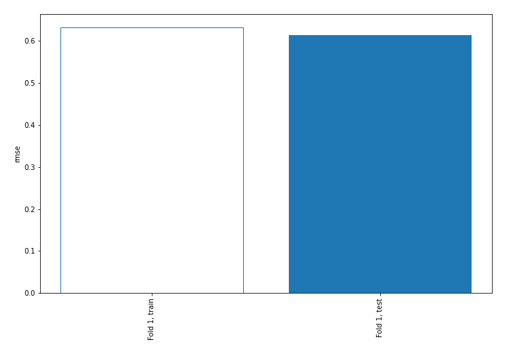
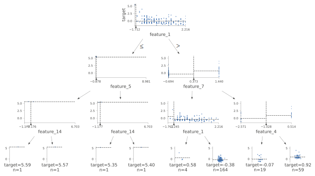
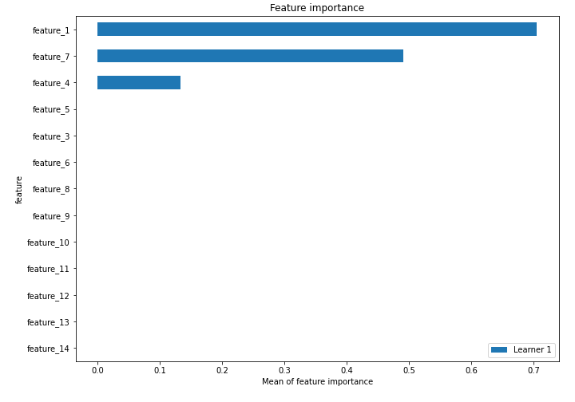
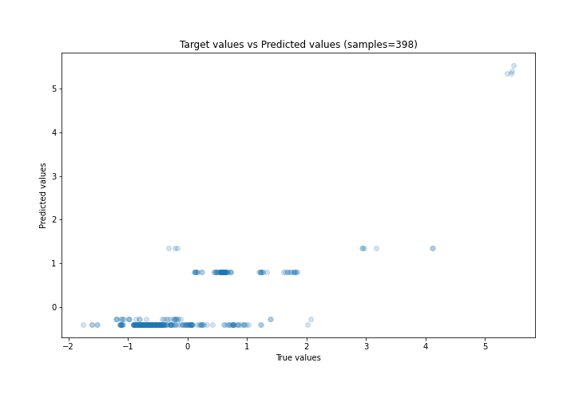
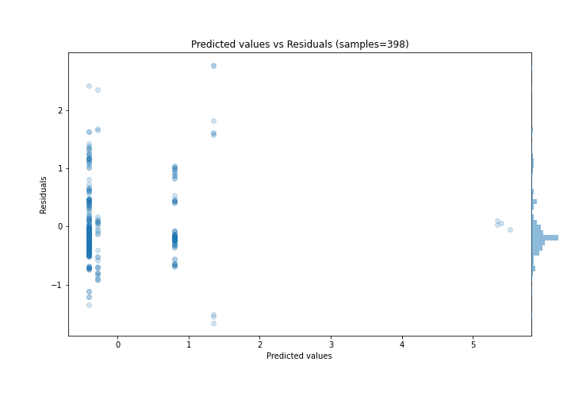
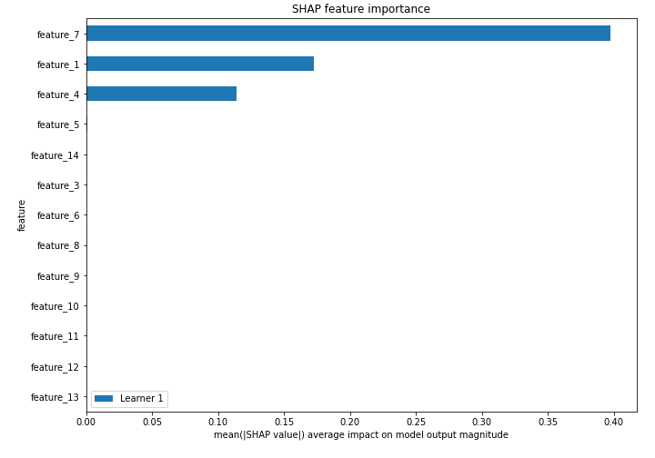
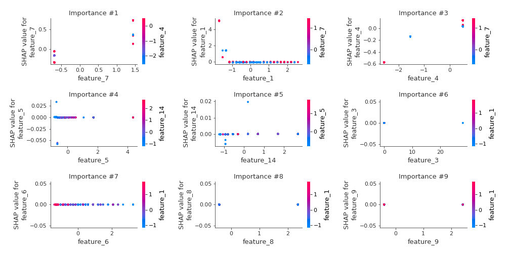
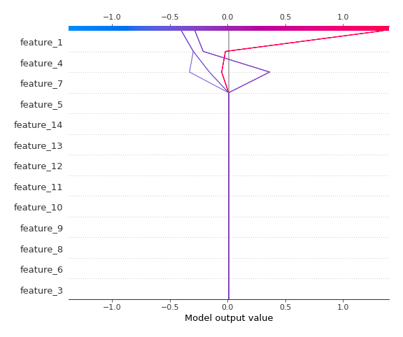
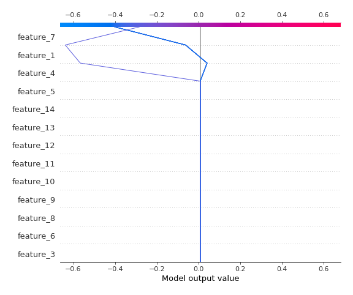

# Summary of 2_DecisionTree

[<< Go back](../README.md)

## Decision Tree
- **n_jobs**: -1
- **criterion**: mse
- **max_depth**: 3
- **explain_level**: 2

## Validation
 - **validation_type**: split
 - **train_ratio**: 0.75
 - **shuffle**: True

## Optimized metric
rmse

## Training time

5.7 seconds

### Metric details:
| Metric   |    Score |
|:---------|---------:|
| MAE      | 0.4368   |
| MSE      | 0.376603 |
| RMSE     | 0.61368  |
| R2       | 0.6329   |
| MAPE     | 1.68592  |

## Learning curves

## Decision Tree 

### Tree #1

### Rules

if (feature_1 > -1.619) and (feature_7 <= 0.373) and (feature_1 > -1.245) then response: -0.401 | based on 775 samples

if (feature_1 > -1.619) and (feature_7 > 0.373) and (feature_4 > -1.028) then response: 0.799 | based on 305 samples

if (feature_1 > -1.619) and (feature_7 > 0.373) and (feature_4 <= -1.028) then response: -0.284 | based on 72 samples

if (feature_1 > -1.619) and (feature_7 <= 0.373) and (feature_1 <= -1.245) then response: 1.344 | based on 28 samples

if (feature_1 <= -1.619) and (feature_5 <= -0.703) and (feature_14 <= -0.176) then response: 5.526 | based on 6 samples

if (feature_1 <= -1.619) and (feature_5 > -0.703) and (feature_14 <= -0.739) then response: 5.344 | based on 3 samples

if (feature_1 <= -1.619) and (feature_5 > -0.703) and (feature_14 > -0.739) then response: 5.397 | based on 1 samples

if (feature_1 <= -1.619) and (feature_5 <= -0.703) and (feature_14 > -0.176) then response: 5.568 | based on 1 samples

## Permutation-based Importance

## True vs Predicted

## Predicted vs Residuals

## SHAP Importance

## SHAP Dependence plots

### Dependence (Fold 1)

## SHAP Decision plots

### Top-10 Worst decisions (Fold 1)

### Top-10 Best decisions (Fold 1)

[<< Go back](../README.md)
