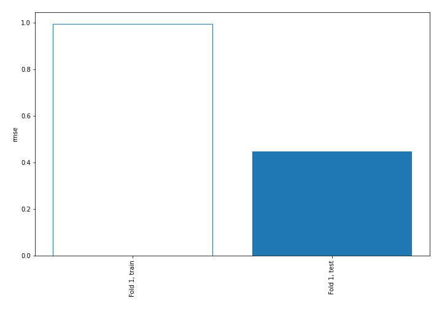
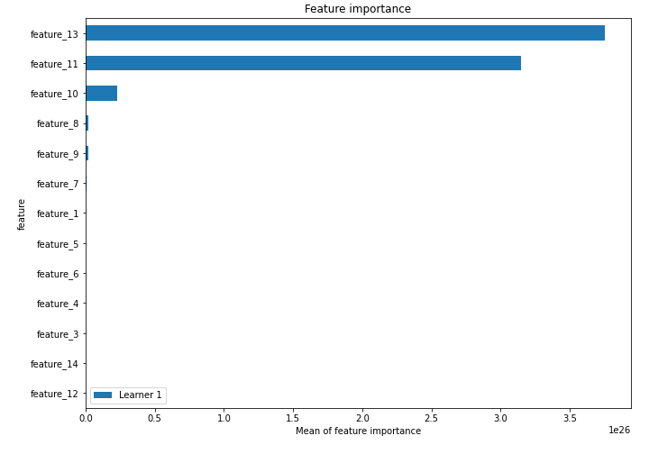
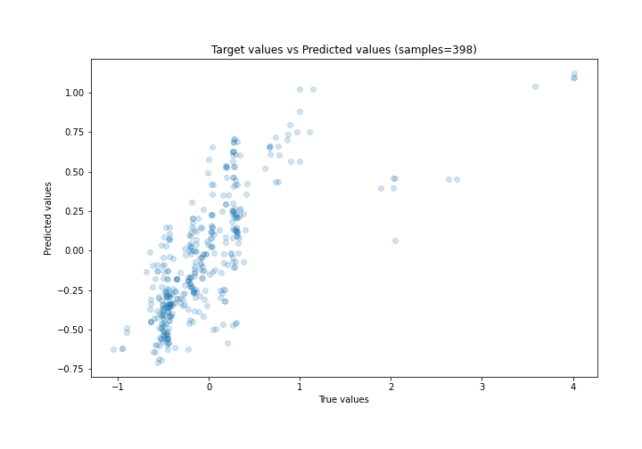
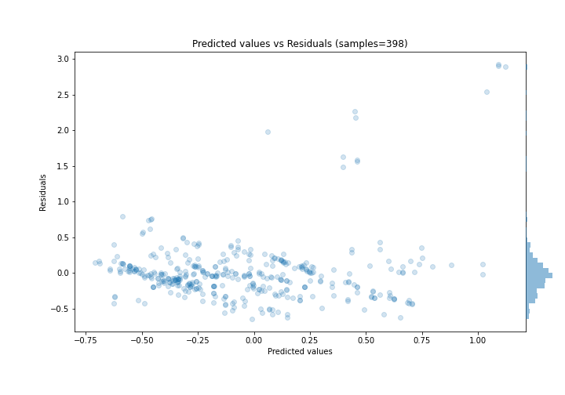
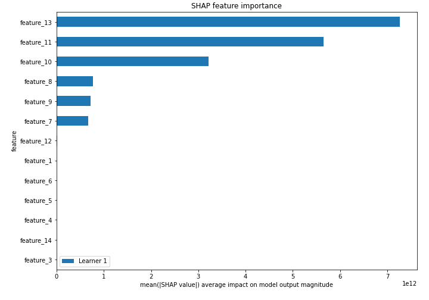
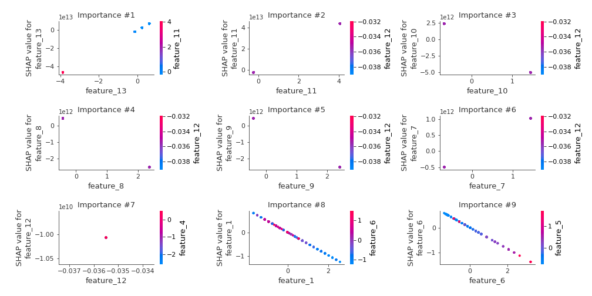
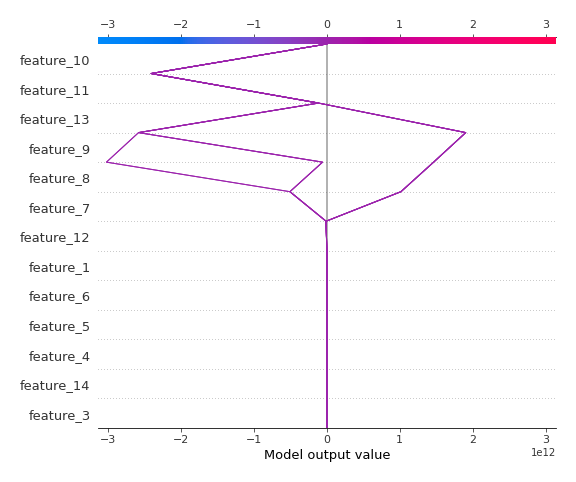
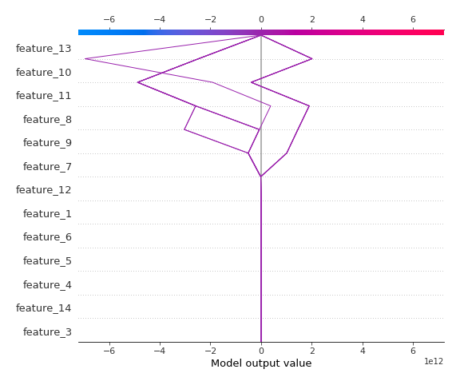

# Summary of 3_Linear

[<< Go back](../README.md)

## Linear Regression (Linear)
- **n_jobs**: -1
- **explain_level**: 2

## Validation
 - **validation_type**: split
 - **train_ratio**: 0.75
 - **shuffle**: True

## Optimized metric
rmse

## Training time

4.5 seconds

### Metric details:
| Metric   |    Score |
|:---------|---------:|
| MAE      | 0.244359 |
| MSE      | 0.199213 |
| RMSE     | 0.446332 |
| R2       | 0.50105  |
| MAPE     | 2.44226  |

## Learning curves

## Coefficients
| feature    |    Learner_1 |
|:-----------|-------------:|
| feature_13 |  1.20037e+13 |
| feature_11 |  1.07667e+13 |
| feature_7  |  7.13657e+11 |
| feature_12 |  2.12538e+11 |
| feature_5  |  0.432124    |
| feature_4  |  0.134877    |
| feature_3  |  0.0621445   |
| intercept  | -0.0080674   |
| feature_14 | -0.059491    |
| feature_6  | -0.426037    |
| feature_1  | -0.475722    |
| feature_9  | -1.04505e+12 |
| feature_8  | -1.0635e+12  |
| feature_10 | -3.47396e+12 |

## Permutation-based Importance

## True vs Predicted

## Predicted vs Residuals

## SHAP Importance

## SHAP Dependence plots

### Dependence (Fold 1)

## SHAP Decision plots

### Top-10 Worst decisions (Fold 1)

### Top-10 Best decisions (Fold 1)

[<< Go back](../README.md)
