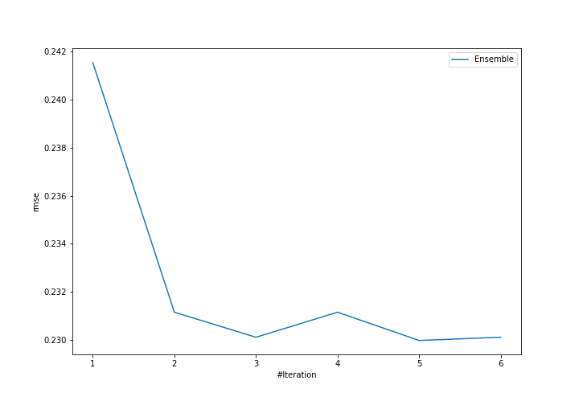
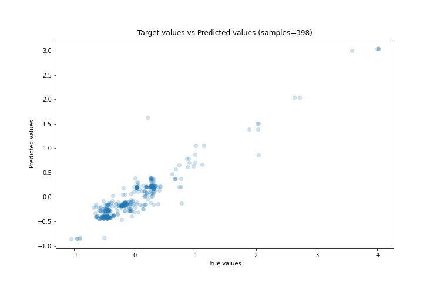
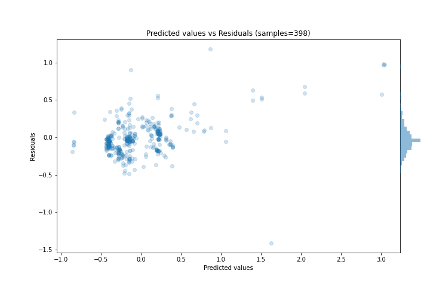

# Summary of Ensemble

[<< Go back](../README.md)

## Ensemble structure
| Model                  |   Weight |
|:-----------------------|---------:|
| 4_Default_Xgboost      |        3 |
| 6_Default_RandomForest |        2 |

### Metric details:
| Metric   |     Score |
|:---------|----------:|
| MAE      | 0.157067  |
| MSE      | 0.0528928 |
| RMSE     | 0.229984  |
| R2       | 0.867525  |
| MAPE     | 1.82297   |

## Learning curves

## True vs Predicted

## Predicted vs Residuals

[<< Go back](../README.md)
