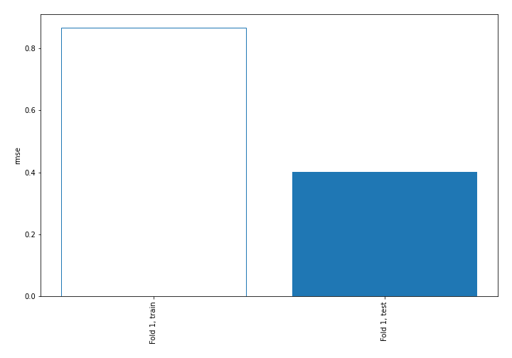
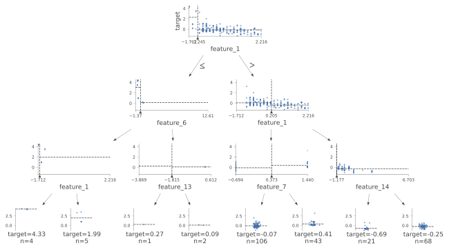
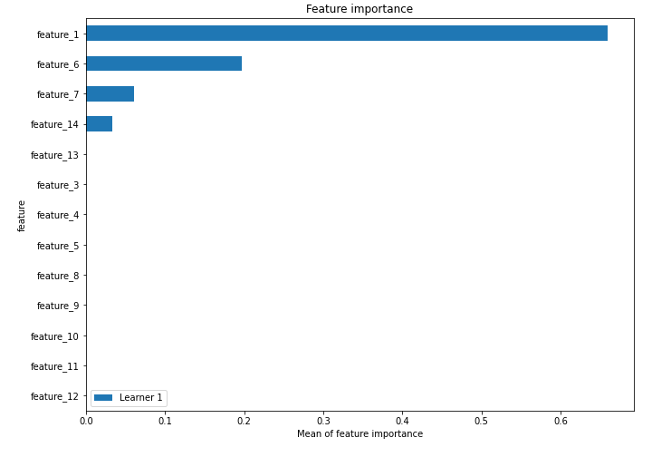
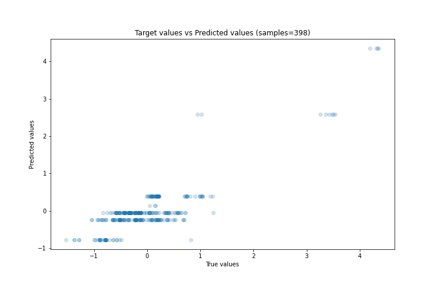
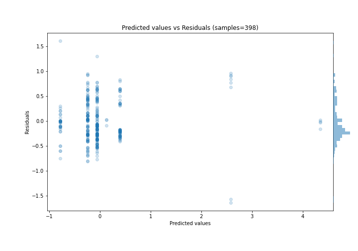
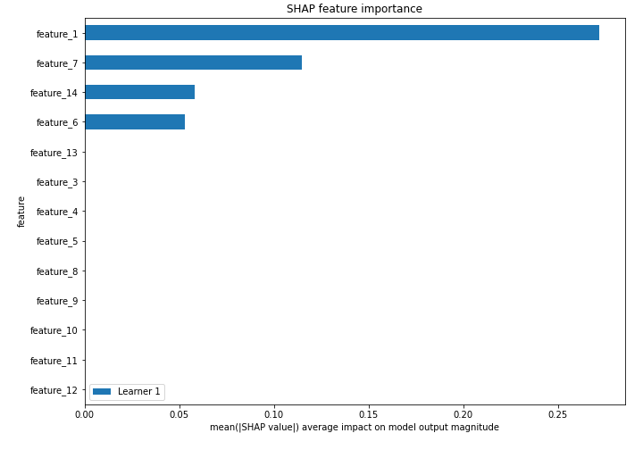
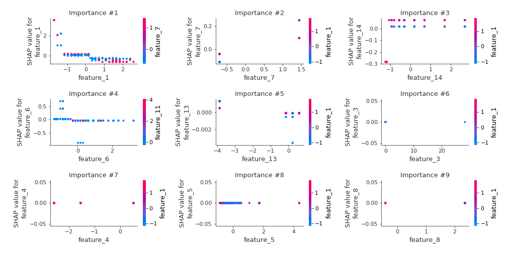
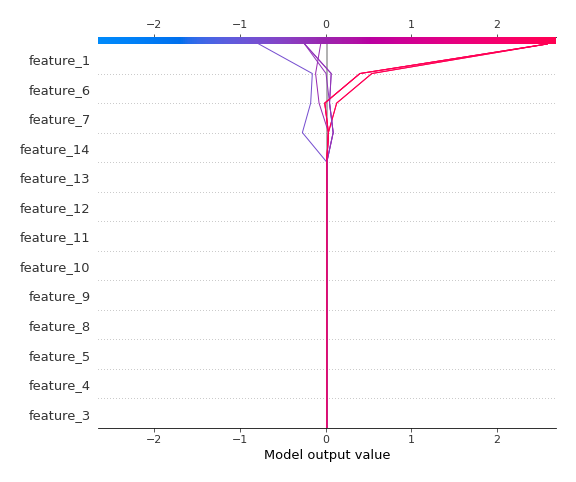
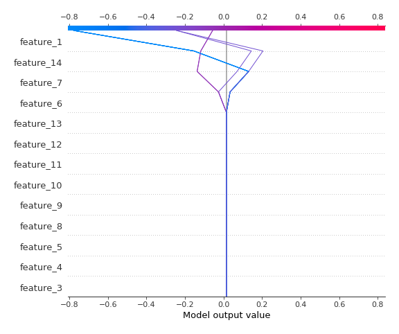

# Summary of 2_DecisionTree

[<< Go back](../README.md)

## Decision Tree
- **n_jobs**: -1
- **criterion**: mse
- **max_depth**: 3
- **explain_level**: 2

## Validation
 - **validation_type**: split
 - **train_ratio**: 0.75
 - **shuffle**: True

## Optimized metric
rmse

## Training time

6.3 seconds

### Metric details:
| Metric   |    Score |
|:---------|---------:|
| MAE      | 0.318123 |
| MSE      | 0.160069 |
| RMSE     | 0.400086 |
| R2       | 0.733894 |
| MAPE     | 5.49858  |

## Learning curves

## Decision Tree 

### Tree #1

### Rules

if (feature_1 > -1.245) and (feature_1 <= 0.205) and (feature_7 <= 0.373) then response: -0.057 | based on 510 samples

if (feature_1 > -1.245) and (feature_1 > 0.205) and (feature_14 > -1.146) then response: -0.244 | based on 326 samples

if (feature_1 > -1.245) and (feature_1 <= 0.205) and (feature_7 > 0.373) then response: 0.395 | based on 223 samples

if (feature_1 > -1.245) and (feature_1 > 0.205) and (feature_14 <= -1.146) then response: -0.778 | based on 85 samples

if (feature_1 <= -1.245) and (feature_6 <= -0.42) and (feature_1 > -1.619) then response: 2.584 | based on 21 samples

if (feature_1 <= -1.245) and (feature_6 > -0.42) and (feature_13 > -1.815) then response: 0.134 | based on 14 samples

if (feature_1 <= -1.245) and (feature_6 <= -0.42) and (feature_1 <= -1.619) then response: 4.347 | based on 11 samples

if (feature_1 <= -1.245) and (feature_6 > -0.42) and (feature_13 <= -1.815) then response: 0.267 | based on 1 samples

## Permutation-based Importance

## True vs Predicted

## Predicted vs Residuals

## SHAP Importance

## SHAP Dependence plots

### Dependence (Fold 1)

## SHAP Decision plots

### Top-10 Worst decisions (Fold 1)

### Top-10 Best decisions (Fold 1)

[<< Go back](../README.md)
