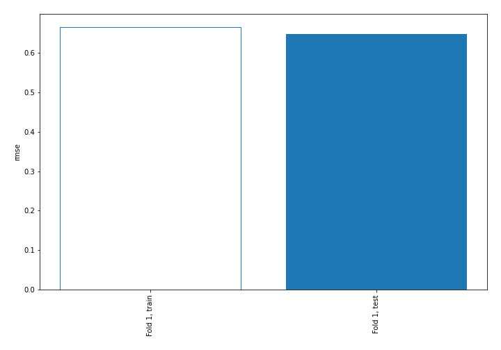
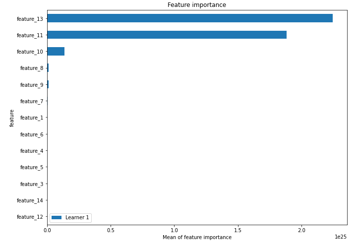
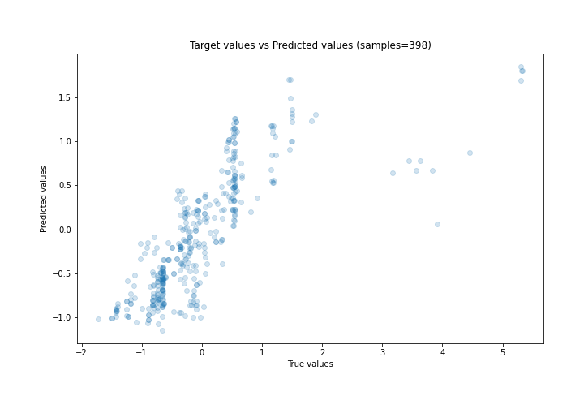
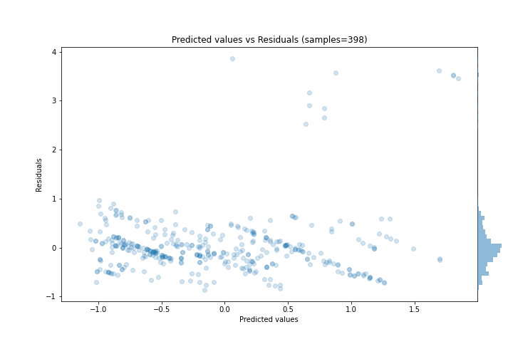
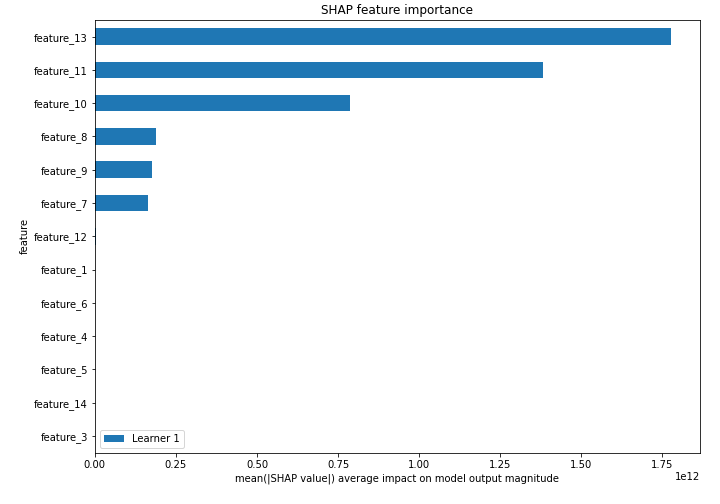
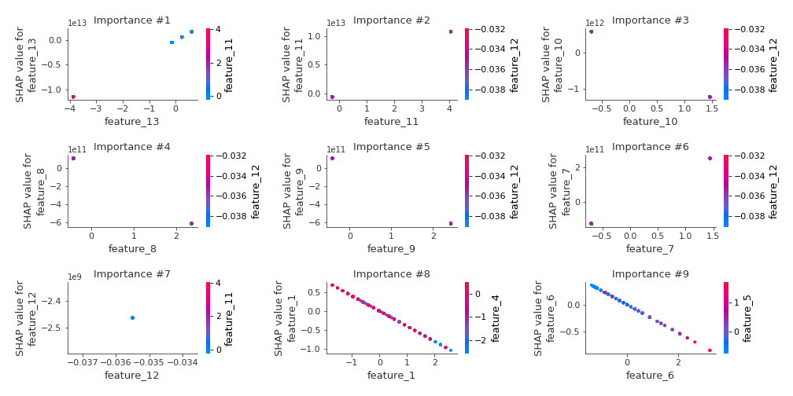
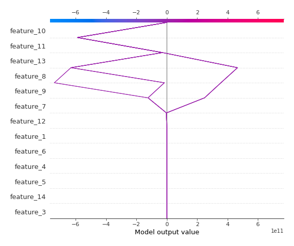
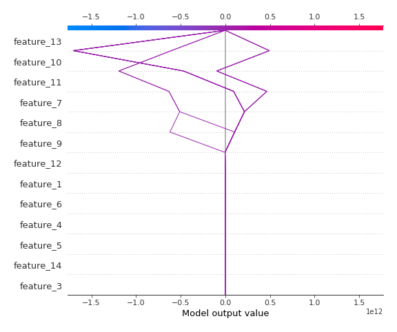

# Summary of 3_Linear

[<< Go back](../README.md)

## Linear Regression (Linear)
- **n_jobs**: -1
- **explain_level**: 2

## Validation
 - **validation_type**: split
 - **train_ratio**: 0.75
 - **shuffle**: True

## Optimized metric
rmse

## Training time

4.9 seconds

### Metric details:
| Metric   |    Score |
|:---------|---------:|
| MAE      | 0.361684 |
| MSE      | 0.418313 |
| RMSE     | 0.646771 |
| R2       | 0.578248 |
| MAPE     | 1.24647  |

## Learning curves

## Coefficients
| feature    |    Learner_1 |
|:-----------|-------------:|
| feature_13 |  2.93625e+12 |
| feature_11 |  2.63368e+12 |
| feature_7  |  1.7457e+11  |
| feature_12 |  5.19896e+10 |
| feature_4  |  0.189662    |
| feature_5  |  0.168707    |
| feature_3  |  0.0701515   |
| intercept  | -0.00596805  |
| feature_14 | -0.0693096   |
| feature_6  | -0.264584    |
| feature_1  | -0.398671    |
| feature_9  | -2.55634e+11 |
| feature_8  | -2.60145e+11 |
| feature_10 | -8.49776e+11 |

## Permutation-based Importance

## True vs Predicted

## Predicted vs Residuals

## SHAP Importance

## SHAP Dependence plots

### Dependence (Fold 1)

## SHAP Decision plots

### Top-10 Worst decisions (Fold 1)

### Top-10 Best decisions (Fold 1)

[<< Go back](../README.md)
