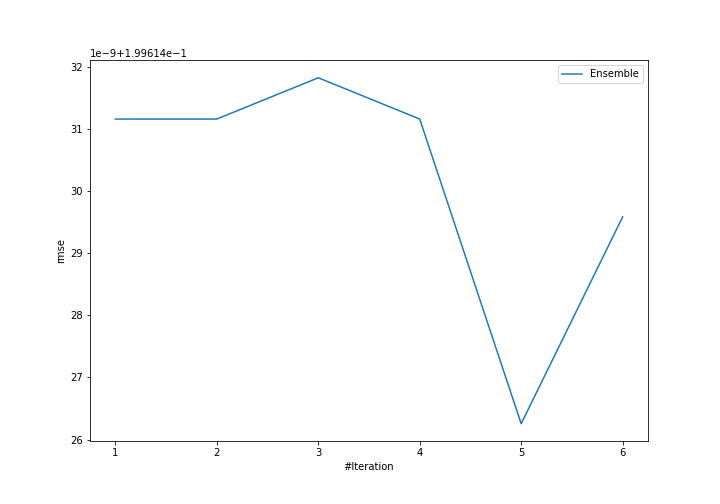
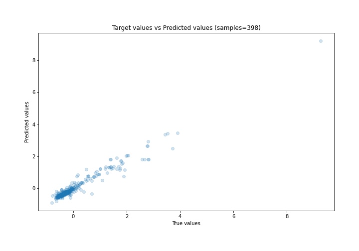
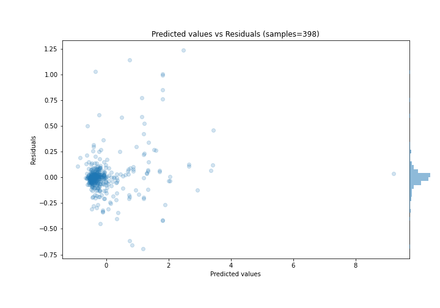

# Summary of Ensemble

[<< Go back](../README.md)

## Ensemble structure
| Model             |   Weight |
|:------------------|---------:|
| 4_Default_Xgboost |        5 |

### Metric details:
| Metric   |     Score |
|:---------|----------:|
| MAE      | 0.103954  |
| MSE      | 0.0398458 |
| RMSE     | 0.199614  |
| R2       | 0.950874  |
| MAPE     | 2.74262   |

## Learning curves

## True vs Predicted

## Predicted vs Residuals

[<< Go back](../README.md)
