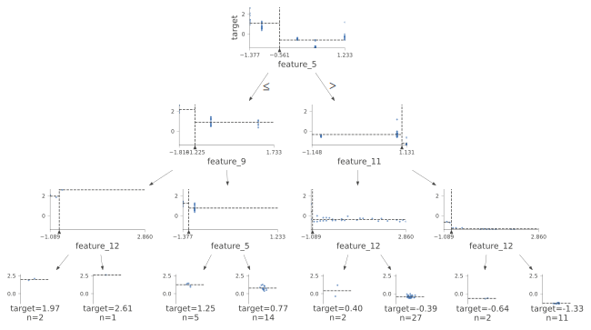

# Summary of 2_DecisionTree

[<< Go back](../README.md)

## Decision Tree
- **n_jobs**: -1
- **criterion**: mse
- **max_depth**: 3
- **explain_level**: 2

## Validation
 - **validation_type**: split
 - **train_ratio**: 0.75
 - **shuffle**: True

## Optimized metric
rmse

## Training time

4.6 seconds

### Metric details:
| Metric   |     Score |
|:---------|----------:|
| MAE      | 0.182882  |
| MSE      | 0.0969693 |
| RMSE     | 0.311399  |
| R2       | 0.921864  |
| MAPE     | 0.242583  |

## Learning curves

## Decision Tree 

### Tree #1

### Rules

if (feature_5 > -0.561) and (feature_11 <= 1.013) and (feature_12 > -1.025) then response: -0.394 | based on 27 samples

if (feature_5 <= -0.561) and (feature_9 > -1.225) and (feature_5 > -1.214) then response: 0.772 | based on 14 samples

if (feature_5 > -0.561) and (feature_11 > 1.013) and (feature_12 > -0.77) then response: -1.326 | based on 11 samples

if (feature_5 <= -0.561) and (feature_9 > -1.225) and (feature_5 <= -1.214) then response: 1.245 | based on 5 samples

if (feature_5 > -0.561) and (feature_11 > 1.013) and (feature_12 <= -0.77) then response: -0.643 | based on 2 samples

if (feature_5 > -0.561) and (feature_11 <= 1.013) and (feature_12 <= -1.025) then response: 0.405 | based on 2 samples

if (feature_5 <= -0.561) and (feature_9 <= -1.225) and (feature_12 <= -0.707) then response: 1.973 | based on 2 samples

if (feature_5 <= -0.561) and (feature_9 <= -1.225) and (feature_12 > -0.707) then response: 2.61 | based on 1 samples

## Permutation-based Importance

## True vs Predicted

## Predicted vs Residuals

## SHAP Importance

## SHAP Dependence plots

### Dependence (Fold 1)

## SHAP Decision plots

### Top-10 Worst decisions (Fold 1)

### Top-10 Best decisions (Fold 1)

[<< Go back](../README.md)
