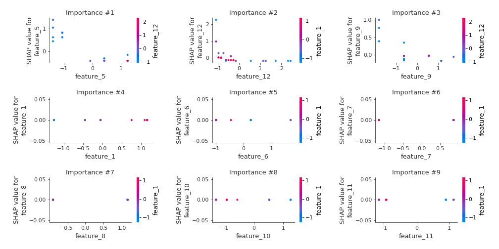

# Summary of 2_DecisionTree

[<< Go back](../README.md)

## Decision Tree
- **n_jobs**: -1
- **criterion**: mse
- **max_depth**: 3
- **explain_level**: 2

## Validation
 - **validation_type**: split
 - **train_ratio**: 0.75
 - **shuffle**: True

## Optimized metric
rmse

## Training time

4.5 seconds

### Metric details:
| Metric   |    Score |
|:---------|---------:|
| MAE      | 0.276031 |
| MSE      | 0.18713  |
| RMSE     | 0.432586 |
| R2       | 0.880228 |
| MAPE     | 0.407587 |

## Learning curves

## Decision Tree 

### Tree #1

### Rules

if (feature_5 > -0.561) and (feature_12 > -1.03) and (feature_12 > -0.677) then response: -0.737 | based on 35 samples

if (feature_5 <= -0.561) and (feature_9 > -1.225) and (feature_12 > -1.03) then response: 0.424 | based on 17 samples

if (feature_5 > -0.561) and (feature_12 > -1.03) and (feature_12 <= -0.677) then response: -0.167 | based on 5 samples

if (feature_5 <= -0.561) and (feature_9 > -1.225) and (feature_12 <= -1.03) then response: 1.811 | based on 2 samples

if (feature_5 <= -0.561) and (feature_9 <= -1.225) and (feature_12 <= -0.677) then response: 1.706 | based on 2 samples

if (feature_5 > -0.561) and (feature_12 <= -1.03) and (feature_9 > 1.142) then response: 0.734 | based on 1 samples

if (feature_5 > -0.561) and (feature_12 <= -1.03) and (feature_9 <= 1.142) then response: 2.354 | based on 1 samples

if (feature_5 <= -0.561) and (feature_9 <= -1.225) and (feature_12 > -0.677) then response: 2.389 | based on 1 samples

## Permutation-based Importance

## True vs Predicted

## Predicted vs Residuals

## SHAP Importance

## SHAP Dependence plots

### Dependence (Fold 1)

## SHAP Decision plots

### Top-10 Worst decisions (Fold 1)

### Top-10 Best decisions (Fold 1)

[<< Go back](../README.md)
