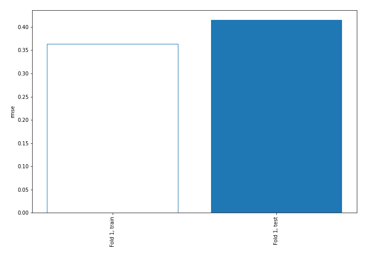
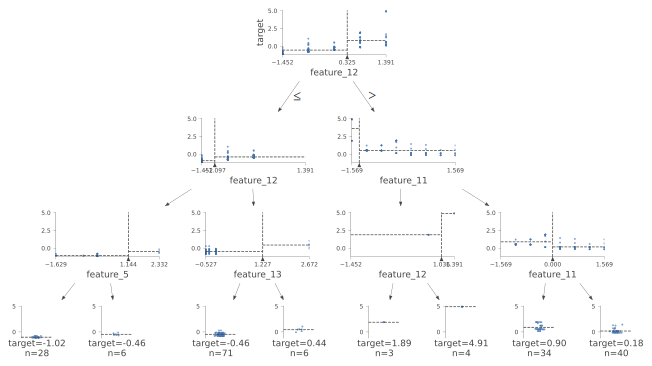
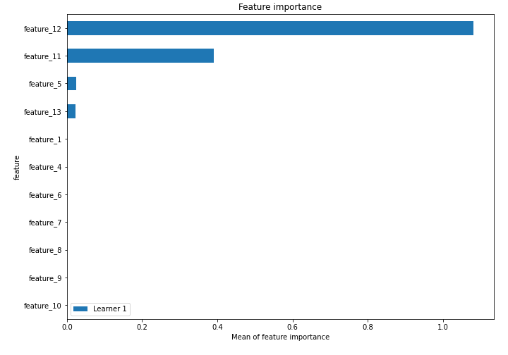
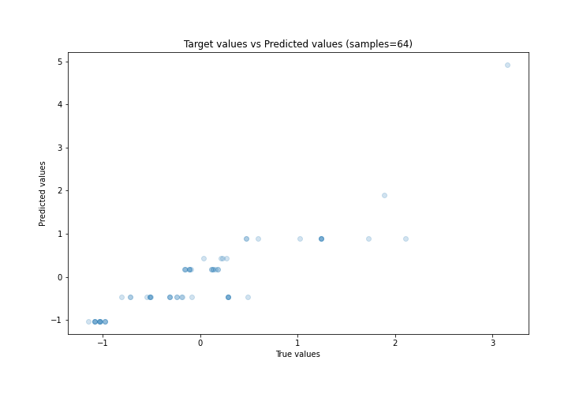
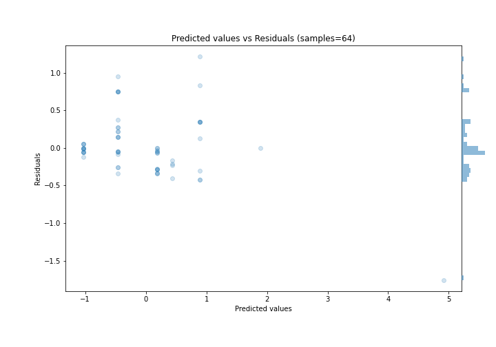
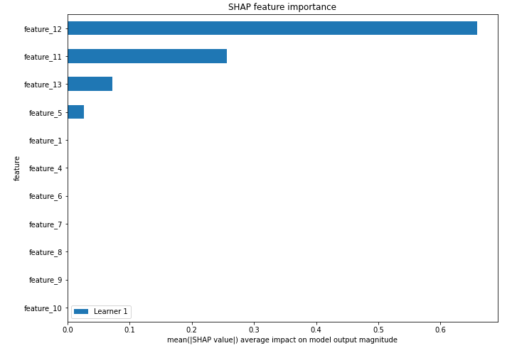
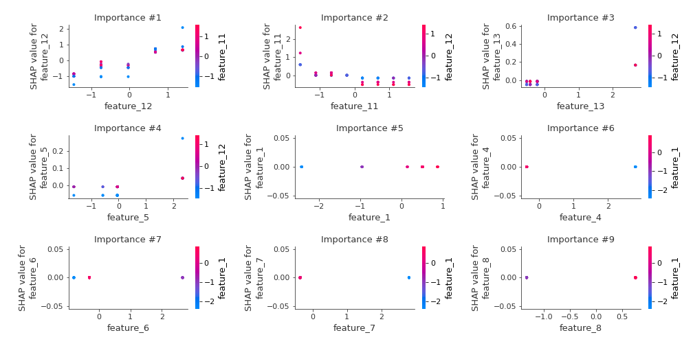
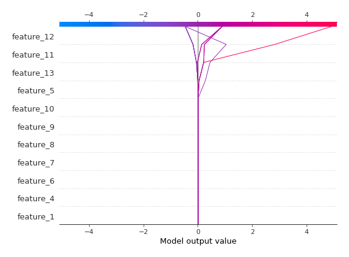
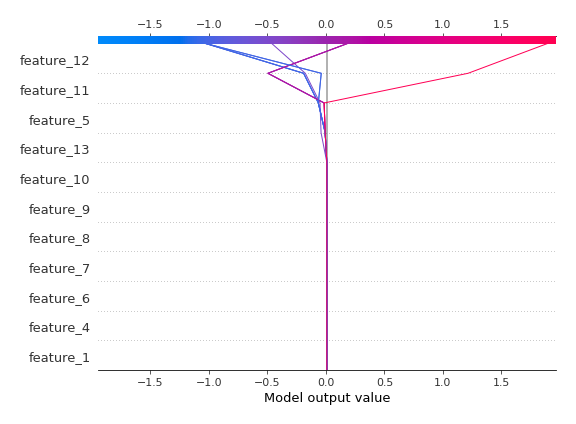

# Summary of 2_DecisionTree

[<< Go back](../README.md)

## Decision Tree
- **n_jobs**: -1
- **criterion**: mse
- **max_depth**: 3
- **explain_level**: 2

## Validation
 - **validation_type**: split
 - **train_ratio**: 0.75
 - **shuffle**: True

## Optimized metric
rmse

## Training time

5.5 seconds

### Metric details:
| Metric   |    Score |
|:---------|---------:|
| MAE      | 0.270009 |
| MSE      | 0.172536 |
| RMSE     | 0.415374 |
| R2       | 0.768045 |
| MAPE     | 0.998126 |

## Learning curves

## Decision Tree 

### Tree #1

### Rules

if (feature_12 <= 0.325) and (feature_12 > -1.097) and (feature_13 <= 1.227) then response: -0.462 | based on 71 samples

if (feature_12 > 0.325) and (feature_11 > -1.345) and (feature_11 > 0.0) then response: 0.181 | based on 40 samples

if (feature_12 > 0.325) and (feature_11 > -1.345) and (feature_11 <= 0.0) then response: 0.896 | based on 34 samples

if (feature_12 <= 0.325) and (feature_12 <= -1.097) and (feature_5 <= 1.144) then response: -1.025 | based on 28 samples

if (feature_12 <= 0.325) and (feature_12 > -1.097) and (feature_13 > 1.227) then response: 0.44 | based on 6 samples

if (feature_12 <= 0.325) and (feature_12 <= -1.097) and (feature_5 > 1.144) then response: -0.463 | based on 6 samples

if (feature_12 > 0.325) and (feature_11 <= -1.345) and (feature_12 > 1.036) then response: 4.914 | based on 4 samples

if (feature_12 > 0.325) and (feature_11 <= -1.345) and (feature_12 <= 1.036) then response: 1.891 | based on 3 samples

## Permutation-based Importance

## True vs Predicted

## Predicted vs Residuals

## SHAP Importance

## SHAP Dependence plots

### Dependence (Fold 1)

## SHAP Decision plots

### Top-10 Worst decisions (Fold 1)

### Top-10 Best decisions (Fold 1)

[<< Go back](../README.md)
