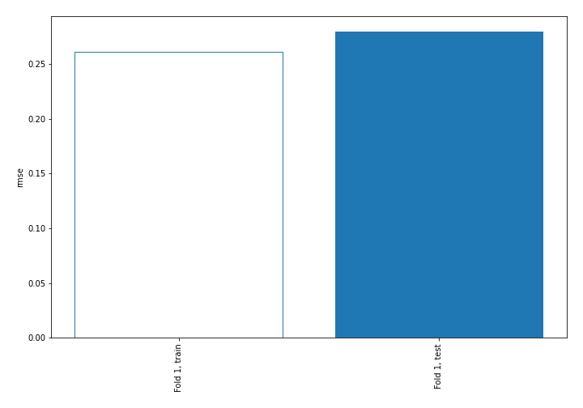
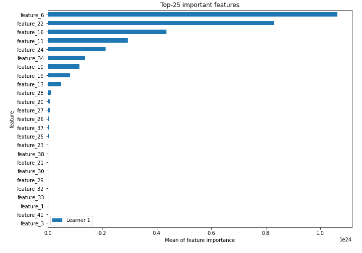
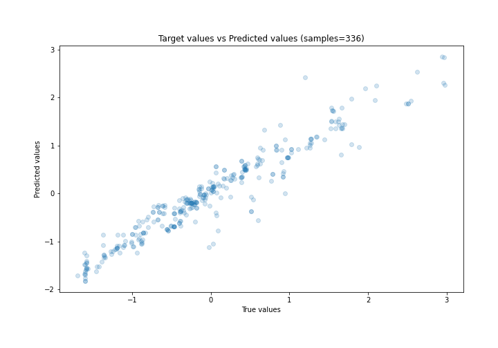
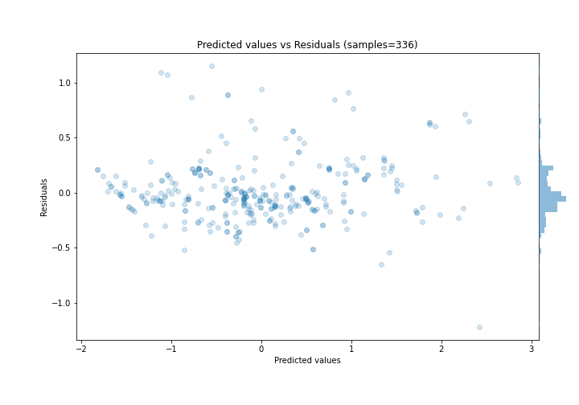
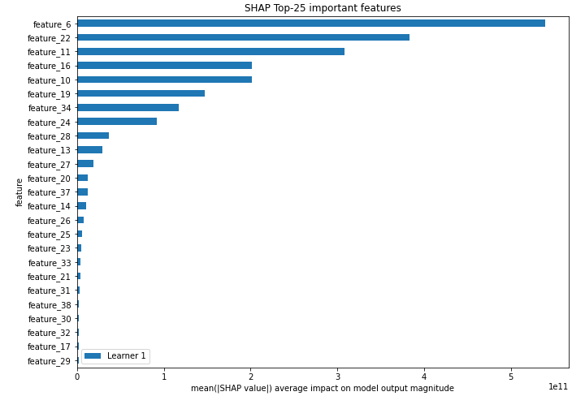
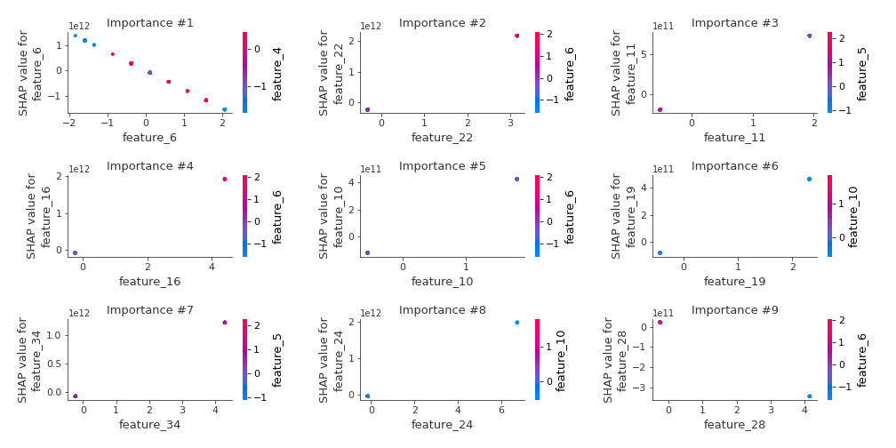
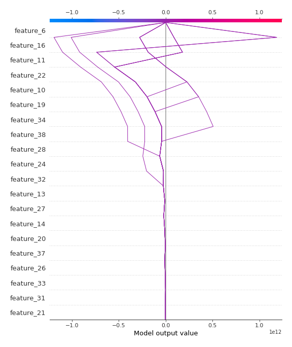

# Summary of 3_Linear

[<< Go back](../README.md)

## Linear Regression (Linear)
- **n_jobs**: -1
- **explain_level**: 2

## Validation
 - **validation_type**: split
 - **train_ratio**: 0.75
 - **shuffle**: True

## Optimized metric
rmse

## Training time

5.1 seconds

### Metric details:
| Metric   |     Score |
|:---------|----------:|
| MAE      | 0.1925    |
| MSE      | 0.0781972 |
| RMSE     | 0.279638  |
| R2       | 0.919801  |
| MAPE     | 1.02379   |

## Learning curves

## Coefficients
| feature    |    Learner_1 |
|:-----------|-------------:|
| feature_22 |  6.8407e+11  |
| feature_16 |  4.35635e+11 |
| feature_11 |  3.74654e+11 |
| feature_24 |  2.92919e+11 |
| feature_34 |  2.83122e+11 |
| feature_10 |  2.32976e+11 |
| feature_19 |  2.00524e+11 |
| feature_13 |  1.5516e+11  |
| feature_14 |  1.22733e+11 |
| feature_26 |  6.11818e+10 |
| feature_20 |  5.79052e+10 |
| feature_17 |  5.49697e+10 |
| feature_35 |  3.99968e+10 |
| feature_25 |  3.67463e+10 |
| feature_21 |  3.35571e+10 |
| feature_12 |  2.5024e+10  |
| feature_15 |  2.5024e+10  |
| feature_33 |  2.18004e+10 |
| feature_38 |  2.12471e+10 |
| feature_39 |  1.50296e+10 |
| feature_40 |  1.13259e+10 |
| feature_4  |  0.207257    |
| feature_3  |  0.202264    |
| feature_7  |  0.189665    |
| feature_5  |  0.0701675   |
| intercept  | -0.000452334 |
| feature_41 | -0.270881    |
| feature_1  | -0.57809     |
| feature_18 | -4.92174e+09 |
| feature_8  | -9.90021e+09 |
| feature_36 | -1.38844e+10 |
| feature_32 | -1.38844e+10 |
| feature_29 | -1.71349e+10 |
| feature_30 | -2.10867e+10 |
| feature_23 | -2.7929e+10  |
| feature_31 | -3.33038e+10 |
| feature_9  | -3.48675e+10 |
| feature_37 | -4.60716e+10 |
| feature_27 | -5.9408e+10  |
| feature_28 | -8.28179e+10 |
| feature_6  | -7.4945e+11  |

## Permutation-based Importance

## True vs Predicted

## Predicted vs Residuals

## SHAP Importance

## SHAP Dependence plots

### Dependence (Fold 1)

## SHAP Decision plots

### Top-10 Worst decisions (Fold 1)

### Top-10 Best decisions (Fold 1)

[<< Go back](../README.md)
