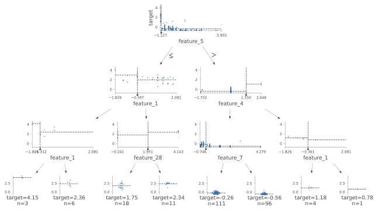
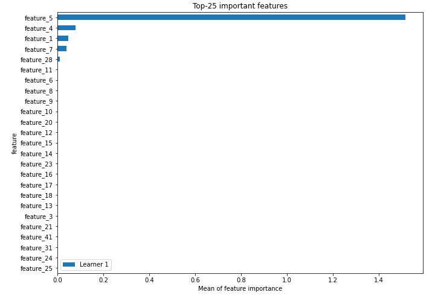
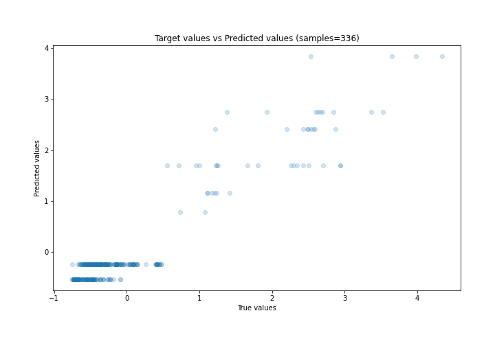
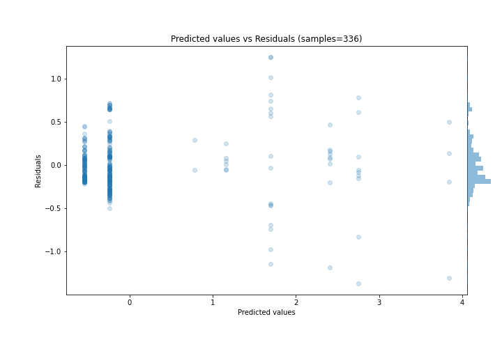
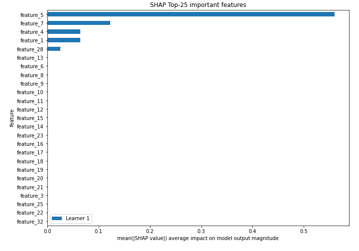
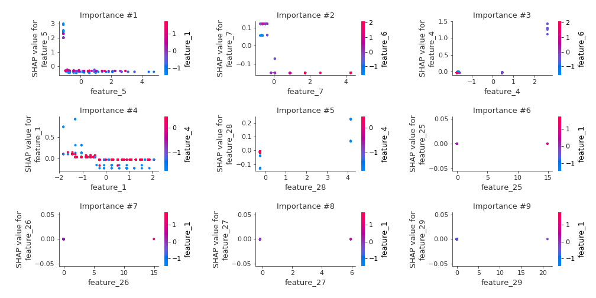
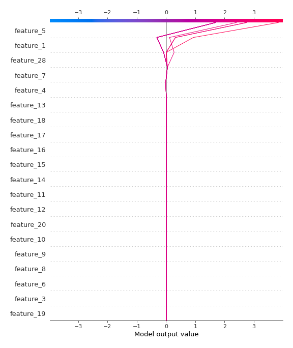
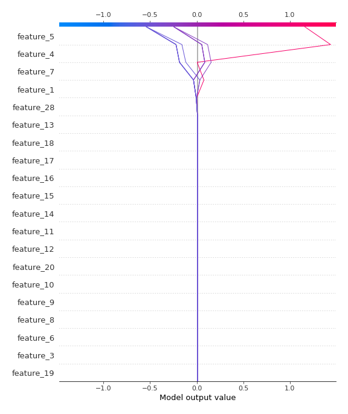

# Summary of 2_DecisionTree

[<< Go back](../README.md)

## Decision Tree
- **n_jobs**: -1
- **criterion**: mse
- **max_depth**: 3
- **explain_level**: 2

## Validation
 - **validation_type**: split
 - **train_ratio**: 0.75
 - **shuffle**: True

## Optimized metric
rmse

## Training time

6.7 seconds

### Metric details:
| Metric   |    Score |
|:---------|---------:|
| MAE      | 0.232162 |
| MSE      | 0.106102 |
| RMSE     | 0.325733 |
| R2       | 0.886549 |
| MAPE     | 0.852288 |

## Learning curves

## Decision Tree 

### Tree #1

### Rules

if (feature_5 > -1.063) and (feature_4 <= 1.55) and (feature_7 <= -0.246) then response: -0.245 | based on 472 samples

if (feature_5 > -1.063) and (feature_4 <= 1.55) and (feature_7 > -0.246) then response: -0.54 | based on 380 samples

if (feature_5 <= -1.063) and (feature_1 > -0.397) and (feature_28 <= 1.951) then response: 1.693 | based on 60 samples

if (feature_5 <= -1.063) and (feature_1 > -0.397) and (feature_28 > 1.951) then response: 2.406 | based on 34 samples

if (feature_5 <= -1.063) and (feature_1 <= -0.397) and (feature_1 > -1.312) then response: 2.749 | based on 21 samples

if (feature_5 > -1.063) and (feature_4 > 1.55) and (feature_1 <= -0.361) then response: 1.161 | based on 19 samples

if (feature_5 <= -1.063) and (feature_1 <= -0.397) and (feature_1 <= -1.312) then response: 3.839 | based on 16 samples

if (feature_5 > -1.063) and (feature_4 > 1.55) and (feature_1 > -0.361) then response: 0.781 | based on 6 samples

## Permutation-based Importance

## True vs Predicted

## Predicted vs Residuals

## SHAP Importance

## SHAP Dependence plots

### Dependence (Fold 1)

## SHAP Decision plots

### Top-10 Worst decisions (Fold 1)

### Top-10 Best decisions (Fold 1)

[<< Go back](../README.md)
