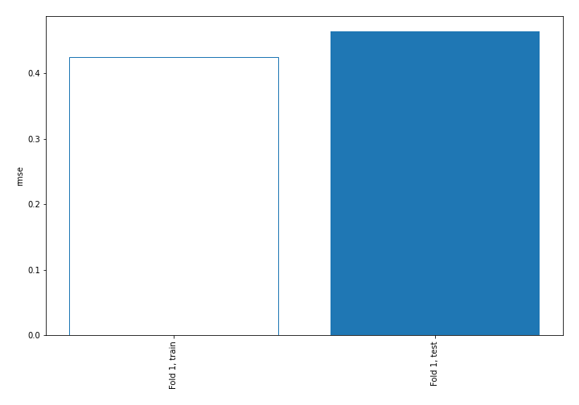
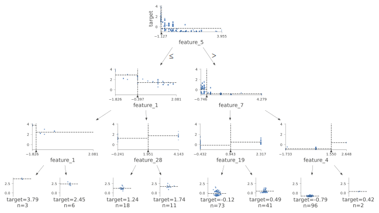
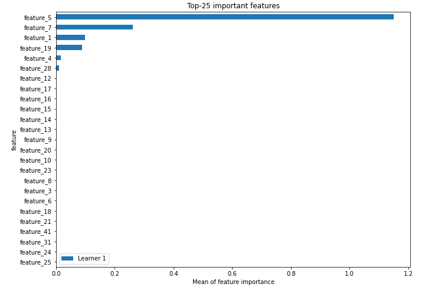
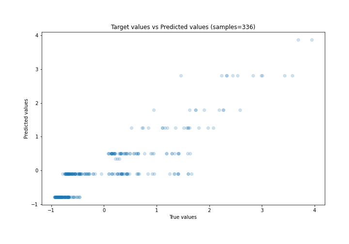
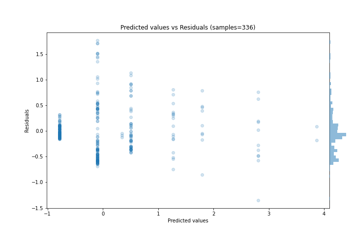
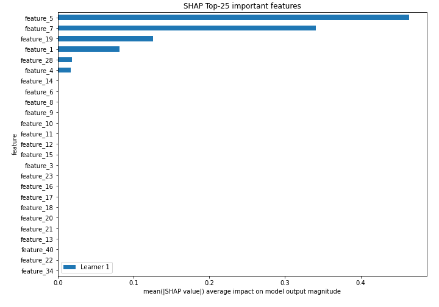
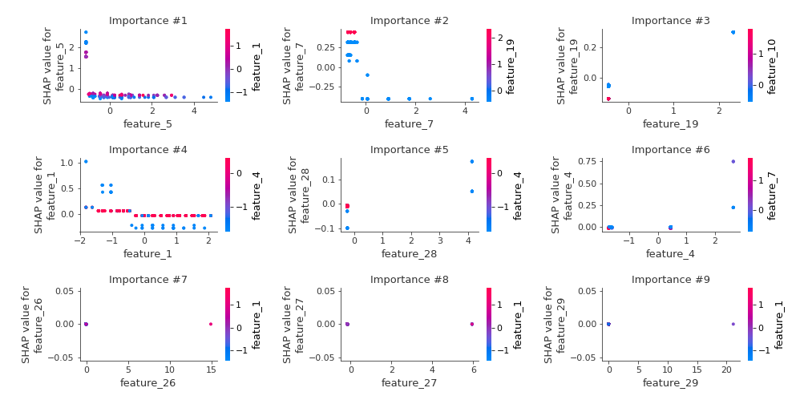
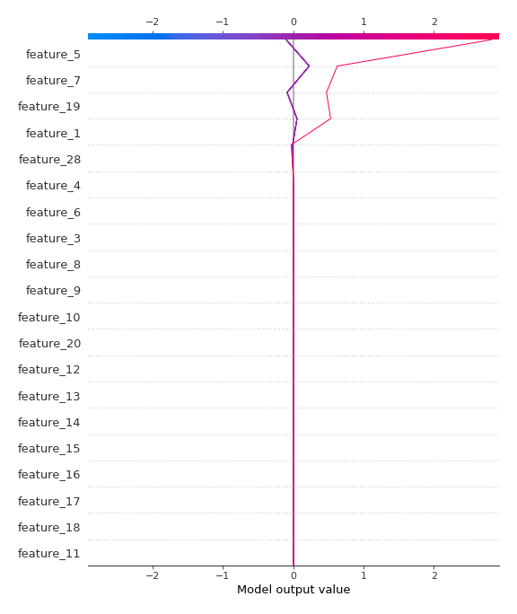
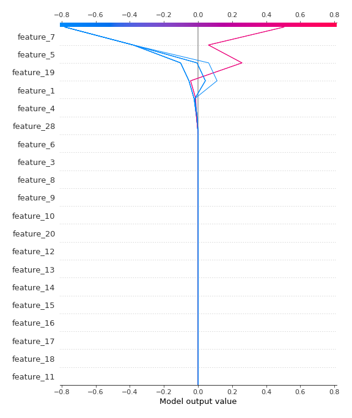

# Summary of 2_DecisionTree

[<< Go back](../README.md)

## Decision Tree
- **n_jobs**: -1
- **criterion**: mse
- **max_depth**: 3
- **explain_level**: 2

## Validation
 - **validation_type**: split
 - **train_ratio**: 0.75
 - **shuffle**: True

## Optimized metric
rmse

## Training time

7.0 seconds

### Metric details:
| Metric   |    Score |
|:---------|---------:|
| MAE      | 0.338064 |
| MSE      | 0.21551  |
| RMSE     | 0.464231 |
| R2       | 0.781965 |
| MAPE     | 0.61656  |

## Learning curves

## Decision Tree 

### Tree #1

### Rules

if (feature_5 > -1.063) and (feature_7 > -0.246) and (feature_4 <= 1.55) then response: -0.78 | based on 380 samples

if (feature_5 > -1.063) and (feature_7 <= -0.246) and (feature_19 <= 0.943) then response: -0.099 | based on 334 samples

if (feature_5 > -1.063) and (feature_7 <= -0.246) and (feature_19 > 0.943) then response: 0.504 | based on 156 samples

if (feature_5 <= -1.063) and (feature_1 > -0.397) and (feature_28 <= 1.951) then response: 1.266 | based on 60 samples

if (feature_5 <= -1.063) and (feature_1 > -0.397) and (feature_28 > 1.951) then response: 1.799 | based on 34 samples

if (feature_5 <= -1.063) and (feature_1 <= -0.397) and (feature_1 > -1.572) then response: 2.813 | based on 29 samples

if (feature_5 <= -1.063) and (feature_1 <= -0.397) and (feature_1 <= -1.572) then response: 3.866 | based on 8 samples

if (feature_5 > -1.063) and (feature_7 > -0.246) and (feature_4 > 1.55) then response: 0.342 | based on 7 samples

## Permutation-based Importance

## True vs Predicted

## Predicted vs Residuals

## SHAP Importance

## SHAP Dependence plots

### Dependence (Fold 1)

## SHAP Decision plots

### Top-10 Worst decisions (Fold 1)

### Top-10 Best decisions (Fold 1)

[<< Go back](../README.md)
