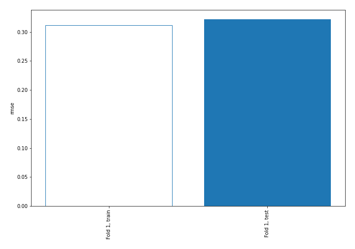
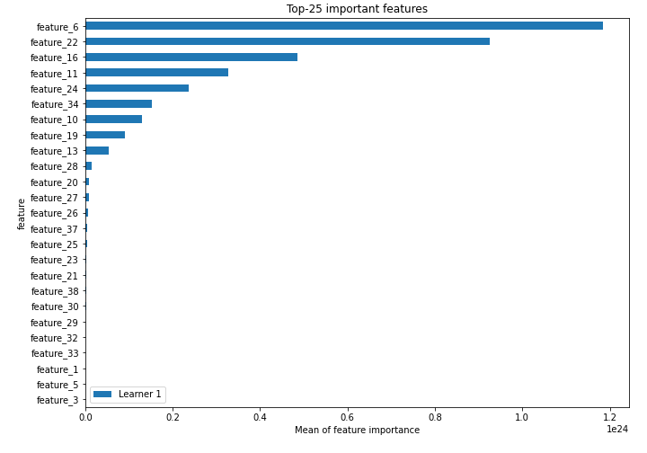
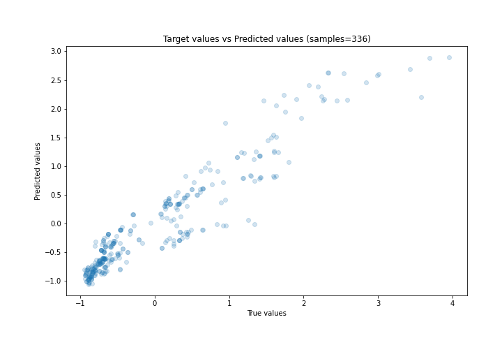
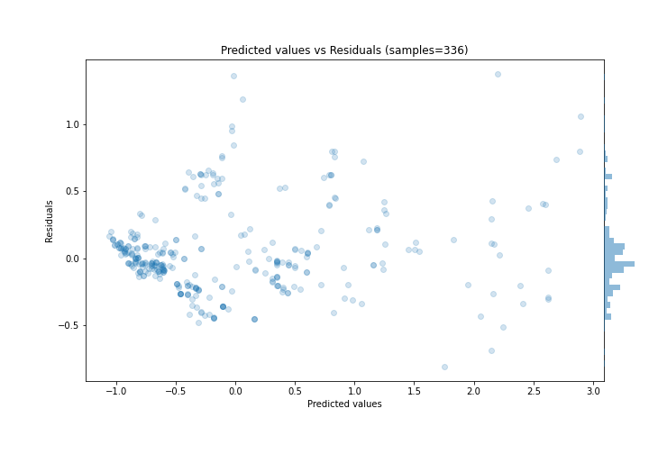
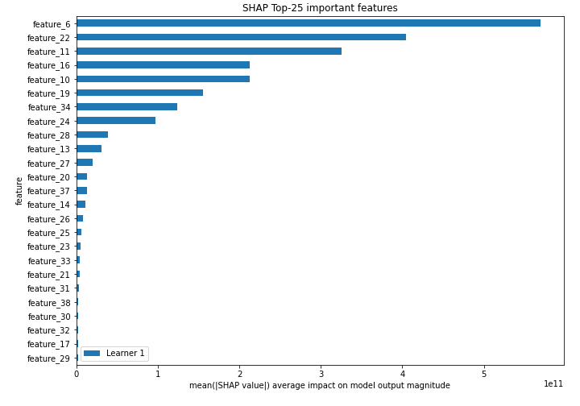
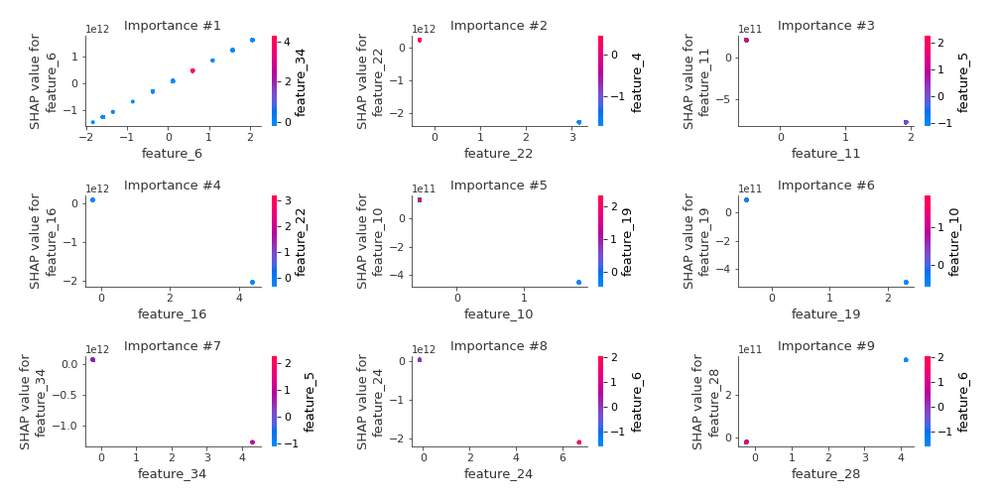
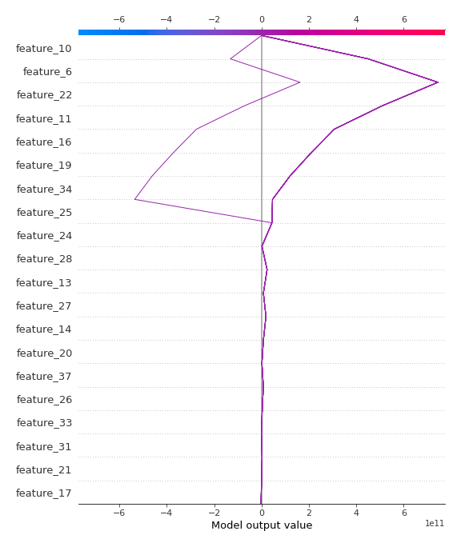
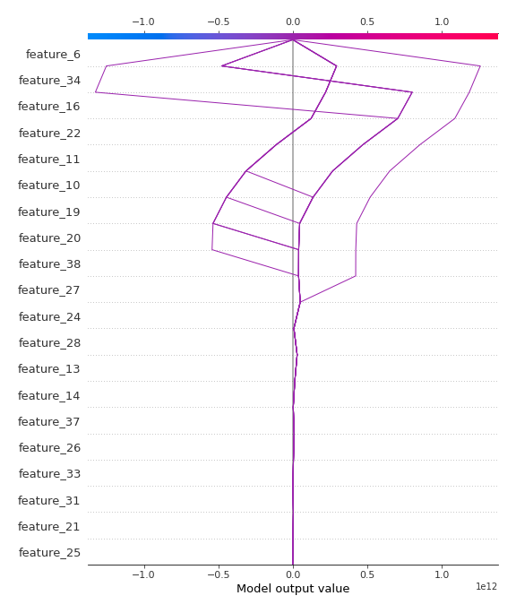

# Summary of 3_Linear

[<< Go back](../README.md)

## Linear Regression (Linear)
- **n_jobs**: -1
- **explain_level**: 2

## Validation
 - **validation_type**: split
 - **train_ratio**: 0.75
 - **shuffle**: True

## Optimized metric
rmse

## Training time

5.6 seconds

### Metric details:
| Metric   |    Score |
|:---------|---------:|
| MAE      | 0.222845 |
| MSE      | 0.103623 |
| RMSE     | 0.321905 |
| R2       | 0.895163 |
| MAPE     | 0.433662 |

## Learning curves

## Coefficients
| feature    |    Learner_1 |
|:-----------|-------------:|
| feature_6  |  7.91219e+11 |
| feature_28 |  8.74335e+10 |
| feature_27 |  6.2719e+10  |
| feature_37 |  4.86393e+10 |
| feature_9  |  3.68107e+10 |
| feature_31 |  3.51598e+10 |
| feature_23 |  2.94855e+10 |
| feature_30 |  2.22619e+10 |
| feature_29 |  1.80899e+10 |
| feature_36 |  1.46583e+10 |
| feature_32 |  1.46583e+10 |
| feature_8  |  1.0452e+10  |
| feature_18 |  5.19604e+09 |
| feature_4  |  0.0963527   |
| feature_3  |  0.0868748   |
| feature_7  |  0.0719249   |
| feature_41 |  0.024327    |
| intercept  | -0.00483158  |
| feature_5  | -0.169708    |
| feature_1  | -0.18119     |
| feature_40 | -1.19571e+10 |
| feature_39 | -1.58672e+10 |
| feature_38 | -2.24313e+10 |
| feature_33 | -2.30154e+10 |
| feature_12 | -2.64186e+10 |
| feature_15 | -2.64186e+10 |
| feature_21 | -3.54273e+10 |
| feature_25 | -3.87942e+10 |
| feature_35 | -4.2226e+10  |
| feature_17 | -5.80333e+10 |
| feature_20 | -6.11324e+10 |
| feature_26 | -6.45916e+10 |
| feature_14 | -1.29573e+11 |
| feature_13 | -1.63807e+11 |
| feature_19 | -2.11699e+11 |
| feature_10 | -2.4596e+11  |
| feature_34 | -2.98901e+11 |
| feature_24 | -3.09244e+11 |
| feature_11 | -3.95534e+11 |
| feature_16 | -4.59914e+11 |
| feature_22 | -7.22195e+11 |

## Permutation-based Importance

## True vs Predicted

## Predicted vs Residuals

## SHAP Importance

## SHAP Dependence plots

### Dependence (Fold 1)

## SHAP Decision plots

### Top-10 Worst decisions (Fold 1)

### Top-10 Best decisions (Fold 1)

[<< Go back](../README.md)
