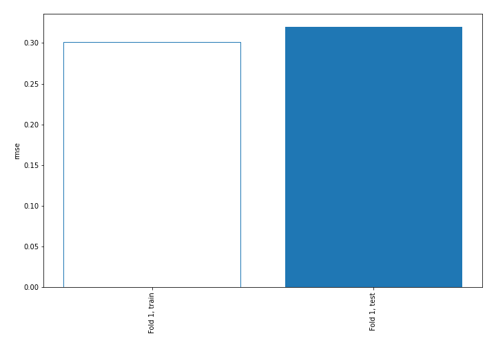
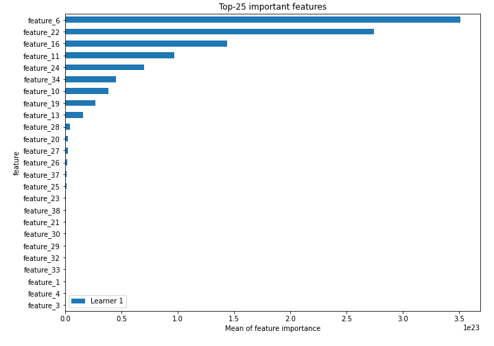
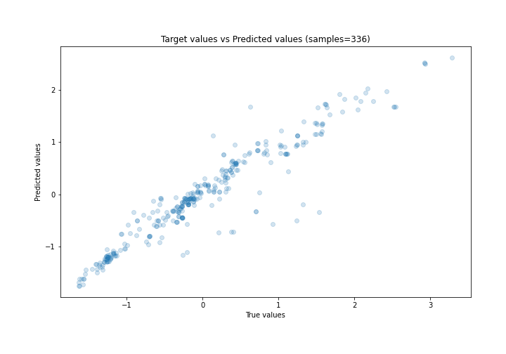
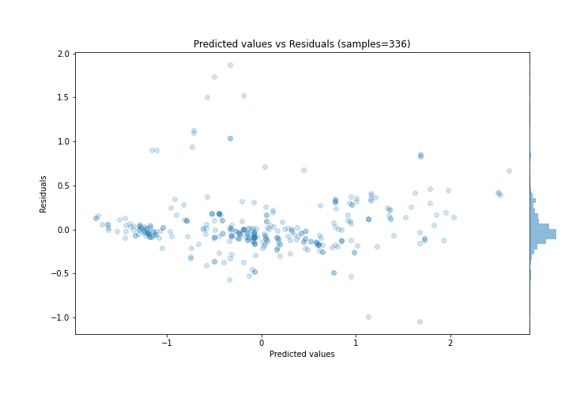
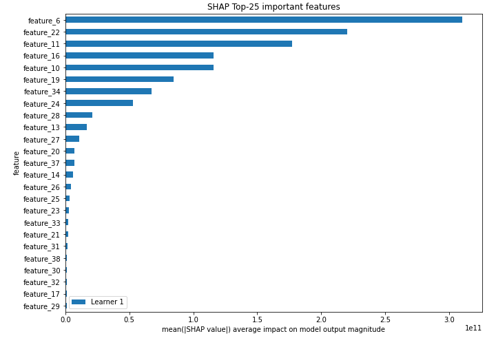
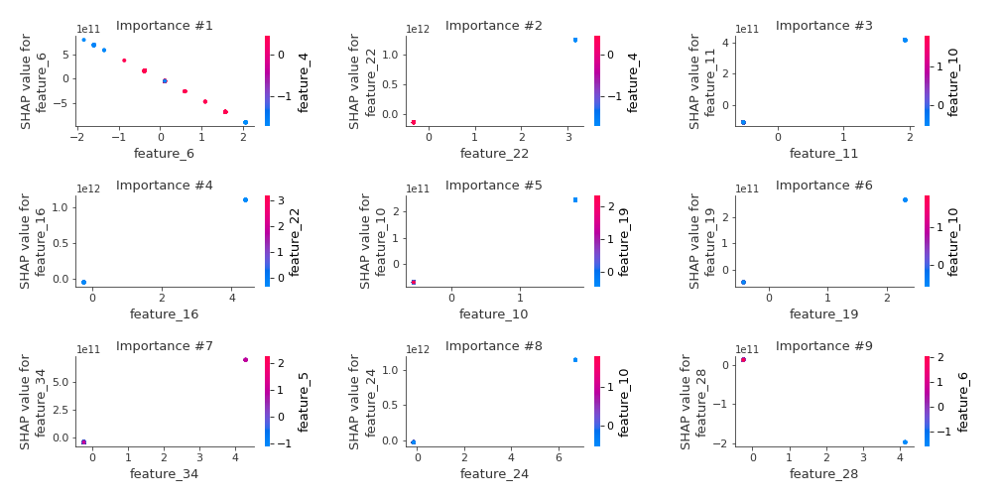
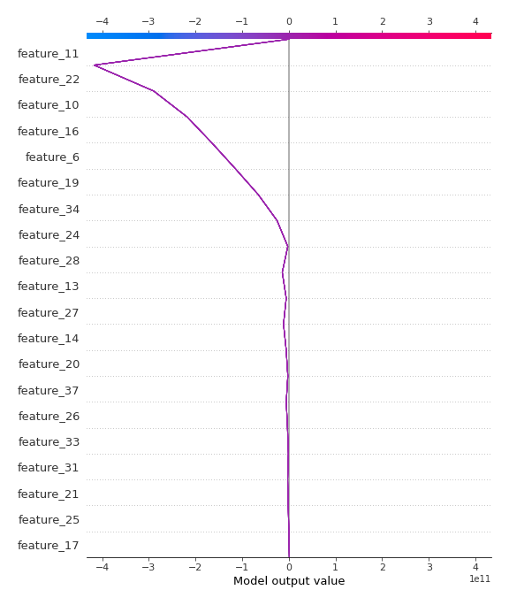
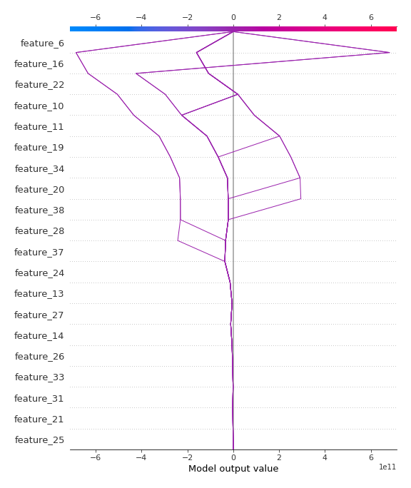

# Summary of 3_Linear

[<< Go back](../README.md)

## Linear Regression (Linear)
- **n_jobs**: -1
- **explain_level**: 2

## Validation
 - **validation_type**: split
 - **train_ratio**: 0.75
 - **shuffle**: True

## Optimized metric
rmse

## Training time

5.7 seconds

### Metric details:
| Metric   |    Score |
|:---------|---------:|
| MAE      | 0.189422 |
| MSE      | 0.102313 |
| RMSE     | 0.319865 |
| R2       | 0.89376  |
| MAPE     | 0.550512 |

## Learning curves

## Coefficients
| feature    |    Learner_1 |
|:-----------|-------------:|
| feature_22 |  3.93294e+11 |
| feature_16 |  2.50461e+11 |
| feature_11 |  2.15401e+11 |
| feature_24 |  1.68409e+11 |
| feature_34 |  1.62776e+11 |
| feature_10 |  1.33945e+11 |
| feature_19 |  1.15288e+11 |
| feature_13 |  8.92064e+10 |
| feature_14 |  7.05631e+10 |
| feature_26 |  3.51754e+10 |
| feature_20 |  3.32916e+10 |
| feature_17 |  3.16039e+10 |
| feature_35 |  2.29955e+10 |
| feature_25 |  2.11266e+10 |
| feature_21 |  1.92931e+10 |
| feature_12 |  1.43871e+10 |
| feature_15 |  1.43871e+10 |
| feature_33 |  1.25338e+10 |
| feature_38 |  1.22157e+10 |
| feature_39 |  8.64101e+09 |
| feature_40 |  6.51162e+09 |
| feature_4  |  0.252379    |
| feature_3  |  0.172135    |
| feature_7  |  0.131618    |
| feature_5  |  0.0703371   |
| intercept  |  0.00133293  |
| feature_41 | -0.106779    |
| feature_1  | -0.484091    |
| feature_18 | -2.82967e+09 |
| feature_8  | -5.69196e+09 |
| feature_36 | -7.98262e+09 |
| feature_32 | -7.98262e+09 |
| feature_29 | -9.85141e+09 |
| feature_30 | -1.21234e+10 |
| feature_23 | -1.60573e+10 |
| feature_31 | -1.91474e+10 |
| feature_9  | -2.00464e+10 |
| feature_37 | -2.64881e+10 |
| feature_27 | -3.41556e+10 |
| feature_28 | -4.76147e+10 |
| feature_6  | -4.30883e+11 |

## Permutation-based Importance

## True vs Predicted

## Predicted vs Residuals

## SHAP Importance

## SHAP Dependence plots

### Dependence (Fold 1)

## SHAP Decision plots

### Top-10 Worst decisions (Fold 1)

### Top-10 Best decisions (Fold 1)

[<< Go back](../README.md)
