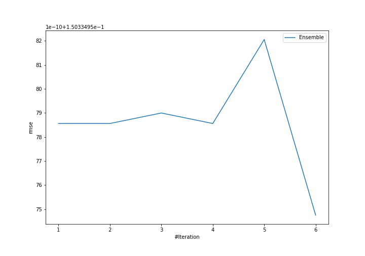
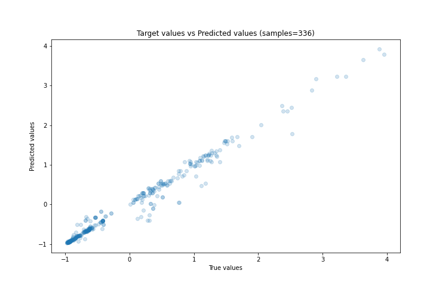
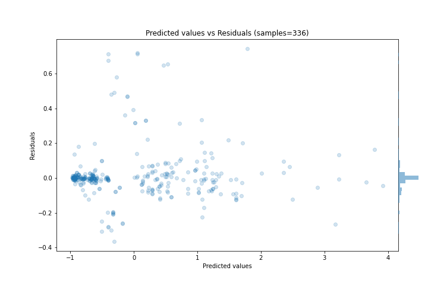

# Summary of Ensemble

[<< Go back](../README.md)

## Ensemble structure
| Model             |   Weight |
|:------------------|---------:|
| 4_Default_Xgboost |        6 |

### Metric details:
| Metric   |     Score |
|:---------|----------:|
| MAE      | 0.0746454 |
| MSE      | 0.0226006 |
| RMSE     | 0.150335  |
| R2       | 0.976445  |
| MAPE     | 0.16058   |

## Learning curves

## True vs Predicted

## Predicted vs Residuals

[<< Go back](../README.md)
