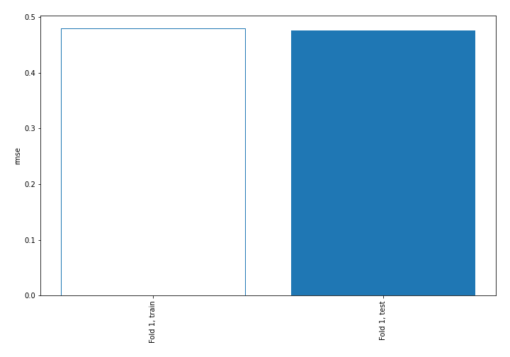
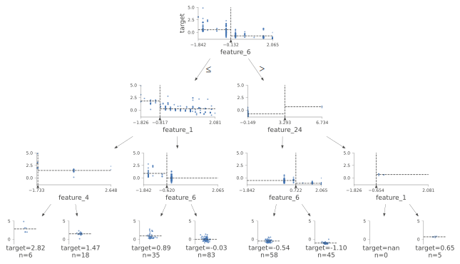
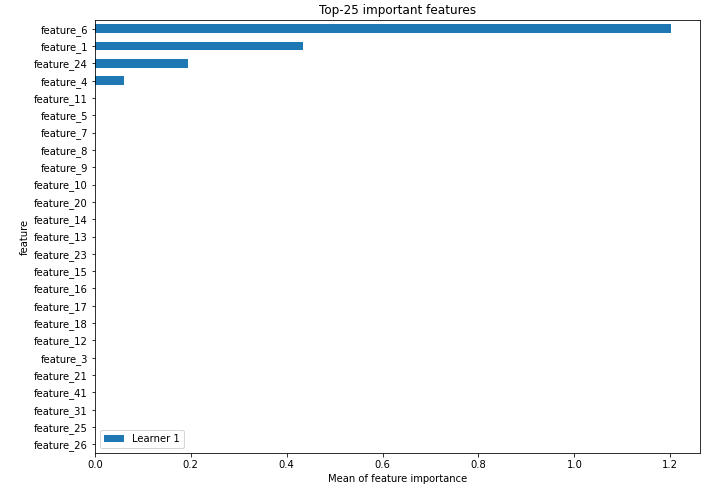
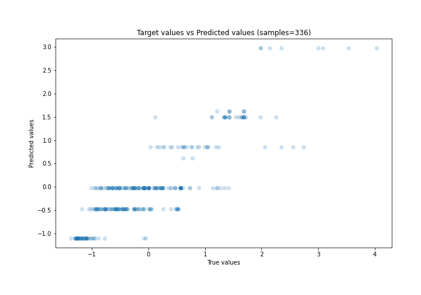
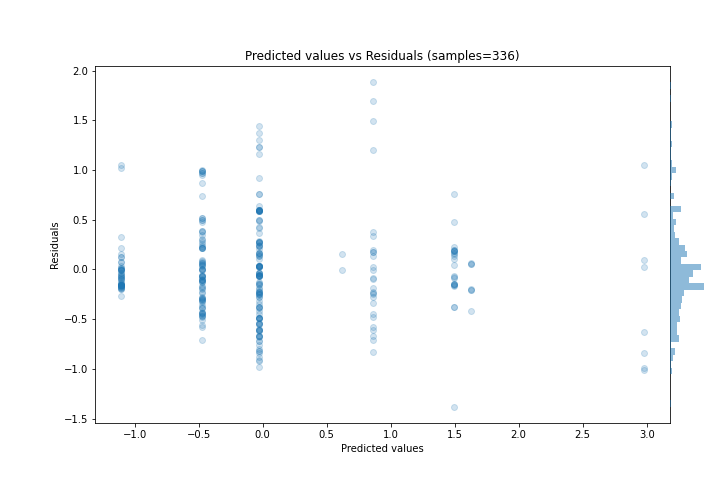
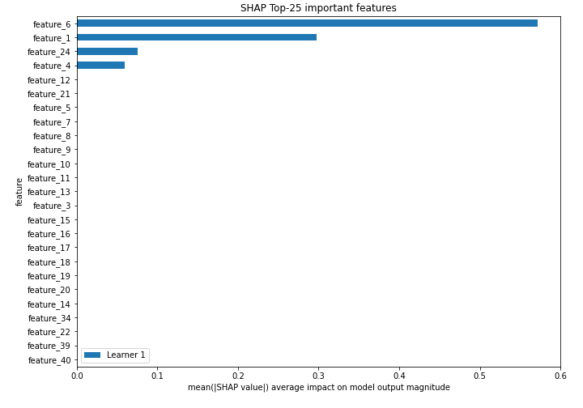
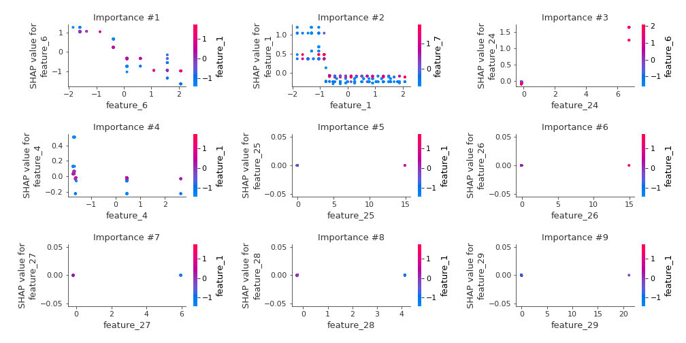
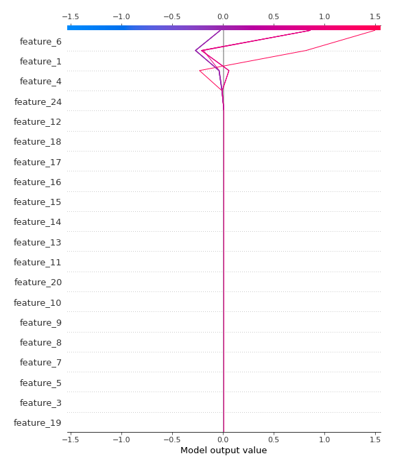
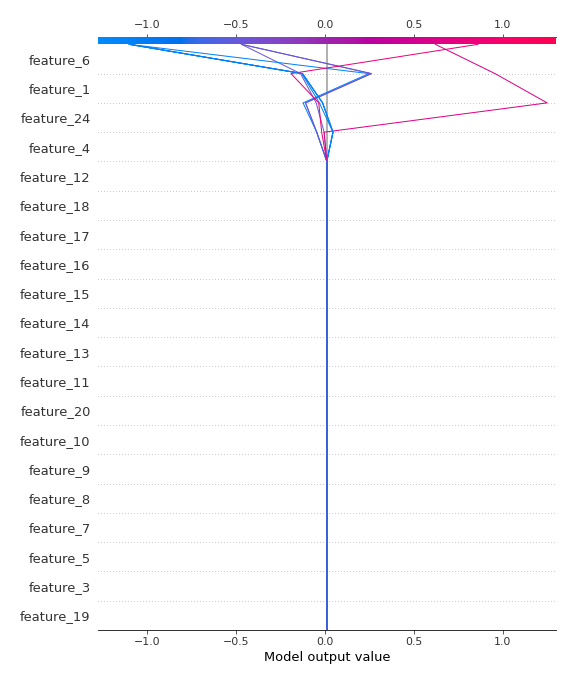

# Summary of 2_DecisionTree

[<< Go back](../README.md)

## Decision Tree
- **n_jobs**: -1
- **criterion**: mse
- **max_depth**: 3
- **explain_level**: 2

## Validation
 - **validation_type**: split
 - **train_ratio**: 0.75
 - **shuffle**: True

## Optimized metric
rmse

## Training time

7.6 seconds

### Metric details:
| Metric   |    Score |
|:---------|---------:|
| MAE      | 0.347317 |
| MSE      | 0.226844 |
| RMSE     | 0.476282 |
| R2       | 0.756862 |
| MAPE     | 1.80373  |

## Learning curves

## Decision Tree 

### Tree #1

### Rules

if (feature_6 <= -0.132) and (feature_1 > -0.817) and (feature_6 > -0.62) then response: -0.027 | based on 343 samples

if (feature_6 > -0.132) and (feature_24 <= 3.293) and (feature_6 <= 0.722) then response: -0.471 | based on 273 samples

if (feature_6 > -0.132) and (feature_24 <= 3.293) and (feature_6 > 0.722) then response: -1.102 | based on 156 samples

if (feature_6 <= -0.132) and (feature_1 > -0.817) and (feature_6 <= -0.62) then response: 0.86 | based on 114 samples

if (feature_6 <= -0.132) and (feature_1 <= -0.817) and (feature_4 > -1.655) then response: 1.496 | based on 71 samples

if (feature_6 <= -0.132) and (feature_1 <= -0.817) and (feature_4 <= -1.655) then response: 2.978 | based on 31 samples

if (feature_6 > -0.132) and (feature_24 > 3.293) and (feature_1 > -0.654) then response: 0.62 | based on 10 samples

if (feature_6 > -0.132) and (feature_24 > 3.293) and (feature_1 <= -0.654) then response: 1.626 | based on 10 samples

## Permutation-based Importance

## True vs Predicted

## Predicted vs Residuals

## SHAP Importance

## SHAP Dependence plots

### Dependence (Fold 1)

## SHAP Decision plots

### Top-10 Worst decisions (Fold 1)

### Top-10 Best decisions (Fold 1)

[<< Go back](../README.md)
