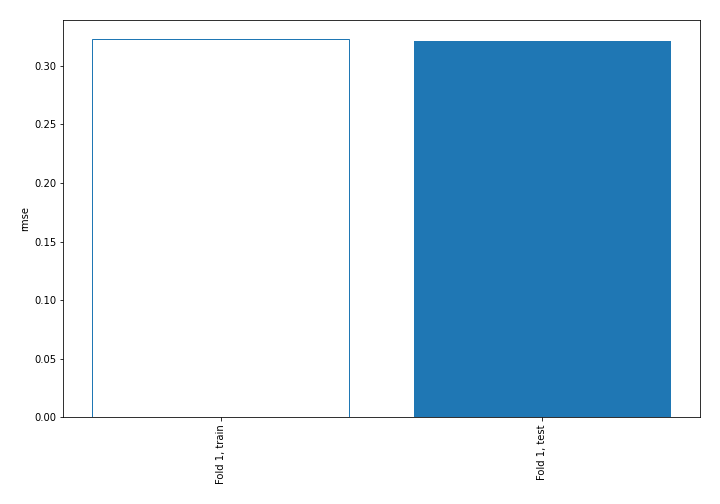
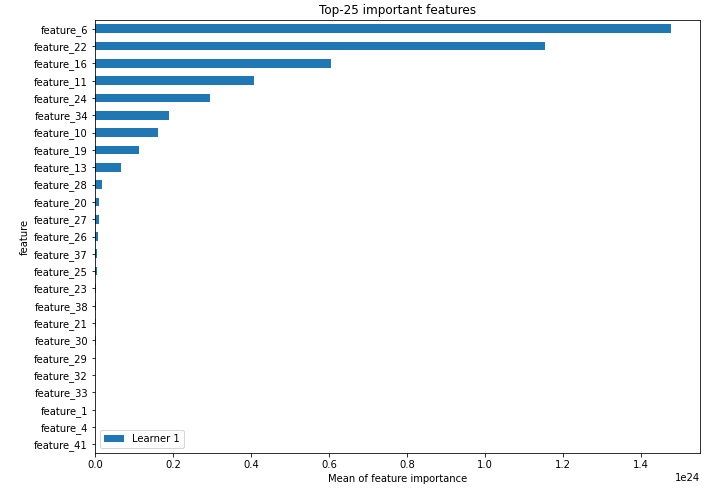
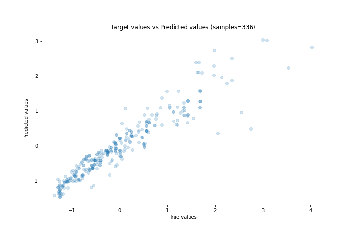
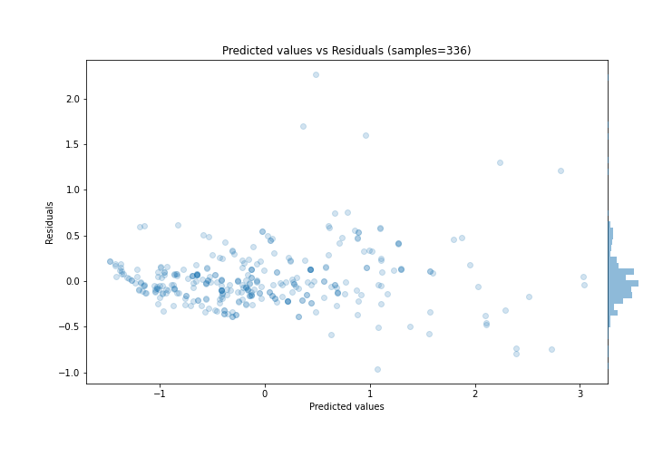
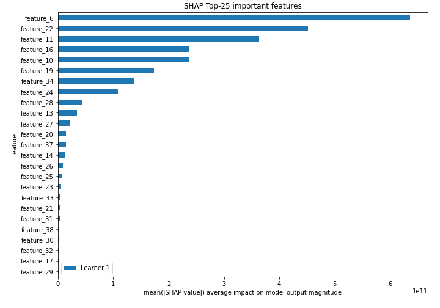
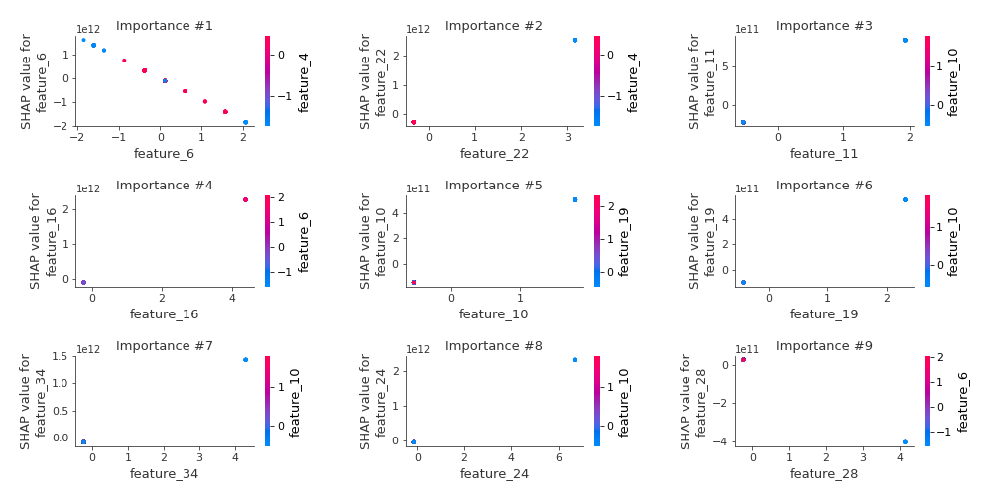
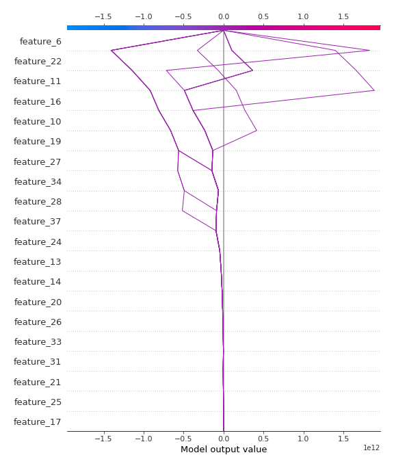
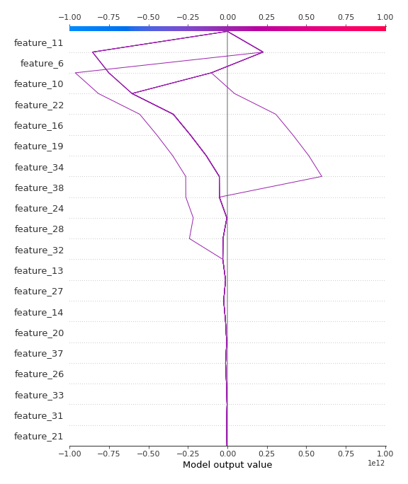

# Summary of 3_Linear

[<< Go back](../README.md)

## Linear Regression (Linear)
- **n_jobs**: -1
- **explain_level**: 2

## Validation
 - **validation_type**: split
 - **train_ratio**: 0.75
 - **shuffle**: True

## Optimized metric
rmse

## Training time

6.2 seconds

### Metric details:
| Metric   |    Score |
|:---------|---------:|
| MAE      | 0.208621 |
| MSE      | 0.103395 |
| RMSE     | 0.32155  |
| R2       | 0.889173 |
| MAPE     | 2.76024  |

## Learning curves

## Coefficients
| feature    |    Learner_1 |
|:-----------|-------------:|
| feature_22 |  8.06343e+11 |
| feature_16 |  5.13502e+11 |
| feature_11 |  4.41621e+11 |
| feature_24 |  3.45276e+11 |
| feature_34 |  3.33728e+11 |
| feature_10 |  2.74619e+11 |
| feature_19 |  2.36366e+11 |
| feature_13 |  1.82893e+11 |
| feature_14 |  1.4467e+11  |
| feature_26 |  7.21176e+10 |
| feature_20 |  6.82553e+10 |
| feature_17 |  6.47951e+10 |
| feature_35 |  4.7146e+10  |
| feature_25 |  4.33144e+10 |
| feature_21 |  3.95552e+10 |
| feature_12 |  2.94968e+10 |
| feature_15 |  2.94968e+10 |
| feature_33 |  2.56971e+10 |
| feature_38 |  2.50449e+10 |
| feature_39 |  1.7716e+10  |
| feature_40 |  1.33503e+10 |
| feature_4  |  0.266178    |
| feature_7  |  0.182277    |
| feature_3  |  0.134777    |
| intercept  | -0.00804452  |
| feature_5  | -0.0469496   |
| feature_41 | -0.188527    |
| feature_1  | -0.490795    |
| feature_18 | -5.80146e+09 |
| feature_8  | -1.16698e+10 |
| feature_36 | -1.63662e+10 |
| feature_32 | -1.63662e+10 |
| feature_29 | -2.01976e+10 |
| feature_30 | -2.48558e+10 |
| feature_23 | -3.29211e+10 |
| feature_31 | -3.92566e+10 |
| feature_9  | -4.10998e+10 |
| feature_37 | -5.43066e+10 |
| feature_27 | -7.00268e+10 |
| feature_28 | -9.7621e+10  |
| feature_6  | -8.83409e+11 |

## Permutation-based Importance

## True vs Predicted

## Predicted vs Residuals

## SHAP Importance

## SHAP Dependence plots

### Dependence (Fold 1)

## SHAP Decision plots

### Top-10 Worst decisions (Fold 1)

### Top-10 Best decisions (Fold 1)

[<< Go back](../README.md)
